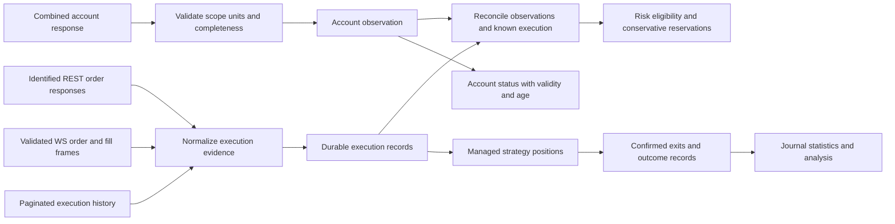

# Account, execution and outcome authority — proposed repairs

Date: 2026-10-07; FV1 implementation added 2026-10-08. Base commit: `f57f95cd918200e02e9ca134a21b795fbd22373e`, plus the locally verified batches. **H, F0 and the inactive FV1 foundation were subsequently approved and implemented locally; FV2 and R1 remain proposals.** Discovery and per-batch implementation evidence are retained in `docs/audits/SYSTEM_DISCOVERY_2026-10-07_evidence.json`; the original findings below are historical observations at their recorded hashes. The fresh-review override of stale project rules remains effective. No commit, push, deployment or real exchange operation occurred.

## Evidence and priority

`backend/diagnostics/live_accounting_diagnostic.py` runs actual executor, position manager, live-service and WebSocket parser methods against scripted transports and temporary execution journals. The installed CCXT balance parser is exercised offline. **37 checks: 24 violated invariants and 13 passing controls**, exit 1 as designed. Directional cases cover both longs and shorts. These are counterexamples, not 24 independent bugs or proof of historical losses. No exchange connection, credentials, application startup or historical journal write occurs.

| Finding | Reproduced behavior | Consequence |
|---|---|---|
| D11 — false orphan completion | Old position plus missing cached price: no exit request, remaining quantity set to zero, completed trade recorded, native stop cancellation sent | Software abandons a position and removes its protection without proof of exit |
| D12 — conflicting account state | $1,000 wallet with $250 reserved reports equity $750 and P&L −$250; position snapshot then delayed fill records 20 units instead of 10; balance snapshot then delayed fee subtracts that fee twice | Sizing, exposure, equity, session returns and risk statistics can diverge from the account |
| D12 — freshness differs by consumer | Invalid balance still displays numeric equity; failed ticker refresh leaves old positive cache which refreshes the manager's successful-monitor timestamp | Sizing rejects unknown value, while display/monitor still consume it as known |
| D13 — cumulative fill cost | 4 units at 100 followed by 6 at 110 has cumulative average 106; application computes 103.6. A later REST correction cannot repair a terminal WS price | Wrong entry cost propagates to exposure, protection geometry and P&L |
| D14 — outcome provenance | Reported fee 0.20 becomes modeled 1.00; confirmed exit 109/91 becomes cached quote 110/90 in completed trades; disappearance alone becomes stop-loss at the planned stop | Recorded trade outcomes are not reliable execution evidence |
| D15 — documented WS envelope | Synthetic frames using the documented `snapshot`/`incremental` type and `orders_p` array produce zero callbacks | Documented execution updates are ignored; REST polling remains a separate recovery path |

D11 uses the **actual service `_get_price` callback**, which returns zero for an absent cache entry. A 100-day-old fixture exceeds the real adaptive timeout; the diagnostic does not establish frequency/reachability of that cache condition in past sessions. A separate fixture proves retained positive cache can instead conceal feed staleness. The original exception-based manager probe is retained in the evidence history, but the final run uses the real callback boundary.

The Phemex [official USDT perpetual protocol](https://github.com/phemex/phemex-api-docs/blob/master/Public-Hedged-Perpetual-API.md#subscribe-account-order-position-aop) documents the AOP envelope and separate execution/cumulative-value fields. D15 is protocol compatibility evidence against that document, not captured production traffic. The direct-handler wrong-price probe bypasses the currently broken envelope intentionally; fixing only dispatch would expose that price problem.

## Current contract and ownership map

| Producer → consumer | Present representation | Required distinction |
|---|---|---|
| Phemex → CCXT → `LiveExecutor._fetch_balance_from_exchange` | USDT `free`, `used`, `total`; executor retains `free` as balance | Spendable margin versus wallet balance versus account equity |
| REST/WS → `_process_exchange_order` → `_record_fill` | Cumulative quantity/average treated as incremental quantity/price; modeled fees | Cumulative executed quantity and cost; execution IDs and actual fees; unknown cost/fees |
| Position snapshots → `reconcile_positions`, concurrent order updates → `_update_position` | Both overwrite/add to the same quantity and average | Snapshot authority and order-execution projection cannot both book the same economic event |
| `get_equity` → `_valuation_equity` → sizing / drawdown | Cached free balance plus local unrealized P&L; recent local ticker observations | Valid account valuation with scope, timestamp, mark-price basis and ownership |
| `_get_price` → `PositionManager` | Float; no observation timestamp; positive cached values look fresh | Price value, validity and observation age for each consumer |
| `_execute_exit_order` → `PositionManager` | Boolean completion only | Confirmed quantity, cost, fees and provenance, including partial exits |
| Position disappearance → `_detect_exchange_closed_positions` | Guessed stop price and stop-loss reason | Flatness evidence is separate from exit-price/cause evidence |
| Manager → completed trade → journal/stats/UI/CSV/analysis | Manager's gross estimated P&L; live fees absent | Gross trading P&L, fees, funding, net P&L and completeness must be explicit |
| Backfill → `phemex_fills.jsonl` | Separate raw-fill audit log | Not currently joined to completed trades; completeness/pagination unverified |

Code anchors: `live_executor.py:401,774,837,977,1331,1342`; `position_manager.py:567,632`; `live_trading_service.py:664,874,1772,1851,2076,2158,2250,2362`; `phemex_ws.py:202,234`. Line references apply to the recorded hashes.

Paper uses the same manager. Pure simulation has its own cash/fee ledger, and `PaperTradingService._journal_pnl_for` prefers its net realized amount. Paper-testnet's live executor lacks that method, so it falls back to manager P&L; the serializer still takes `pnl_pct` from the manager in either case. This divergence is source-confirmed, not end-to-end replayed here. The manager also applies synthetic stop slippage after an executor callback confirms success. That remains an additional source-confirmed outcome concern, not a measured check in this run.

## Approved H scope — preserve exposure on orphan timeout

This bounded implementation was approved and completed before accounting changes. The original scope is retained here; results follow below.

**Production file:** `backend/bot/executor/position_manager.py`, principally `monitor_all_positions`. Diagnostic/test files: the accounting diagnostic and focused position-manager/service integration regressions. Update these audit artifacts in the same batch. No changes to entry strategy, scoring thresholds, execution journal schema, account configuration or historical records.

On the orphan timeout, retain quantity and OPEN/PARTIAL status and emit an explicit actionable failure identifying the position and unavailable price. Do not set a fabricated exit price, realized P&L or terminal status. Retry monitoring; normal confirmed execution and reconciliation remain the ways to establish a close. Repeated failure remains inspectable without inventing a completed trade. Do not send a blind replacement exit using zero or a stale synthetic price.

**Upstream:** live and paper monitor loops; each service's `_get_price`; manager timers. **Downstream:** both services' closed-trade synchronizers, executor callbacks, native-stop/TP cleanup, journal writes, statistics, telemetry and UI open positions. In particular the live cleanup must never receive a terminal position from this failed-feed branch, so it cannot cancel that position's protection. Paper positions also stay visible instead of generating fictitious simulation outcomes.

**Behavioral risk:** positions with unavailable feeds remain unresolved longer; this is deliberate and must be visible. Native protection remains independent. This batch does not repair the separate stale-positive-cache freshness contract, financial accounting, or orphan recovery across restarts, and cannot be described as full feed-outage recovery.

**Verification:** both directions; OPEN/PARTIAL; exceptions, missing/zero/invalid prices; timeout boundaries; repeated cycles; no new order and no fabricated close, journal row or protection cancellation; feed recovery resumes monitoring; real confirmed exits still settle; rejected/unknown/partial exit replies preserve remaining exposure. Exercise live and paper/testnet callers with isolated transports. Run affected lifecycle and fill-protection regressions. The broader accounting diagnostic must retain its unrelated failures until their own repairs land; do not weaken it to make a green report.

**Rollback:** revert only the H production diff and its tests if necessary, preserving the reproducer and this unresolved safety finding. This restores the unsafe behavior and therefore cannot justify enabling execution. No runtime/historical data migration is needed.

## H implementation and verification

The only production file changed is `backend/bot/executor/position_manager.py`: the orphan branch now emits `ORPHAN_PRICE_FEED_UNAVAILABLE` with position ID, symbol, age, timeout and remaining quantity. It performs no second price fetch, order request, financial settlement or terminal-state mutation. Already-closed positions are skipped. Invalid prices (missing, non-numeric, boolean, nonfinite or nonpositive) are rejected before updating P&L or the successful-monitor timestamp. Valid-price exit behavior is unchanged; stale positive cache remains a separate unresolved input-contract issue.

`backend/tests/unit/test_position_feed_failure.py` adds **84 passing regressions**: both directions and OPEN/PARTIAL states; repeated outages and malformed prices; exact timeout boundaries using both last-observation and creation-time fallback; valid-price recovery with confirmed/unconfirmed exits; actual live, paper-testnet and paper callbacks plus completion synchronizers. Service cases verify unchanged position state, zero completed records/telemetry/journal writes, no exit submission or stop cancellation, and retained native-stop identity where applicable. The first zero-price regression failed against the original production source, demonstrating fabricated closure and −$1,000 P&L, before the repair was applied.

The broader guarded backend run passed **549 tests in 37.89 seconds** (the prior 465 plus 84 new cases). Existing acknowledgment tests cover unknown/partial exit confirmations and retained protection. The unchanged accounting diagnostic still intentionally exits 1: **37 checks, 15 holding invariants including all 13 controls, 22 remaining violations**. Both orphan containment cases now pass; every other result is unchanged from the final pre-H run. This is not a claim that accounting is repaired.

Pipeline smoke passes all eight checks. API, telemetry and pipeline contracts are clean; the DB checker still reports the same five pre-H differences (D2's historical journal sampling mismatch plus B's three durable tables and table count). No baseline was rewritten. Protected historical files and all prior B implementation/test files retain their recorded hashes. Exact runners, outputs and a pre-H backup are recorded in the evidence JSON.

The operational limit is deliberate: a feed-starved position remains unresolved and logged, with its existing protection untouched by this timeout. H does not independently prove exchange flatness, guarantee stop availability, repair positive-cache staleness, recover strategy state across restarts, or correct financial outcomes. Those remain separate work.

## Following batches — design direction, separately bounded before implementation

1. **F — normalize execution evidence.** Repair the documented WS envelope and normalize cumulative quantity/cost, deriving delta cost from cumulative cost differences. Never substitute an order limit for an execution average. Allow additional factual cost/fee data after terminal quantity without replaying quantity. Deduplicate execution IDs and distinguish cumulative fees from per-execution fees, including zero/rebates and fee currency. Touch WS adapter, executor, durable state schema/migration and focused tests. Receipts need explicit completeness; B's existing request journal is not yet a complete financial ledger. Crash, out-of-order, duplicate and REST/WS overlap tests are mandatory for this batch.
2. **V — account observations and local projections.** Store wallet balance, used/free margin and mark-based unrealized value as distinct fields. Use one validated account observation boundary with scope/time/revision; do not promise atomicity from two independent REST calls. Keep local order history separate from authoritative account balances/positions so snapshots followed by delayed fills cannot double-book. Risk, UI and session P&L must use consistent validity and provenance, including unmanaged account exposure. Distinguish cash flows/funding from strategy returns. Keep the existing free-balance floor's policy explicit instead of silently converting it into an equity threshold. Affected: adapter, executor, live service, paper-testnet bridge, API/types and existing status presentation. Reject unavailable values and display them as unavailable rather than numeric zero. Do not change configured risk percentages.
3. **R — execution-backed outcomes.** Replace boolean-only financial settlement with an execution receipt contract, covering partial/full closes, actual cumulative cost and known fee records. Preserve unknown price/cause when account flatness arrives before execution evidence. Journal gross P&L, actual fees, funding and net P&L with their completeness and version; calculate percentage on the same declared basis. Share execution settlement with paper-testnet while keeping simulated slippage/fees in the simulation executor. Trace journal/API/CSV/analysis compatibility before adding fields; no historical record rewrite. Backfill must be checked for pagination and equal-timestamp gaps before it becomes authority.

F and V boundaries interact and must be designed together before either mutates account state; the numbered list is not approval to edit all of them. The narrow H batch can land independently.

## Alternatives considered

| Approach | Assessment |
|---|---|
| Patch average arithmetic and rename free balance | Helps individual examples but leaves snapshot replay, fee provenance and guessed settlement unresolved |
| Use only exchange snapshots for everything | Useful for current exposure/equity; snapshots alone cannot reconstruct per-trade fills, fees or exit reasons |
| Separate authoritative account observations and durable execution receipts inside the current app | Preferred direction; preserves the product and makes reconciliation responsibilities explicit |
| Introduce a separate accounting/execution service | Adds deployment and migration complexity before current in-process contracts are settled; not justified by present evidence |

Extra High remains recommended while settling these boundaries. High should suffice for the narrowly defined H implementation once approved, with the stated regressions. No mode switch is performed by this document.

## F/V architecture decision — ready for review, implementation not yet approved

**Status: Proposed. Decider: user. Date: 2026-10-07.** The user's subsequent “Ok go” authorized the accounting design. The H repair remains complete; this section changes no production code. This detailed sequencing supersedes any implication that the earlier F/V list can be implemented as unrelated patches.

### Evidence that changes the design

The new `backend/diagnostics/accounting_contract_diagnostic.py` exercises installed CCXT 4.5.49 and actual application methods under the existing offline guard. **12 checks: seven parser/fixture controls hold and five application invariants fail.** These add two defect groups:

- **D16 — position exposure falsely attributed to an order.** After an identified order query reports OPEN with zero filled, `LiveExecutor.check_fill_via_positions:720` sees a three-unit account position and marks the ten-unit order FILLED for three units. All four combinations of BUY/SELL and same/opposite account position reproduce. The position row has no order identity. `LiveTradingService._monitor_pending_entries:1145` invokes this fallback after an old entry's ordinary poll. Restart-restored IDs are already excluded by B, but ordinary in-process entries remain affected.
- **D17 — fill-history pagination gap.** With 201 unique executions sharing one timestamp and a 200-row page, two real `_run_backfill_once` calls save 200 rows. The cursor advances to timestamp +1 and excludes the remaining execution. This controlled example does not establish the production endpoint's sort direction or actual historical losses. It establishes that the consumer is unsafe for a permitted equal-timestamp page boundary.

Parser controls expose why normalized CCXT fields alone are insufficient evidence: absent raw cumulative cost can yield a calculated `cost` from the order limit while `average` stays null; an explicit raw zero order fee normalizes to `fee=None`; this installed parser returns the nonzero order fee cost as a string; an invalid raw position side normalizes to short. Validate raw fields and retain provenance before trusting normalized values. The first diagnostic run had incorrect expectations about the fee type and inferred average; it was corrected against observed parser behavior, and the failed harness results are retained in evidence.

A single scripted `/g-accounts/positions` response supplies account balance, reserved balance and position unrealized P&L: wallet 1,000, free 750 and UPnL 60 produce equity 1,060. The [official account endpoint](https://github.com/phemex/phemex-api-docs/blob/master/Public-Hedged-Perpetual-API.md#query-account-positions-with-unrealized-pnl) documents mark-based UPnL and warns of high request weight. This supports a combined observation adapter; it does **not** prove a globally atomic exchange snapshot, bounded exchange-side lag, or cross-channel sequence comparability. Those remain explicit limitations.

### Decision: separate three owners inside the existing application

1. **Account observations own current account values and exposure.** Only a validated exchange observation replaces wallet/free/used balances, account positions and account UPnL. Local fills never debit or credit that observation. A successful HTTP response is not automatically complete, fresh or reconciled.
2. **Execution records own order facts.** Original client/exchange IDs identify an order; execution IDs identify individual fills and fees. Position snapshots cannot manufacture an order fill, exit price, fee or exit reason. Execution facts never increment the account-position snapshot.
3. **Strategy positions own intended trade management.** Plans, targets, stops and remaining managed quantity are tied to identified execution receipts. Account mismatches require reconciliation; they do not silently resize the strategy's ownership or liquidate foreign positions. Completed outcomes derive from receipts, with unknown components explicit.

Retain the current process, adapter, services, UI and B's single local execution owner. A new service, message broker or repository rewrite is not justified. This split removes double writers without pretending that snapshots provide trade history or that local fills reproduce all account cash flows.

The diagram describes the proposed end state. The account and execution arrows deliberately meet at reconciliation rather than both mutating the same balance/quantity dictionary.

### Concrete contracts

| Proposed internal type | Required information | Rules |
|---|---|---|
| `AccountObservation` | environment/account binding, `phemex:swap:USDT` scope, observation ID, request start/end monotonic times, optional exchange timestamp, execution revision before/after read, completeness, wallet/free/used, all positions, account UPnL/equity, reason codes | Preserve last observation separately from current eligibility. Missing/malformed data is unavailable, not zero. Free margin is distinct from equity. |
| `AccountPositionObservation` | canonical market ID/symbol, settlement asset, side, contract quantity, contract multiplier, base quantity, entry price, mark price, UPnL and raw field provenance | Validate raw side before parsing. Zero rows may have `side=None`; nonzero rows may not. One net position per symbol is the supported strategy shape; unexpected hedge exposure stays visible and blocks new risk. |
| `OrderExecutionState` | original request IDs and purpose, lifecycle status, cumulative filled base quantity, cumulative quote cost or null, quantity covered by that cost, cost provenance/revision, unresolved flags | Quantity confirmation and financial completeness are separate. A terminal order can receive later cost/fee evidence. An entry limit is never execution-price evidence. |
| `ExecutionFact` | account/environment, market, execution ID, order linkage if known, side, quantity, price/cost, fee amount/currency or unknown, event kind, exchange timestamp, source | Deduplicate on scoped execution identity. Missing IDs are quarantined, not synthesized from amount and timestamp. Conflicting duplicates block financial finalization. Funding is not a trade fill. |
| `ExitReceipt` | requested/confirmed cumulative quantity, remaining quantity, original IDs, execution cost/average if verified, known fees, quantity-complete and financial-complete flags | Replace boolean-only financial settlement explicitly across callers. Unknown cost never causes duplicate exit submission. Full quantity confirmation may close exposure while financial attribution remains pending. |

Amounts are parsed as finite decimals from raw strings for financial aggregation; round for exchange submission or presentation, not at every event. Fees may be zero or negative (rebates), and currency is mandatory before aggregation. Prices and nonzero fill quantities must be positive. Signed wallet/equity/P&L may be negative; rejection must not hide a loss. Initially support only the application's USDT linear perpetual, one-way scope; market metadata must establish amount units. If a multiplier cannot be represented safely by the existing base-quantity order contract, block new entries rather than silently assuming one. No expansion to inverse contracts or multi-collateral trading is proposed.

`equity = wallet_balance + sum(validated account mark UPnL)`. Reserved margin reduces `free`, not equity. Keep the existing minimum-free-balance rule distinct from equity drawdown; no thresholds change. Session equity change includes deposits, withdrawals, funding and other account activity. Until cash-flow attribution exists, label that value **account equity change**, not strategy profit. Trade outcome fields must separately declare gross execution P&L, execution fees, funding/other adjustments, net amount and completeness; percentages use the same declared basis and entry-notional denominator.

### Reconciliation and ordering

- Capture the execution revision before a combined account request and compare it after return under the existing state lock. Publish a validated observation as one object; a read that overlaps local execution changes cannot authorize new risk. This protects local races only, not remote consistency.
- Maintain an expected owned **quantity projection** from identified order watermarks relative to a known-flat generation baseline. It is separate from the account snapshot and never added to it. Repeated cumulative facts do not move that projection twice. A delayed account response that disagrees with known execution remains unreconciled; new entries wait while original requests, protection and risk-reducing recovery continue.
- Raw `execSeq`, AOP message sequence, `transactTimeNs` and local revision are different domains. Do not compare them as a shared total order without evidence. Receive time describes when the response arrived, not the age of every exchange mark. Expose that distinction.
- Reserve outstanding entry commitments independently of account cash/quantity. Do not release a filled order's commitment merely because its status became terminal while incorporation into account exposure is unproven. Temporary conservative over-reservation is preferable to releasing risk early, but it must be labelled and tested; never report that reservation as actual position quantity or a trading loss. Reduce-only orders do not create entry capacity until confirmed account reconciliation.
- A fresh response with unmatched/manual exposure blocks additional bot risk and preserves ownership boundaries. Foreign orders/positions are visible and are not cancelled or liquidated for convenience. Equal net quantities do not prove financial attribution, so account eligibility and trade-outcome completeness remain separate.
- Coalesce observation refreshes, serialize publication, keep synchronous transport off the event loop, and honour rate-limit/backoff responses. The configured 60-second reconciliation interval is the initial scheduled cadence; execution changes invalidate eligibility and request a coalesced refresh, not a one-request-per-fill storm. Expiry or throttling leaves new-risk valuation unavailable. The expensive valuation endpoint does not replace B's full active-order sweep used for Start/Reset/flatness.
- Preserve B's conservative restart policy: restore original request identities, reacquire fresh account state and recover without automatically resuming strategy entries. Old cached observations never become fresh by restarting the process.

### Fill cost, persistence and history rules

For cumulative observations `(Q0,C0)` then `(Q1,C1)`, `delta_quantity = Q1-Q0` and `delta_cost = C1-C0`; when both are verified and delta quantity is positive, the incremental average is `delta_cost/delta_quantity`. A first known cumulative cost after unknown earlier cost establishes coverage; it does not fabricate prices for individual prior fills. A same-quantity cost correction revises cost without adding quantity or charging the fee again. A regressing old observation cannot roll back quantity; an incompatible newer claim is retained as a conflict rather than silently preferred.

Persist a normalized execution observation and its derived watermark in the **same SQLite transaction before publishing the new local execution state**. Transaction failure freezes new risk and retains the previous durable projection. Replay that projection after a crash; never replay its money deltas into an exchange account observation. Per-execution facts are deduplicated separately from cumulative-order watermarks so REST/WS/history overlap cannot double count.

Extend the existing execution store in a separately reviewed schema batch. Keep the `.initialized` marker's creation/identity format stable; migrate the database schema under the existing exclusive owner with a verified backup and explicit versioned migration. Do not create a two-file crash window by incrementing both marker and DB versions independently. Old binaries must reject the newer DB schema. Legacy average prices are historical claims, not verified cumulative-cost evidence; migrate them as incomplete and re-observe, with no invented fees. Preserve old events and trade journals.

History ingestion must page to a verified boundary, deduplicate execution IDs, and commit facts plus cursor advancement together. Preserve overlap at an equal timestamp; do not advance by one millisecond just to suppress duplicates. A full page without a provable continuation/completeness condition remains incomplete. Offset pagination under a changing result set needs an explicit bounded window/overlap policy and repeated-boundary tests; the present single-page helper cannot be promoted to a financial ledger. Unsupported/missing provenance remains unresolved rather than reconstructed by guesses.

### Delivery order and exact next approval request

**F0 — stop inferring order fills from account positions.** This is the next small, independently reviewable repair. Production files: `backend/bot/executor/live_executor.py` and `backend/bot/live_trading_service.py`. Remove the position-based fallback from `_monitor_pending_entries`; keep its ordinary original-ID polling and unresolved-plan retention. Retain `check_fill_via_positions` only as a documented compatibility wrapper to original-identity recovery if needed by direct callers; it must never inspect an account position to manufacture a fill. No account quantity becomes an order watermark or price. Identified partial fills and native protection continue through the existing paths.

Upstream callers: old pending-entry polls, direct executor recovery callers and restored IDs. Downstream: order reservations, pending plans, filled-entry adoption, native stop/TP placement, `_record_fill` cash/quantity projection and durable request state. The expected behavioral cost is slower recognition when exchange order history lags; the order stays unresolved and reserved, and no replacement is sent. This is preferable to attaching a foreign position to the strategy. No new schema, endpoint, model, threshold or account setting is needed.

F0 verification must cover both directions, same/opposite/manual positions, position quantity greater/less than requested, malformed position data, a real identified fill after a lag, identified partial fills and cancellation, unknown/not-found identity retention, restart-restored requests, repeated monitor cycles, and no duplicate entry/protection or fictitious fee/P&L. The four D16 cases should change to pass, while D17 and existing accounting failures remain visible. Run the affected 549-test baseline plus the new regressions, lifecycle diagnostics and current contract/smoke checks. Rollback reverts only the F0 code/test diff; retain the reproducer and mark the unsafe behavior unresolved. No historical data migration occurs.

After F0, implement separately approved stages with a shared design:

| Stage | Affected files/components | Activation boundary |
|---|---|---|
| FV1 — typed evidence and combined account observations | New small `backend/bot/executor/accounting_models.py`; Phemex adapter; executor; execution journal version/validators; isolated parser/replay tests | Establish validated typed observations and durable normalized facts; preserve current runtime routing until all required consumers are ready. No new snapshot is declared an order fill. |
| FV2 — atomic consumer cutover | Live executor/service; paper-testnet bridge in paper service; WS adapter normalization/dispatch; API status serializers/types; existing BotStatus view | Together remove fill writes to observed account cash/positions, activate normalized WS facts, introduce revision/mismatch risk gating, and make risk/UI use one account observation. Pure simulation retains its executor-owned cash model. Do not enable WS dispatch alone. |
| R1 — receipt-backed outcomes and complete history | Position manager exit callback contract; live/paper service callbacks; simulation receipt adapter; backfill cursor/facts; journal serializer; API/types/CSV/analysis consumers | Replace guessed settlement and boolean-only financial attribution; introduce versioned completeness-aware outcomes without rewriting historical rows. |

FV1 is a prerequisite foundation, not a claim of repaired live accounting. FV2 must have its own explicit file-level change plan before implementation; it is intentionally kept out of the narrowly scoped F0 approval. Candidate front-end consumers include `src/services/liveTradingService.ts`, `src/services/paperTradingService.ts`, `src/services/activeSession.ts` and `src/pages/BotStatus.tsx`; exact field consumers must be checked before nullable/validity contracts change.

### Alternatives and consequences

Keeping a single locally mutated account ledger would require a complete synchronized stream of fills, funding, transfers, liquidation and manual activity; the current system does not have that evidence. Exchange snapshots alone cannot attribute individual orders or outcomes. The chosen split accepts temporary unavailable risk values, delayed entry admission and more explicit reconciliation state in exchange for avoiding guessed financial truth. A broker or external accounting service would add operational complexity without solving missing provenance.

The design leaves endpoint lag/ordering guarantees, nonzero bonus treatment, full cash-flow attribution and pagination under concurrent exchange history changes as evidence requirements. They must produce explicit unsupported/incomplete states, not hidden assumptions. Strategy calibration and historical win rates remain uninterpretable until outcome provenance is sufficiently complete. Extra High remains appropriate for FV implementation and review; the narrow F0 repair can use High with its required regressions.

### F0 approved and implemented locally

The user's **“Yes”** approved the two-file F0 proposal above. The pending-entry monitor now uses its existing order polling and cancellation paths without consulting account positions to establish a fill. `check_fill_via_positions` remains as a compatibility entry point delegating to `refresh_order`, which resolves the original exchange/client identity. Its old metric key remains present at zero; legitimate recovered fills use the REST metric. Unknown/not-found identities retain the request and reservation. Restored requests update durable order state without replaying local cash or strategy positions. No schema or account-setting change was made.

The pre-fix regression recorded an invented three-unit fill at 105 and a 0.315 fee for a ten-unit order whose original exchange record remained open/unfilled. After the change, **50 new regressions pass** for both directions, unrelated same/opposite positions smaller/equal/larger than the request, malformed position rows, delayed identified fills, unknown/wrong IDs, partial cancellation, restart recovery, dry-run/unknown IDs, repeated monitoring, and native-stop adoption exactly once. A first test expectation was corrected to match the existing terminal convention (`FILLED` for the confirmed portion of a partial cancellation); no cancellation production logic changed. The regression asserts actual confirmed quantity, reservation release and fee count.

The guarded selected suite passes **599 tests in 42.15 seconds** (the H baseline of 549 plus 50). Lifecycle diagnostic: 16/16 safety conditions hold. The unchanged boundary diagnostic now has 11/12 passing checks: exactly the four D16 cases changed to pass, and D17 remains an intentional failure. All 37 results in the broader accounting diagnostic remain identical to H: 15 hold, 22 unresolved violations. Pipeline smoke: eight clean checks. API, telemetry and pipeline contracts: clean. DB contracts: the same five recorded differences (D2 sample drift and B execution-store tables/count); no baseline rewrite.

Raw results, runner sources, current hashes and the pre-F0 backup are recorded under `identified_fill_recovery_fix` in the audit evidence and coverage JSON. Historical journals, contract baselines, the H repair and all B implementation files outside the two approved production files are unchanged. This is offline local verification, not a production execution or whole-system accounting validation. Exchange history lag can delay adoption; account positions cannot resolve missing order identity. FV1/FV2/R1 remain separately scoped, unapproved implementation stages. The next architecture work should use Extra High.

## FV1 implementation plan — exact foundation batch

**Status: approved and implemented locally on 2026-10-08; original plan retained below, results at the end.** The earlier “Ok go” authorized preparation of this concrete batch; the subsequent “Approved” authorized implementation. No production file or execution database was changed during preparation. The preceding broad FV1 list is refined below: defer executor integration to FV2 because its current quantity, balance, fee and fill-publication mutations are inseparable. Adding a second observer there now would preserve two financial writers and create misleading partial activation.

### Additional evidence constraining implementation

`accounting_foundation_diagnostic.py` records ten expected observations using actual journal/executor/parser code and disposable SQLite sketches. Exit 0 means the probes reproduced their stated observations, **not** that the financial defects are repaired:

- A confirmed positive fill with unknown price (`None` or zero) cannot pass the current journal validator. Preserve that legacy contract and represent financial completeness separately; inventing a price would destroy the distinction.
- In both BUY and SELL cases, a persistence error after a confirmed fill leaves memory at ten units and cash at 999 while durable state remains zero filled. Existing containment correctly blocks further entry risk. Future financial projection must become visible only after its observation and projection commit together; FV1 alone does not repair the currently active path.
- One `SCHEMA_VERSION` currently controls both marker and database. Simply changing it to two blocks the existing version-one store. An old reader rejects a version-two database, as required for compatibility safety.
- A SQLite context-manager-only migration sketch rolls back the version update but leaves its newly created table. An explicit `BEGIN IMMEDIATE` rolls back both. This is a proposed-migration hazard reproduced in a scratch database, not a claim that the current code runs such a migration.
- Installed CCXT can calculate UPnL when the raw response omits it, and its normalized balance output does not resolve nonzero bonus treatment. The new parser must preserve evidence provenance and keep unsupported financial cases explicit.

All nine production/vendor hashes remain unchanged. The exact reports are under `accounting_foundation_plan` in the evidence/coverage JSON. The official [combined-account response](https://github.com/phemex/phemex-api-docs/blob/master/Public-Hedged-Perpetual-API.md#queryaccountpositionsWithPnl) documents raw wallet, used balance, bonus, position and mark-PnL fields; it does not establish global atomicity or a shared order-event clock. Those limitations still apply.

### Production scope: five files

| File | Exact responsibility | Upstream → downstream |
|---|---|---|
| New `backend/bot/executor/accounting_models.py` | Frozen, versioned financial evidence types; explicit units, identity, decimal strings and missing/conflict state; serialization validation | Normalizers/store reload → reducer, store, later FV2 consumers |
| New `backend/bot/executor/accounting_reducer.py` | Pure order-evidence merge; quantity/cost coverage, duplicate detection, enrichment and conflict dispositions; no I/O or account mutations | Validated observations/facts + prior financial projection → proposed new projection/disposition |
| New `backend/data/adapters/phemex_accounting.py` | Pure raw Phemex USDT-linear account/order/execution normalization with market metadata and observation context | Raw REST response or explicit execution row → typed observation/rejection; no requests |
| `backend/data/adapters/phemex.py` | Add an opt-in combined-account observation reader using the pure normalizer; existing balance, position, order and lifecycle snapshot methods keep routing unchanged | Explicit caller → one combined-account request → observation; no scheduled caller in FV1 |
| `backend/bot/executor/execution_journal.py` | Separate marker/schema versions; explicit opt-in v1→v2 migration with verified backup; transactional evidence/projection writes and replay | Existing exclusive store owner + typed evidence → durable financial state; unchanged default v1 startup |

Tests: new `test_accounting_models.py`, `test_accounting_reducer.py`, `test_phemex_accounting.py`, `test_accounting_journal.py`; extend the existing foundation diagnostic and audit artifacts as needed. The existing 599-test suite remains the regression baseline. No executor, live/paper service, WS callback, API route, UI, strategy, threshold or historical trade-journal change belongs to FV1. Default startup must not upgrade a database or call the new account reader. FV2 provides the single coordinated runtime activation after all consumers are ready.

### Types and interpretation

- `ObservationContext`: explicit environment and existing credential/store binding, scope `phemex:swap:USDT`, source kind, local observation ID, aware UTC receive time and process-local monotonic request interval. Keep exchange timestamps/sequences separately with their source domain. Monotonic values are not reusable freshness evidence after restart. Executor revision is attached/checked by the later coordinator, not invented by the adapter.
- `AccountObservation`: complete raw account/position collection, wallet/used/free, bonus, mark UPnL and equity, typed position rows, field provenance and reason codes. Account identity must agree across rows where supplied. Validate envelope, settlement scope, duplicate rows and market identity before accepting totals. Missing fields, mismatched scope, malformed rows or unsupported units cannot become a zero/flat account. A transport failure remains an explicit failure; retain an older observation only as stale evidence.
- Initially accept only linear USDT perpetual metadata with a verified unit multiplier of one for usable valuation. Preserve unsupported/hedged exposure as diagnostic evidence with blocking reasons; do not net two hedge legs to zero or drop unknown markets. Preserve negative wallet/equity/free and PnL as signed observations; eligibility is a later risk decision. Nonzero or missing bonus treatment is incomplete until separately verified. With zero bonus, free is wallet minus used and equity is wallet plus raw mark UPnL. The original minimum-free policy is unchanged.
- `OrderExecutionObservation`: exact original exchange/client identity, canonical market and side, requested quantity where supplied, cumulative confirmed base quantity, raw executed quote cost or unknown, lifecycle evidence, source/revision and completeness. Require consistent alias fields when two documented variants are present. No limit-price fallback or inferred CCXT cost. Missing financial fields do not invalidate independently confirmed identity/quantity.
- `ExecutionFact`: scoped execution ID, market, order linkage when known, side/event kind, confirmed quantity and raw execution cost, fee components with amount/currency/provenance or unknown. Zero and negative fees remain valid facts. No execution ID means quarantined evidence; do not invent an ID from timestamp/amount. An order's ambiguous `execFeeRv` without execution identity or proven aggregation semantics must not become either a per-order total or a newly charged fill fee. Funding rows remain a different event kind. PT and other fee currencies stay separate; no guessed USDT conversion.
- `OrderExecutionState`: confirmed quantity watermark, verified cost and the quantity it covers, selected evidence references, financial completeness/conflict reasons, lifecycle evidence and local durable revision. Legacy `Order` and `Fill` objects stay unchanged in FV1. Decimal amounts serialize as strings, with finite-value/type checks and explicit arithmetic precision; binary floats cannot silently become raw financial evidence. Derived display averages may round on a declared basis; exact cumulative costs remain authoritative.

### Reducer rules to implement and test

1. Scope/identity/side mismatches are quarantined before changing a projection. Known order linkage must match the durable submission intent; unrelated/manual facts can be retained as unowned evidence, not adopted as strategy fills.
2. Repeated identical facts are idempotent; richer evidence can fill previously unknown fields without incrementing quantity or fees again. Conflicting known values remain recorded conflicts. Arrival time or a larger timestamp from a different source domain cannot silently choose a winner.
3. Higher confirmed cumulative quantity advances the watermark. Stale lower observations never roll it back; a supposedly newer regressing claim in a comparable domain is a conflict. Lifecycle completion and financial completion are separate. A terminal quantity can receive later financial enrichment without another order or fill.
4. For compatible known cumulative quantity/cost observations, derive delta cost by subtraction. If earlier cost is unknown, a later verified cumulative cost covers that cumulative quantity; do not fabricate an incremental price for its earlier portions. Same-quantity unknown→known enrichment is allowed. Different already-verified costs at the same quantity are a conflict unless explicit comparable correction evidence is supported; “last arrival wins” is not a correction policy.
5. Execution facts and cumulative order claims are two representations of overlapping evidence. Never add their quantities or fees together. Reconcile their coverage; known execution-cost/fee totals are usable only for the quantity/IDs actually covered. A conflicting duplicate removes financial-finalization eligibility rather than silently retaining a misleading complete total.
6. Pure reducer output includes the disposition (`applied`, `duplicate`, `stale`, `quarantined`, `conflict`) and reason codes. It has no path to account cash, account positions, native orders or strategy state.

### Durable layout and migration

Retain existing `requests`, `events`, `metadata`, record validators and request IDs. Use the existing append-only `events` stream for versioned normalized observations, quarantines and merge dispositions, with their original source/provenance. Add `financial_orders` (one financial projection per original request) and `execution_facts` (unique execution identity within the bound environment/account/market). Both carry the event sequence that last established their state. Version and validate payloads during replay; malformed financial data blocks use rather than being skipped.

The store method accepts validated observations, reads the prior projection/fact under the existing mutex and exclusive owner, invokes the pure reducer, then commits the observation event, fact enrichment and financial projection in **one explicit transaction**. Return the immutable committed state only after successful commit. On failure, retain the previous projection and latch the store failure; no caller-visible candidate state is published. Restore from the durable projection without emitting synthetic fills or applying cash deltas. No financial account snapshot is persisted as fresh runtime state in FV1.

Keep marker format version one permanently for this migration; introduce separate database schema constants. Default construction continues using v1 for new stores and opening v1 without upgrade. V2 is understood and validated by the new code, but financial APIs require an explicitly upgraded store. A dedicated offline `upgrade_accounting_schema(path, binding)` entry point acquires its own exclusive migration lease before any executor is constructed. It must fail if a service/executor already owns the store; a mutex alone cannot exclude an in-flight exchange request. It does not perform normal service startup or reset the recorded clean/recovery flag. The operation performs:

1. Validate marker/binding, database integrity and all legacy records; require no active transaction. Hold the existing OS ownership mechanism and store mutex for the entire operation. No service calls this entry point in FV1.
2. Create an exclusive, non-overwriting backup with SQLite's backup API, verify its integrity/identity/schema, flush it, and record its hash/path for the caller. Backup failure leaves v1 untouched. A database copy made without a coherent SQLite backup is insufficient.
3. `BEGIN IMMEDIATE`; create the two new tables, initialize legacy financial projections as **unverified legacy evidence** with unknown cost/fees, append the migration event and set DB version two last within that transaction. Do not multiply the old average by quantity and label it verified executed cost. Preserve existing requests/events byte values and clean/recovery state. Foreign key enforcement and uniqueness constraints must be enabled and tested.
4. Commit, then expose v2 capability. Any pre-commit failure rolls back DDL, version and projections. Reopening after an interruption must find a valid v1 or v2 database, or fail closed; never delete/recreate a suspect store. An interrupted valid v2 migration must not re-seed or duplicate financial state.

The old binary rejects v2. **Do not roll back by blindly restoring the pre-upgrade backup after newer execution evidence exists.** Keep v2 plus its backup, block execution and reconcile through a forward repair. Reverting the source is straightforward before any explicit upgrade; once a store is upgraded, data-aware recovery is required. No actual user store, historical JSONL or baseline will be migrated while implementing/testing this batch.

### Required verification and acceptance

| Area | Meaningful acceptance evidence |
|---|---|
| Raw account contract | One combined-response call; wallet 1,000/used 250/UPnL 60 → free 750/equity 1,060; negative balances; zero rows; missing raw UPnL; invalid/duplicate/mismatched account/market rows; hedge/bonus/non-unit contract rejection; no fallback to separate balance/position calls |
| Execution arithmetic | Both sides: 4@100 then 6@110 → cumulative cost 1,060 and average 106; partial cancel, missing cost, late terminal enrichment, same-quantity conflict, backward quantity, original-ID mismatch, zero/rebate/foreign-currency fees |
| Overlap/idempotency | Repeated REST observations, repeated identified fills, execution IDs overlapping cumulative observations, unknown→known fees, conflicting duplicates and unowned/manual facts; no double quantity/cost/fee count |
| Storage | Event/fact/projection atomicity; fail each write and commit boundary; deterministic replay; corrupt financial data; owner exclusion; no exposure/cash side effect; backup error; explicit DDL rollback; process interruption before/after commit; v1/v2 reopen; actual pre-batch reader rejects v2 |
| Inactivity and compatibility | Default v1 creation/reopen unchanged; no migration/new endpoint calls in existing startup/monitor paths; unchanged legacy request/marker semantics and current financial routing; existing 599 tests pass |
| Structural checks | Pipeline smoke, API/telemetry/pipeline contracts; report the expected two-table DB contract addition separately from existing D2/B drift. Preserve baseline and historical files. Confirm source scope and update current hashes/evidence |

The current D12–D15/D17 and financial-publication counterexamples **must remain visible** until FV2/R1 repairs the active paths. FV1 completion means the new components are validated, durable and ready for integration, not that live accounting is correct. No new order, production credential, live account query, deployment or publishing is part of verification.

### Decision and next approval boundary

The five-file foundation is preferred over changing the active executor piecemeal or creating a second independent database owner. It keeps identity/recovery intact and gives FV2 one tested observation/persistence boundary to activate. The trade-off is one temporarily inactive component set and an explicit schema capability transition; tests and docs must prevent it being mistaken for a completed accounting fix.

The approved scope is **FV1 exactly as scoped above: five production files, isolated tests/diagnostic and audit updates, without runtime activation or migration of actual user stores**. FV2 and R1 remain later proposals. Extra High remains recommended for the coupled accounting work.

## FV1 implementation and verification — 2026-10-08

The user's **“Approved”** authorized the five-file batch. The three new modules implement frozen typed evidence and decimal serialization, pure cumulative/execution merges, and raw Phemex normalization. The adapter adds only `fetch_account_observation`; every existing adapter method is unchanged. The journal separates marker format one from optional accounting schema two, adds explicit offline `upgrade_accounting_schema(path, binding, environment=...)`, and adds transactional `record_accounting`/validated `financial_state` APIs. A source call-site check finds no caller in existing services or active executor paths. Default store creation remains v1.

The normalizers reject malformed identities, scope, units, partial collections and ambiguous aliases. Unsupported bonus, hedge or market evidence retains diagnostic reasons without usable equity. Missing raw execution cost/fees stays unknown. Raw order limit and unified inferred fields never establish execution cost. Individual execution identity, raw zero/rebate fees and separate currencies remain explicit. Identified cumulative totals and individual facts overlap instead of adding together; verified conflicts invalidate financial completion. Funding and unowned facts remain separate from strategy fills.

`record_accounting` commits an observation event, any execution-fact enrichment and the derived financial projection together before returning immutable state. Replay validates payloads, request identities, event references and reconstructed totals. Pre-commit faults retain the old state; if the commit succeeds but its return is lost, the store freezes further writes and reopening recovers committed evidence without another financial increment. Legacy `Order`, cash, balance, position and fee mutation paths were not changed, so their earlier defects remain active until FV2/R1.

Migration uses the existing OS lease independently of service construction. It rejects concurrent owners, verifies a non-overwriting SQLite backup, flushes that backup, and uses explicit `BEGIN IMMEDIATE` for tables, seed projections, event records and the version update. It preserves marker bytes, existing request/event values and the recorded clean/recovery flag. Legacy quantity is labeled unverified; no old average is promoted to executed cost. Windows verification exposed that flushing a read-only descriptor fails; the backup is reopened read/write for the flush without changing its content. Actual user stores were never opened or migrated.

**Verification:** the selected guarded suite passes **708 tests in 43.56 seconds**: the unchanged 599-test F0 baseline plus **109 new tests**. These cover both directions in accounting arithmetic, precision/type validation, missing and late financial evidence, duplicate/conflicting execution IDs, scope/link errors, fee currencies and rebates, inactive defaults, backup failure, ownership, foreign-key/event corruption, fault injection at writes/commit, replay and lost commit acknowledgment. The new `accounting_storage_diagnostic.py` passes **10 process/compatibility checks**: interruption after DDL, before/after migration commit, after each financial write and before/after commit, cross-process owner exclusion, and actual pre-FV1 reader rejection of v2. These are OS process exits in disposable fixtures, not a power-loss guarantee.

The original foundation diagnostic had a verification weakness: its shared offline guard treated a local SQLite `file:` URI as a literal filename, so a read-only inspection could be rejected by the guard before reaching schema validation. The diagnostic guard now decodes local fixture URIs, still rejects nonlocal/escaping paths, and has a positive valid-v1 inspection control. Its **11 probes match expected observations**; misleading old-reader/version labels were corrected. Actual old-reader compatibility is established separately by the crash diagnostic using the saved pre-FV1 source. Earlier diagnostic results remain historical evidence with this qualification.

The broader accounting diagnostic's **37 outcomes remain identical to F0** (15 hold, 22 unresolved failures), as do the boundary diagnostic's **12 outcomes** (11 hold, D17 remains unresolved). Lifecycle: **16/16 hold**. Pipeline smoke: **eight clean checks**. API, telemetry and pipeline contracts are clean. The DB checker reports **eight textual differences**: the existing D2/B drift, the two deliberate production tables, and the prior foundation diagnostic's scratch `financial_observations` table; its count also includes scratch `metadata`. This regex checker scans diagnostics and truncates nested SQL constraints, so it is not proof of a complete physical schema. Actual temporary-v2 `PRAGMA table_info`, `foreign_key_list` and integrity results are saved separately. No baseline or historical journal was rewritten.

`accounting_foundation_implementation` in evidence/coverage records exact commands/runners, raw reports, schema inspection, source hashes, scoped changes, pre-batch backup and protected-file checks. This completes the approved inactive foundation. It does not fix live account ownership, the WS callback, active fill publication, outcome attribution or pagination. Store-wide replay validation currently prioritizes consistency; performance and retention under sustained ingestion need measurement before FV2 activation. Stop at this boundary; the runtime switch remains a separate batch.

## FV2 decision record — coordinated runtime integration, 2026-10-08

**Status: proposed; implementation awaits approval of this scope.** The next “Ok” accepted preparation of the concrete integration plan. Previous work was subsequently committed and pushed as `140f42e92addec5e66e8547cbb9b800bb24e4f43`; earlier no-commit statements describe their historical checkpoints. This preparation changes a diagnostic and documentation only. Extra High is recommended for the implementation and verification.

### Verified constraints at commit 140f42e

| Boundary | Scoped code evidence | Consequence |
|---|---|---|
| Fill publication | `LiveExecutor._process_exchange_order:729`, `_record_fill:792`, `_durable_state:164` | Money/quantity changes precede legacy persistence; terminal responses return early. Calling the new ledger afterward preserves a crash gap. |
| Recovery contract | `ExecutionJournal.observe:290`, `record_accounting:390`, `validate_record:50`; `LiveExecutor._restore_execution:138` | Lifecycle/financial writes are separate transactions. Positive legacy quantity requires positive price, preventing honest representation of confirmed quantity with unknown cost. |
| Account/risk/status | `LiveExecutor.get_equity:932`, `_total_exposure_usd:430`; `LiveTradingService.get_status:663`, `_monitor_loop:1187`, `_valuation_equity:2151` | Free margin is used as balance, risk and status add independently calculated PnL, and fills/snapshots both write account positions. |
| Feed freshness | `LiveTradingService._get_price:1765`, `_refresh_price_cache:2165` | A failed refresh invalidates sizing timestamps but still supplies old positive cache to the manager. |
| WS boundary | `PhemexWebSocketClient._dispatch:201`, `_handle_order_event:233`; `normalize_execution:161` | Current dispatch drops documented envelopes; scalar callback loses raw provenance; normalizer accepts only `execQtyRq`. |
| Paper-testnet | `PaperTradingService._start_session:705`, `get_status:1148`, `_calculate_position_size:3279`, `_update_drawdown:3913` | Same LiveExecutor, separate arithmetic and simulated initial-balance assumptions in sizing, drawdown and reporting. |
| UI | Both service types, `utils/api.ts`, `BotStatus.tsx`, `training/RangeBot.tsx`, `BotSetup.tsx` | Unknown amounts become zero/initial balance. RangeBot polls the shared paper status endpoint and can receive testnet state. |

The official [Phemex USDT perpetual protocol](https://github.com/phemex/phemex-api-docs/blob/master/Public-Hedged-Perpetual-API.md#subscribe-account-order-position-aop), checked for this plan, shows `snapshot`/`incremental` with `orders_p`, execution `execQty`, and successive order states sharing `execSeq`. That sequence alone cannot identify a unique order revision. Its [combined valuation endpoint](https://github.com/phemex/phemex-api-docs/blob/master/Public-Hedged-Perpetual-API.md#query-account-positions-with-unrealized-pnl) supplies mark-based unrealized PnL at high request weight. Neither establishes cross-channel ordering or exchange-side freshness guarantees.

`accounting_cutover_diagnostic.py` reproduces the integration constraints for BUY and SELL. Supported quantity aliases, unproven sequence handling and known-price records have positive controls. **14 probes match expectations**: the documented WS execution quantity currently needs normalization; naive repeated-sequence ordering creates a conflict; positive legacy quantity rejects unknown price. These are design constraints, not repaired financial invariants. No service, client or real store is constructed.

### Decision, alternatives and consequences

Choose one coordinated consumer cutover inside the existing process and journal owner. A small `accounting_runtime.py` owns immutable account publication, local eligibility/revisions and commitments. The executor remains the order mutation boundary; strategy positions retain their own ownership. Keep the pure reducer's conservative conflict rules.

| Option | Complexity / operating cost | Assessment |
|---|---|---|
| Add ledger calls while retaining local account mutations | Low initially / high debugging cost | Rejected: duplicate financial writers and non-atomic publication remain. |
| Coordinated account/execution/consumer change | Moderate-high / same process and store | Selected: one account truth and durable order facts; requires every consumer below to move together. |
| Separate accounting service or broker | High / another deployed component | Rejected: infrastructure does not resolve missing exchange provenance. |

Unavailable, conflicting or unreconciled evidence will delay new entries. Confirmed reductions, original-request recovery and native protection retain their existing ownership/storage guards. Corrected equity intentionally changes sizing results; configured risk factors, scoring, strategy and leverage limits stay unchanged. This is a behavior-changing repair, not a refactor.

### Exact production scope — 17 files

| File | Responsibility / upstream → downstream |
|---|---|
| `backend/bot/executor/accounting_models.py` | Typed live execution update and account eligibility/status views; separate quantity/cost/fee completeness. Durable evidence → executor/services/status. |
| `backend/bot/executor/execution_journal.py` | V3 capability, atomic lifecycle/fact/projection batch, explicit offline migration and validated replay. |
| **New** `backend/bot/executor/accounting_runtime.py` | Account observation, revision/generation check, expected owned quantity, commitments and coalesced refresh coordination. No second client/store or order submission. |
| `backend/bot/executor/live_executor.py` | Restore and publish committed updates; raw REST/WS normalization; remove fill mutations of observed account money/positions; final admission checks. |
| `backend/bot/executor/paper_executor.py` | Shared `Order.average_fill_price` annotation permits `None` for live unknown cost. Simulation continues producing numeric prices; its arithmetic is unchanged. |
| `backend/data/adapters/phemex_accounting.py` | Validated explicit WS aliases/event shapes, identity/placeholder checks; no inferred cost/fees. |
| `backend/data/adapters/phemex_ws.py` | Raw row/context dispatch, reconnect/gap invalidation and bounded ingestion; no scalar price fallback. |
| `backend/bot/live_trading_service.py` | Startup/monitor, pending adoption/protection, account refresh, sizing/drawdown/status/reports and price freshness. Preserve full active-order flatness checks. |
| `backend/bot/paper_trading_service.py` | Same contract for LiveExecutor/testnet startup, sizing/margin, status/drawdown, checkpoint/report and freshness paths; pure simulation unchanged. |
| `backend/bot/executor/live_preflight.py` | Read-only combined-account validation; unavailable/free/equity/scope distinction. Keep clock check; no executor construction. |
| **New** `src/services/accounting.ts` | Shared nullable account types and formatting/basis helpers. |
| `src/services/liveTradingService.ts` | Status/preflight contract, nullable numbers and reason codes. |
| `src/services/paperTradingService.ts` | Shared status contract, simulation/testnet basis. |
| `src/utils/api.ts` | Align older `PaperTradingBalance` interface; no routing changes. |
| `src/pages/BotStatus.tsx` | Render unavailable/stale/reconciling amounts, account-equity-change labels and neutral unknown styling; retain layout. |
| `src/pages/training/RangeBot.tsx` | Equivalent shared paper/testnet handling; preserve simulation experience. |
| `src/pages/BotSetup.tsx` | Show unavailable preflight free margin explicitly instead of zero. |

Verification-only: `backend/api_server.py` status routes pass through dictionaries without response models; `activeSession.ts` selects services without calculating money; `DiagnoseWizard.tsx` reads position/cap state. Existing `PhemexAdapter.fetch_account_observation` supplies the combined boundary unchanged. No changes planned to `accounting_reducer.py`, `position_manager.py`, scanner/configuration or historical outcomes. Document any additionally required production file as a specific scope delta before proceeding beyond this list.

### Contracts and implementation rules

**Durable schema and publication.** V3 is required because v1/v2 readers reject unknown average prices with positive quantities. Keep marker format one and existing tables/history. Extend the explicit offline upgrade with verified non-overwriting backup, exclusive ownership, atomic version/event update and idempotence. Test v1→v2→v3 and v2→v3, including interruptions at valid intermediate versions. No automatic upgrade at service startup; actual data migration is outside implementation authorization. Fresh stores may explicitly request v3; older binaries must reject v3.

For v3, lifecycle quantity and nullable average must agree with financial evidence in the same transaction. An order row may contribute cumulative evidence and an individual execution fact: commit both, the resulting lifecycle record and projection before publishing `Order`/typed update. Successive `record_accounting()` and `observe()` calls are insufficient. Acknowledgment-only responses may establish identity without inventing execution. Preserve cancellation intent, unknown submissions, clean/recovery state and original IDs.

Unknown price is `None`, never a limit/cached-price fallback. Services consume committed typed updates instead of treating synthetic `Fill` fees as facts; pure paper `Fill` is unchanged. Executor history/statistics expose actual fee currencies and completeness. Quantity-complete orders are never resubmitted to obtain missing price/fees. Replay restores order evidence without account cash deltas, strategy resurrection or fresh observation eligibility. Lost commit return or corruption blocks new risk and preserves recovery.

Full consistency replay runs at open and explicit verification. Targeted transaction validation must retain identity/event/projection and foreign-key guarantees without replaying all history twice per frame; an order lookup index for execution facts may be added in v3. Measure 100/1,000/10,000-event disposable stores, duplicate bursts and mixed-order ingestion/replay with an event-loop heartbeat. Do not weaken corruption checks to hit a speed target; unresolved load limits block activation.

**Account and risk ownership.** Only a validated combined observation replaces wallet/free/used/mark-UPnL/equity and observed positions. Local fills never debit/credit that object. Retain previous values only as explicitly stale evidence after failure, incompleteness or unsupported scope. Capture owner generation and execution/mutation revision before/after each request; publish under the state lock only when compatible. Submission/cancel/fill/shutdown overlap cannot grant entry eligibility. Never hold state locks across network awaits.

Coalesce concurrent refresh requests with one bounded in-flight operation, transport off the event loop, backoff/rate-limit handling and rejection of old-session completions. Preserve live's configured reconciliation interval (default 60 seconds) and two-interval expiry; use explicit 60/120 seconds for testnet's paper bridge, which lacks that setting. These are receipt-age limits, not exchange-side freshness guarantees. A queued WS mutation invalidates eligibility before its worker writes; queue overflow/gap is visible and blocks new risk pending reconciliation.

Keep B's complete active-order/position sweep for Start/Reset, separate from valuation. A supported known-flat generation anchors expected owned quantities from committed entry/exit/protection watermarks. Compare that projection with observed positions; never add them. Mismatches, foreign activity and unresolved identities block new entries. Equal net quantities do not prove order attribution or exclude offsetting manual activity; retain that limitation explicitly.

Preserve gross entry-cost exposure policy. Reserve outstanding entry commitments plus filled portions not yet incorporated by compatible observation. Release cancelled unfilled remainder only after identified terminal evidence; transfer confirmed quantity into observed exposure only after reconciliation. Unknown cost makes capacity unavailable. Reductions do not create capacity before account confirmation. Show commitments separately from position quantities/PnL. Recheck account generation/revision/age and reserve atomically at the final send boundary, including after awaited setup.

Use eligible equity for sizing/drawdown, free margin for the existing minimum-balance policy. A valid low-free observation retains the existing kill behavior; unavailable free margin blocks new risk and is not a zero-balance liquidation trigger. Testnet risk sizing uses equity and its available-margin cap uses free margin, preserving existing numerical factors. Preserve signed losses in display; unavailable/nonpositive sizing basis rejects entry. Live/testnet price callbacks reject failed/expired positive caches before the manager sees them; account marks do not refresh ticker timestamps. Preserve H's feed-loss containment and native stops; pure-paper freshness policy is unchanged.

**Protocol and management boundary.** Validate `snapshot`/`incremental`, `orders_p`, root/row shape, market/scope, raw strings and explicit quantity aliases. Conflicting aliases fail. AOP account/position rows invalidate/request a refresh; they cannot replace the combined valuation with a partial frame. Non-fill acknowledgments and all-zero execution placeholders are not trades. Preserve exchange sequence/timestamps as evidence, but leave `sequence_domain` absent without proven comparability. Connection-scoped message sequence can detect gaps; it is not a REST/account revision, and multiple rows can progress within one sequence.

Unknown→known late cost/fees enrich terminal orders without duplicate quantity/fees. Conflicting verified cost remains unavailable and logged, including after management adoption; no silent repricing. Unknown fees alone need not block account-based admission when quantity/valuation reconcile, but net outcome remains incomplete.

Known filled quantity with unknown cost stays visible/reserved with its pending plan. Do not adopt at the order limit. Owned quantity may receive native protection at the approved plan's absolute stop using existing original-ID/retry semantics independently of manager adoption; do not invent stop geometry. If coverage cannot be confirmed, preserve an unprotected-exposure reason and block entries. Never repeat a quantity-complete exit just to obtain cost. Full receipt-backed manager settlement stays R1; FV2 does not certify legacy completed-trade PnL.

**HTTP/UI contract.** Retain routes/balance keys and add versioned `accounting`: basis (`exchange_mark`/`simulation`), state (`unavailable`/`stale`/`reconciling`/`ready`/`unsupported`), reasons, observation ID/receive time/local age, generation/revision, wallet/free/used/UPnL, observed exposure and held commitments. Separate valid observation from entry eligibility. HTTP amounts are finite numbers or null; durable exact amounts remain decimal strings.

For exchange-backed status, `balance.initial` is first eligible session equity, `current` is free margin, `equity` is eligible mark equity, `pnl`/`pnl_pct` are **account equity change** from that baseline. Missing baseline/evidence yields null; transient failure cannot reset the baseline. This change includes deposits/withdrawals/funding, so it is not strategy profit. Status/report reads perform no network refresh. Pure simulation retains its numerical results and gains a basis tag. Old trade-history sparklines/statistics remain estimated outcomes until R1, never verified account-equity observations. Historical rows are not rewritten.

### Sequence, acceptance and rollback

One bounded implementation approval covers four internal steps: (1) v3 atomic publication/migration and raw protocol tests; (2) account coordinator/executor integration; (3) live/testnet/protection/freshness consumers; (4) shared types/screens and combined verification. None is operationally ready until all consumers agree.

| Area | Required evidence |
|---|---|
| Valuation | Wallet 1,000/used 250/UPnL +60 → free 750/equity 1,060; negative balances, unknown/expired/malformed/unsupported data; no added manager PnL. |
| Execution | BUY/SELL, 4@100 then 6@110 → cost 1,060/average 106; actual zero/rebate/multi-currency fees, partial cancel, missing/late/conflicting cost. |
| Races | Snapshot then delayed fill, fill then lagged snapshot, concurrent admissions, mutation during observation, duplicate REST/WS, same-sequence rows, bursts/gaps and old-session completion. |
| Durability | Fail every lifecycle/event/fact/projection/commit boundary; lost acknowledgment; actual older reader rejects v3; owner exclusion, dirty/clean preservation and replay without strategy resurrection. |
| Protection | Unknown-price entry, over-cap adoption, partial fill/cancel, native stop/TP, foreign exposure; no duplicate exit, early reservation release or protection loss. |
| Services | Identical live/testnet account fixture yields matching results; testnet sizing/drawdown/baseline/reports, dry-run no-submit, unchanged simulation fidelity. |
| API/UI | Existing status/preflight routes and service selection; all three screens handle null/negative/stale values without false zero, initial-equity fallback or profit colors; shared type check. |
| Structure/load | Store-size and burst measurements; guarded smoke/contract checks; deliberate v3 payload/index/status changes distinguished from existing D2/B/FV1 drift. |

Extend current accounting/journal/parser, lifecycle/entry-risk/valuation/protection/identified-recovery and paper-fidelity tests. Add `test_accounting_runtime.py`, `test_accounting_cutover.py`, `test_phemex_ws_accounting.py` and UI accounting rendering cases. Preserve meaningful coverage from the selected 708-test baseline; change expected arithmetic only for approved repairs with before/after evidence. Extend current accounting/storage/foundation diagnostics. D12/D13/D15 and publication-order probes should move to specified repaired outcomes; D14/R1 and D17 history failures remain explicit. This plan did not rerun or claim the full suite.

Before actual-store upgrade, rollback is a coordinated source revert to `140f42e`. After newer v3 evidence exists, old binaries or restored old backups are not safe rollback: stop new risk, retain store/backup and forward-reconcile. Shutdown must not release the lease while in-flight workers can still publish.

**Approval scope:** the 17 production files above, focused tests/diagnostics and audit updates, verified offline. Excludes actual-store migration, exchange account/order requests (including testnet), deployment, further commit/push, R1 history/outcomes, calibration and UI redesign. Operational migration/testnet exercise needs its own concrete runbook and authorization after offline acceptance. Original Phase 4 requires each implementation batch to be approved; this checkpoint completes the requested plan and stops before applying runtime changes.

### FV2 implementation checkpoint and continuing authority — 2026-10-08

The user subsequently authorized completing successive sessions without further approval check-ins, retaining Extra High. This authorizes the planned offline integration and subsequent bounded review/repair sessions. It does not authorize actual account operations, migration of historical stores or deployment. Earlier pending-approval statements describe their historical checkpoints.

All 17 planned production files are integrated. Runtime schema v3 permits confirmed quantity with unknown price and commits lifecycle/evidence/projection together. Validation is cached only across journal-owned writes; open, explicit inspection and unexpected connection/data-version changes force full replay. Single-order transactions validate their own evidence/projection. The 10,000-request FULL-synchronous profile measured roughly 8 ms publication and 3.62 s full replay. A 200-event duplicate burst exercises the real queue/journal with a heartbeat bound. This is local performance evidence, not a production SLA.

The combined account observation owns financial values; service account/balance fields derive from one captured view. Live cadence follows configured reconciliation interval, testnet defaults to 60 s, both expire after two intervals. Current account quantities must match generation-owned executions. Unknown cost, pending WS work, failed/overlapping reads, foreign activity and orphan reduce-only stops block entries. Testnet/native protection cleanup is retried; late cost cannot resurrect an already stopped entry. Native-stop execution and completed-outcome reconciliation remain R1.

Sequence evidence is retained without inventing a cross-channel order. The protocol does not establish contiguous increments of the connection sequence; we do not manufacture a gap guarantee. Disconnect/reconnect, malformed frames, queue overflow and callback failures invalidate and require a complete order sweep. Identical net quantity cannot exclude offsetting manual activity.

Verification: 748 guarded backend tests, 20 frontend tests, TypeScript, 11 runtime crash/compatibility cases, nine foundation crash cases, 16 lifecycle checks and eight structural checks pass. Known DB checker drift remains eight differences. The evidence and coverage entry `accounting_runtime_implementation` records artifacts/source/protected hashes and bounds. Existing historical rows are untouched. Old accounting discovery scripts need runtime-fixture updates during R1; their previous results remain historical. UI rendering has source/type/helper coverage, not a browser acceptance run. Continue R1 autonomously, without another approval checkpoint.

### R1a — bounded raw history recovery before outcome attribution

Proceed under the user's continuing offline authority. Files: `phemex.py` (explicit raw USDT history page), `live_trading_service.py` (pagination, durable deduplication and completeness status), focused tests and these audit records. Upstream: the existing five-minute backfill task. Downstream: account-scoped raw fill log and Phemex health status; completed trades and strategy decisions remain separate. No actual account requests are made during verification.

Fresh protocol/source inspection finds that installed CCXT 4.5.49's USDT `fetch_my_trades` passes `response.data` straight to `parse_trades`, whereas the documented `tradingList` response is an object with `rows` and `total`. That method also hides page-count evidence. Add an explicit adapter page contract over `privateGetExchangeOrderV2TradingList`, requiring `withCount=true`, offset, limit, USDT scope, unique nonempty execution IDs, and valid raw receive shape. Retain raw financial strings. Do not reinterpret numeric history side/type codes as WS enums without a separate verified normalizer.

The documented endpoint guarantees offset/count fields but does not document a stable snapshot or start/end filter. Therefore each sweep starts at offset zero, uses counts and unique IDs to detect overlaps/missing rows, and rechecks the first page/count before calling the sweep consistent. Bound work to 50 pages (10,000 rows); truncation, inconsistent counts, missing IDs, malformed pages, changed first page and transport/write errors are visible incomplete states. No timestamp filter or `+1ms` cursor can discard equal-timestamp or late-arriving rows. A consistent available-history sweep is not a guarantee of the exchange's historical retention/completeness.

Persist raw rows in an account/environment-scoped log alongside the exclusively owned execution journal. Flush/fsync before advancing status; use atomic checkpoint replacement. Legacy unscoped cursors are not authority. Strictly reject malformed existing log rows rather than skipping them. Repeated sweeps deduplicate by execution ID; raw identity conflicts remain errors. Do not import raw fills into completed-trade history or infer ownership from a symbol alone.

Verification: 201+ identical-timestamp executions across pages, repeated runs/restart, count drift, duplicate overlap, missing/conflicting IDs, scope mismatch, page limit, write failure, malformed existing log and raw adapter payload. Rollback only these code changes; preserve any newly produced raw evidence. This batch resolves D17's consumer gap within documented available-history scope; R1b still owns trade receipts/net-result completeness and journal retry semantics.

### R1b priority interlude — paper-testnet Stop confirmation

Following the history implementation, a direct source trace finds `PaperTradingService._stop_session -> _close_all_positions -> PositionManager.close_position` bypasses `_execute_exit_order` entirely. The same method serves pure simulation and the real testnet executor. Four LONG/SHORT × confirmed/unconfirmed offline cases fail before the fix: no exit callback is invoked and local remaining quantity is zeroed. This is a newly reproduced safety defect, independent of final P&L attribution.

Bounded repair: only `paper_trading_service.py` plus focused tests/evidence. For the runtime testnet executor, cancel/resolve pending entry remainders, adopt already-confirmed priced fills, and require the original reduce-only exit to complete before local closure. Retain unconfirmed positions/plans/request IDs and allow repeated Stop to retry recovery while scanning remains stopped. Pure simulation retains its existing close behavior. Do not claim the existing manager's estimated settlement price is receipt-backed; R1 outcome work remains next. Upstream: Stop and repeated Stop. Downstream: manager state, session report/history and Start/Reset ownership gate. Rollback restores the unsafe local-only closure, so it cannot justify operation.

### R1c — durable attribution and pure outcome contract

Continue the already-authorized offline work. The next internal step adds `execution_outcomes.py`, optional parent entry identity to `paper_executor.Order`, journal validation of that identity, and executor propagation for exit/protection requests. These four files plus tests establish the input contract before changing management/report consumers. Subsequent R1 integration must cover `position_manager.py`, both trading services, completed-trade serialization, journal classification/aggregation and existing UI trade rows. Do not certify completed-trade accounting after the foundation step alone.

An exit/protector may name exactly one original entry order. Persist this link inside the immutable request intent before transport, validate same owner/generation/symbol and opposite side, and restore it. Never reconstruct attribution from symbol/time/flatness alone. Older records without a parent remain explicitly unallocated; no historical migration or automatic relabeling. The optional intent field is compatible with v3 execution state and does not add a SQL table, change order quantity, or enable strategy replay after restart.

Pure outcome calculation combines one entry and its explicitly assigned exits. Quantities must reconcile exactly; duplicate IDs, cross-account/direction/generation links, over-close, unclosed remainders and conflicting evidence prevent a complete result. Derive gross P&L from actual cumulative costs, aggregate actual fee currencies, and expose execution-fee-adjusted P&L only when costs and fees are complete in supported settlement currency. Funding remains separately unknown/unallocated; the declared basis excludes funding/transfers and must never be labeled all-in account profit. Missing fees do not become zero. Confirmed exit quantity may exist independently of cost; the receipt reports both explicitly and cannot request a replacement order for enrichment.

This separates management triggers from financial authority without introducing another service. Snapshot equity changes cannot attribute round-trip P&L because funding/transfers and other exposure also change equity; using cached trigger prices reproduces D14. Parent IDs and receipts make that distinction inspectable. Verify LONG/SHORT, partial/multiple exits, zero/rebate/foreign-currency/unknown fees, missing/late/conflicting cost, parent conflicts, restart and publication faults. Keep the existing simulation path and historical rows unchanged. Roll back code only before activation; preserve durable evidence and require forward reconciliation after new linked requests exist.

### R1c foundation verification and next receipt handoff

Four production files now implement the foundation. Twenty-five focused tests and the selected 792-test suite pass; 11 runtime crash/old-reader cases and 16 lifecycle checks hold. Parent links are checked against original submit evidence on replay. At 10,000 disposable requests, publication takes 7.48–8.43 ms and full replay 4.03 seconds. `execution_outcome_foundation` records exact hashes and artifacts. This does not certify manager/report consumers.

Next bounded handoff changes `execution_outcomes.py`, `position_manager.py`, and both trading services. Upstream callers are stop/target/max-age/stagnation, shutdown, direction flip and native protection placement. Downstream consumers are remaining quantity, gross management P&L, completed-trade construction and durable attribution. Return a validated receipt from runtime exit callbacks, carrying the original entry identity into every new reduction/protector. The manager uses the execution average for the filled slice, with no second simulated slippage charge. Missing cost retains the original request and unconfirmed local settlement; fee completeness remains separate. Pure simulation's boolean contract and arithmetic remain unchanged. Fourteen LONG/SHORT counterexamples fail on the preceding source, including unknown/conflicting/partial receipts. Direction-flip and emergency helpers must not settle after an unconfirmed callback. Native absence alone must not invent a stop execution or price. Complete outcome publication, fee history and retryable report persistence remain later work; no broader completion claim follows from this handoff.

Receipt handoff verification: 822 selected tests pass, including 30 new regression cases; lifecycle 16/16 and smoke 8/8 hold. The same API/telemetry/pipeline shape checks are clean; known DB drift remains eight. Native partial exposure discrepancies are contained, not automatically attributed to targets. The simulation arithmetic is retained, with two necessary closure corrections shared by all callers: target slices cannot exceed remaining quantity, and an empty target list cannot erase remaining exposure. Direction/emergency failures retain positions. See `execution_receipt_handoff` for source hashes, counterexamples, verification and limits.

### R1d — retryable trade publication and atomic history writes

Bounded scope: both trading services and `trade_journal.py`, plus tests. Current callers mark completion/update statistics/remove positions before a journal failure can be retried. Move successful `upsert` ahead of those irreversible in-memory transitions; keep failed candidates available and log the failure. Paper's statistics helper must not independently append another row. Consumers are session statistics, telemetry, journal queries and later outcome reporting.

The existing journal appends without fsync and silently skips malformed rows during dedupe. A crash can leave a partial final line; a retry can then append into that tail. Preserve the JSONL contract and prior bytes but publish each new record by a same-directory temporary file, fsync and atomic replace. Serialize writers with a sidecar OS lock across service instances/processes; contention fails visibly for retry. Strictly validate existing rows before mutation, reject conflicting values for an existing trade ID, and leave corrupt history untouched for explicit recovery. Keep legacy `append` and missing-ID behavior for existing consumers; new completed-trade writers use stable-ID `upsert`. This avoids a new database/migration while giving readers either the old complete file or the new complete file. Full-file copying is acceptable only for low-frequency completed-trade writes; measure a 10,000-row fixture and do not route fills through this path. Verify pre/post-commit exceptions, failure before replace, conflicts, malformed tails, writer exclusion and process interruption using disposable files. No actual journal migration/repair is authorized by this implementation.

R1d result: 22 new focused tests pass and the expanded affected-path suite passes 911 tests (four existing planner datetime deprecations). The process diagnostic passes before/after-replace interruption and cross-process writer exclusion; actual-serializer 10,000-row publication is 285 ms for 16.23 MB. Statistics/peak state rolls back if its derivation fails after the durable write. Identical retries confirm fsync again before completing. Protected history and baselines are unchanged. No hardware power-loss or untested POSIX guarantee is inferred. Financial completeness and restart materialization from executions remain separate R1 work, not implied by reliable publication of the current report shape.

### R1e — raw execution fee recovery contract

Next bounded scope: `phemex.py`, `phemex_accounting.py`, `live_executor.py`, and regression tests. The official [hedged perpetual API specification](https://github.com/phemex/phemex-api-docs/blob/master/Public-Hedged-Perpetual-API.md#futureDataTradesHist), checked 2026-10-08, documents `/api-data/g-futures/trades` as a raw array with symbol, explicit millisecond start/end, offset and limit up to 200. Its sample carries execution/order IDs, real quantity/value/fee strings and may have an empty client ID. Installed CCXT 4.5.49 exposes the raw method `privateGetApiDataGFuturesTrades`; do not route this through the earlier v2 numeric-enum history endpoint or a unified trade parser.

Add a strict raw-page reader and allow the documented empty client ID to mean absent while still requiring provable order identity. Import only execution facts matched to an explicit existing request by order/client ID, with symbol/side/account checks delegated to the durable reducer. History facts may enrich costs/fees but cannot fabricate order status, allocate funding, infer ownership from symbol, add cash deltas or replay strategy on restart. Reuse the atomic lifecycle/financial publication path. Invalid evidence is visible; duplicate facts cannot double count. This contract is initially callable but not yet scheduled by services; the next integration must bound pagination/retries, expose recovery status and gate final outcome reporting on complete evidence. Upstream: raw history transport. Downstream: financial reducer, receipts, future completed-outcome materialization. Test both directions, blank/contradictory IDs, foreign rows, duplicates, unknown/zero/rebate fees, late fee enrichment and restart.

R1e verification: 29 focused tests and the expanded 940-test suite pass; lifecycle 16/16 holds. Raw fee import is available without scheduler activation. The documented blank-ID case failed on the prior normalizer; missing new reader/import methods were contract-development tests, not additional claims of reproduced deployed defects. Evidence/coverage entry: `execution_fee_history_contract`.

### R1f — bounded background fee recovery

Next scope: a shared `execution_fee_recovery.py` worker, live executor lifetime guard, and both service lifecycle/status integrations. One owned incomplete order per interval (30 seconds), fair rotation across attempts, fixed start/end window, at most 50 raw pages, duplicate-page detection and first-page recheck. Only explicit matching order/client IDs reach the importer. Complete means the requested order's reducer has full quantity/cost/fee coverage, not exchange-wide history completeness. Missing retention or shifting pages remain visible pending errors.

Run the blocking history reads in a separate worker thread, not the risk-monitor loop. Cancellation must await an in-flight import before releasing the execution journal; the executor also independently refuses close while history work is in flight. Both live and paper-testnet own/start/stop this worker with their session, and expose its status. It must not mutate account cash, resume strategy after restart, allocate funding or publish guessed trade results. Test page boundaries, duplication, foreign rows, fairness, late/unknown evidence, transport failure and shutdown while a fetch/import is in flight. Final trade report materialization and native partial reconciliation remain the following bounded steps.

R1f verification: 950 selected tests pass, including ten worker/shutdown cases. Repeated paper-testnet Stop now also awaits history drain after requesting exits. Lifecycle 16/16, smoke 8/8, API/telemetry/pipeline shapes hold; eight known DB differences remain. See `execution_fee_recovery` for exact sources and protected hashes. Continue final outcome consumers; no operational activation or new commit/push occurred.

### R1g — durable execution-report outbox and service consumption

Continue within offline authority. Scope: a shared `execution_reports.py`, additive reporting events in `ExecutionJournal`, both services and `CompletedTrade` serialization, plus tests. Upstream: closed managed positions or explicitly linked recovered requests, and the existing fee worker. Downstream: complete-trade history, session statistics and status. No strategy resumption, new trading request, funding allocation, historical rewrite or new database table.

Persist immutable report context before waiting for missing fees, then a complete report snapshot before JSONL delivery, then an acknowledgement after durable upsert. Derive runtime trade identity from account binding/environment and original entry ID, never a recreated position timestamp. An interrupted delivery retries the identical prepared row. Financial quantity, weighted entry/exit cost, gross and fee-adjusted P&L come only from `ExecutionOutcome`; absent fees/cost remain pending. Keep decimal financial evidence alongside numeric compatibility fields; reject non-finite/underflow conversions. Pure simulation retains its existing path. Recovered requests lacking strategy metadata can produce a minimal, explicitly recovery-labeled financial record; do not invent excursions or entry regime.

The outbox uses the existing exclusively owned execution journal instead of a second database or best-effort in-memory queue. Reporting events are immutable and shape/scope/link validated on replay; publication is a historical snapshot as of its durable preparation. If subsequent evidence contradicts a prepared financial result, surface `EXECUTION_REPORT_EVIDENCE_CHANGED`, preserve both original evidence/report and the later evidence, and stop certifying that report as current. Do not silently overwrite historical money. A two-store crash can require redelivery, never a replacement order. Test preparation/delivery/acknowledgement failures, restart, late/conflicting fees, LONG/SHORT and multiple exits, deterministic identities, corrupt report events, scope mismatch, and simulation compatibility.

R1g verification: 984 selected backend tests, including 34 new report cases; 25 frontend tests and TypeScript pass. Lifecycle 16/16, runtime storage 11/11 and smoke 8/8 hold; known DB drift remains eight. Runtime report context/prepared/delivered events are integrated into both services, background fee recovery and live restart shutdown. Numeric compatibility fields retain exact underlying financial evidence. A prepared timestamp identifies the immutable historical snapshot; contradictory later evidence is visible and requires review. New entry intents opt into report reconstruction; older requests are not automatically assigned a second historical identity. Concurrent report callbacks cannot double-count or roll back another trade’s statistics. The UI now exposes report pending/error states and the financial basis. Source/protected hashes and verification bounds are in `execution_report_outbox`. Continue native/terminal-partial exit reconciliation.

### R1h — native target ownership and cumulative partial settlement

Source trace: live `_place_exchange_stop` submits TP1 as a reduce-only limit but leaves the same target active in `PositionManager`; `_monitor_loop` runs software targets before periodic exchange reconciliation. Reduce-only prevents reversal but does not prevent reducing twice the intended target slice. The current quantity-mismatch flag contains a discrepancy only after observation. Separately, terminal partial software exits retain the original request forever because receipts must match the entire requested quantity. Treat these as related ownership/reconciliation problems, not a reason to invent fills or relax receipt validity.

First bounded repair: `position_manager.py` and `live_trading_service.py`, plus tests, register the runtime native target's order identity on its managed position and defer software profit targets until that original request is reconciled. Keep stop, timeout, stagnation and emergency paths available. Pure simulation is unchanged. Verify LONG/SHORT and acknowledged, uncertain, partially filled, filled-but-unreconciled and rejected TP requests. This is containment, not complete partial-settlement recovery.

Following integration scope: shared exact cumulative exit-progress calculation, executor projection, manager reconciliation and both service monitors/callbacks. Owned cumulative quantities/cost must set remaining exposure and realized gross once, with known software fills included in the watermark. Native target attribution must use the explicit original target/order association, never a price touch or account-flat inference. Only a terminal known partial request whose executed portion was already accounted may authorize a bounded remainder; preserve uncertain request identity. Reconcile before software target evaluation and keep exchange mismatch/error flags from being overwritten by an unconditional success flag. Inspect stop-size refresh and native protection cancellation as part of the same workflow. No threshold/score change, strategy restart, exchange operation or historical rewrite is authorized by this offline implementation.

R1h native-TP result: eight prior-source counterexamples now pass; 1,015 selected tests pass with 31 new native/progress cases. Lifecycle 16/16 and smoke 8/8 hold. The runtime target guard is integrated with exact cumulative owned progress and current account matching, including partial fill then full fill, terminal partial cancellation, opposite-side account rejection, unknown cost and monitor ordering. Terminal partial software exits, paper-testnet native stops and fixed-stop quantity/liveness are explicitly separate next work. See `native_target_reconciliation` for source/protected hashes and limits.

### R1i — explicit remainder orders for a terminal partial market reduction

Bounded design before implementation: retain the manager's whole-request receipt contract and link any remainder orders to the original reduce-only market request with an immutable optional `reduction_root_order_id`. Each still names the same original entry. The root's quantity is the logical reduction goal; aggregate actual fills/cost across that root and its explicit children. Unknown or still-working requests cannot authorize a new child. A terminal priced partial may submit only the exact unfilled goal, and only after a current combined account observation matches owned execution progress and covers that reduction. Serialize advancement per root so concurrent callbacks cannot submit two remainders. Every child gets its own durable intent before transport. An unexecutable/rejected remainder stays visible; never round a residual away or fabricate a fill.

Scope: `Order`, `execution_journal.py`, `execution_outcomes.py`, `live_executor.py`, both service exit callbacks and targeted manager retry state, plus tests/evidence. Upstream: stop/target/time/emergency callbacks and repeated Stop. Downstream: parent-linked execution progress, actual aggregate receipt, native protection cleanup, final outcome reports. The new optional link must survive restart, validate scope/direction/generation and the original submission event, and cannot relink old requests. Restore remains evidence recovery only; this change does not authorize strategy resumption or arbitrary new requests after restart.

Manager retry state must preserve an already requested full exit/target when price moves back across the trigger while the request is pending. Pure simulation stays on its existing callback contract. Native fills racing a software exit require whole-entry reconciliation before clearing the pending operation; they must not cause another full-size request. Paper-testnet native-stop closure and fixed-stop size/liveness remain within the next workflow checks. All execution tests use scripted transport/disposable stores only.

R1i result: 1,048 selected backend tests pass, including 33 new reduction cases; lifecycle 16/16 and smoke 8/8 hold. A new test initially expected revised terminal evidence to certify; the existing reducer correctly treats it as conflict, so the test now requires containment and no new request. One old callback fixture was updated to the aggregate receipt API. Source/protected hashes and limits are in `terminal_partial_reduction`. Continue native-stop reconciliation and protection sizing/liveness.

### R1j — adopted native stops and fixed-stop validity

Bounded next implementation: executor refresh of explicitly parented exit evidence, paper-testnet position reconciliation before software monitoring/Stop, and live stop validity checks. An adopted native stop fill must update owned cumulative quantity/gross exactly once after current account matching; partial working native stops defer another software exit, terminal partial native stops retain an intent to close the remainder, and unknown cost/account discrepancies stay pending. Pending logical market exits keep their R1i whole-request accounting until complete or a verified whole-entry closure supersedes them.

The live stop cache must verify order status, remaining quantity, parent and level, rather than level alone. Unknown/triggered stops require reconciliation; a rejected replacement must retain old protection. Place an accepted replacement before cancelling the old stop. New tests cover LONG/SHORT native partial/full/cancelled fills, missing cost, mismatched account, correct monitor order, unchanged-level resized/cancelled/uncertain stops, and delayed replacement acceptance. No exchange operation, store migration or deployment.

R1j result: 1,076 selected tests pass, including 22 native-stop cases and six shutdown/emergency cases; lifecycle 16/16 and smoke 8/8 hold. Inspection found that Stop must drain an existing target reduction before changing its goal to full closure; this is now integrated in both services and the manager emergency path. A legacy fixture returned the first symbol even for the second position; fixed the fixture rather than removing scope validation. See `native_stop_reconciliation` for hashes/limits. Next: pre-adoption native fills and testnet protection replacement.

### R1k — native fills before adoption and managed testnet protection

Source review after R1j: both entry-adoption paths deliberately retain an entry forever if its early native protector has filled. This prevents resurrection but does not finish partial/full execution reconciliation. Separately, testnet protection is established only during pending entry adoption, so an adopted position's changed quantity/stop is not maintained. Existing executor protection returns a previous working stop without validating those requested values.

Proposed bounded continuation: allow PositionManager to initialize a position from verified cumulative execution progress before publishing it into the manager. A verified already-flat entry publishes only a closed reporting record; a verified partial exit publishes only the actual remaining quantity/gross. Preserve plan context, original entry identity and single-adoption markers; no new entry or protection for a flat result. Use fresh parent-linked exit evidence plus matching current account state; missing cost/unknown identity retains the plan.

Extend executor entry protection with an optional current quantity and retained pending-replacement identity. Validate status, scope, quantity and level; uncertain or triggered requests cannot authorize another blind replacement. Accept replacement before cancelling old protection. Paper-testnet reconciliation invokes this only for current owned remaining exposure with no triggered native stop/reduction awaiting settlement; maintain changed stop levels as well as size. Flat cleanup must retain/retry every owned protector, including an older replacement whose cancellation is not confirmed. Test LONG/SHORT, pre-adoption partial/full stops, late cost, duplicate adoption, no flat resurrection, rejected/unknown replacement and quantity/level changes. These are local offline implementation changes only.

R1k result: 1,094 selected backend tests pass, including 18 new adoption/protection cases; lifecycle 16/16 and smoke 8/8 hold. Native stop IDs are tracked by protection type during the current session, unlike market/limit reduce-only IDs; a new superseded-stop cleanup test exposed this distinction and the predicate now handles both. Explicit rejected replacement does not freeze known-quantity software risk management. See `pre_adoption_protection` for hashes/bounds. Continue diagnostic fixture repair and D2, then broad decision-system review.

### R2 — restore useful diagnostic and persistence-contract checks

The old live_accounting_diagnostic uses a pre-runtime journal and split balance/position fixture, so it cannot exercise the current combined-observation authority. Migrate its scripted adapter to raw identified orders and combined account responses, its expectations to actual receipt/outcome fees, and its WS checks to the bounded raw-order worker. Preserve feed-loss/duplicate/unknown-cost/LONG-SHORT controls and source hashes; do not instantiate network transport or read historical journals. This changes diagnostic fixtures/expectations, not production trading logic.

D2 source review confirms the persistence checker scans tests/diagnostics as if they owned production tables, splits SQL at commas/parentheses without SQL semantics, and reads historical JSONL rows instead of writer contracts. Follow with a deterministic source-based storage inventory and explicit writer-shape evidence; unsupported dynamic contracts must remain visible. Keep the old baseline as historical evidence until a deliberate new baseline is justified; do not edit actual history to make a checker pass.

D2 implementation choice: parse literal SQLite DDL from production execute/executescript call sites and let SQLite inspect each CREATE TABLE in memory, preserving exact declarations and column attributes. Exclude diagnostic/test fixtures from the production inventory. For JSONL, capture selected writer/serializer AST fingerprints with literal-key hints and explicit dynamic-output limits; do not claim those hints are a complete JSON schema. This catches changed writer implementations without reading any historical rows. Alternatives were importing runtime writers (unnecessary startup/side effects for an inventory) or maintaining duplicate hand-written schemas (another drift source). Add counterexamples for nested SQL constraints, omitted columns, fixture contamination, history-independent output and changed writer keys. New baseline, if recorded, must be explicitly documented with the old hash and verified new inventory; history itself remains untouched.

D2 verification: 23 focused tests pass. The old capture failed two integration regressions (nested SQL, historical-row access), and ten additional counterexamples exposed false-success/missing-identity cases. Six production declarations and eleven selected writer implementations were reviewed, then only the DB baseline was deliberately replaced. Its old/new hashes and original artifact are recorded in `persistence_contract_inventory`. All four inventories compare clean; this is bounded structural evidence, not runtime-schema certification.
