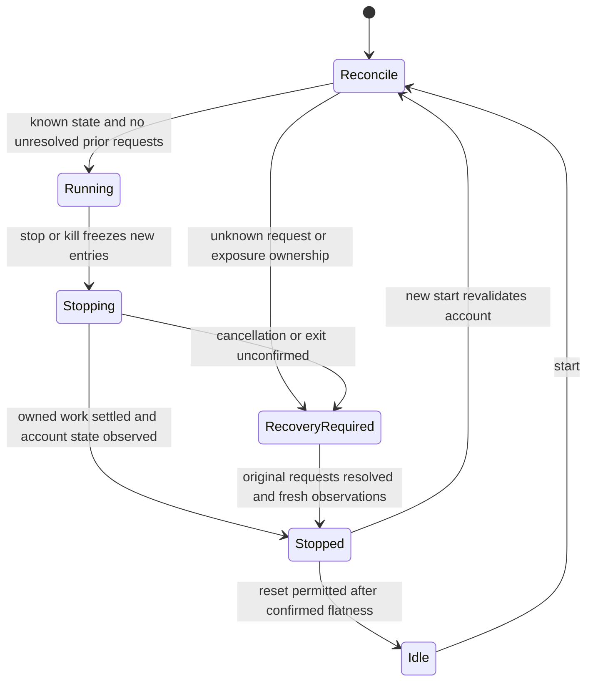

# D10: Stop, reset and restart must preserve execution uncertainty

**Status:** Batch A approved by the user's “Yes” and implemented locally. Batch B remains proposed, unimplemented and separately gated by the original audit scope. No commit/push or deployment.
**Date:** 2026-10-07
**Decider:** User, under the original audit brief's bounded-batch approval rule.
**Reasoning mode:** Extra High while resolving lifecycle/state ownership; reassess for routine implementation once contracts and failure cases are settled.

## Context and evidence

Pinned base: `f57f95cd918200e02e9ca134a21b795fbd22373e`, plus the locally verified D1/D3–D9 repairs. The latest source hashes and exact reproduction output are in `docs/audits/SYSTEM_DISCOVERY_2026-10-07_evidence.json`, `shutdown_restart_review`. Historical project instructions are not design constraints for this fresh review.

The D9 executor retains uncertain submissions and cancellation intents in memory, and the running monitor recovers them by original identity. This protection ends at the session boundary:

| Actual source | Observed behavior and consequence |
|---|---|
| `LiveTradingService.stop:322` | Marks STOPPED and cancels monitor/WS before close attempts; never cancels pending entries. An acknowledged entry can remain working after Stop. |
| `LiveTradingService.kill_switch:363` | Attempts entry cancellation, then one-shot closure; unresolved requests remain in memory after recovery tasks stop. A return is not proof of flatness. |
| `LiveTradingService.reset:395` | Guards only RUNNING, then clears executor and recovery maps. Reset can erase outstanding requests and can interleave while Stop awaits task cancellation. |
| `LiveTradingService.get_status:429` | Omits PENDING entries from `pending_orders`; there is no account-flatness or recovery contract. |
| `LiveExecutor.__init__:35`; `LiveTradingService.start:142` | A new executor has empty order/intent maps; start replaces the old executor before startup reconciliation. There is no execution-state restore. |
| `LiveTradingService._startup_reconcile:787` | Validates observed positions/open orders and preserves protection, but cannot query an earlier unknown client ID that was discarded. |
| `BotStatus.tsx:1080` | Displays “all positions closed” based solely on `kill_switched`, despite unconfirmed exits. |

`backend/diagnostics/live_lifecycle_diagnostic.py` compiles selected actual definitions, with in-memory scripted adapters, without application imports or credentials. **16 safety conditions fail: eight cases repeated for LONG and SHORT.** Exit 1 means reproduced defects, not a passing regression suite. Controls confirm that Kill does attempt cancellation and D9 still refuses to book an unconfirmed exit.

The concurrent fixture observes cancellation of a background worker while Stop awaits that task, then performs Reset before Stop resumes. Reset succeeds; the original manager never receives closure and the stop response reports idle. It uses the actual task-cancellation await, not a fabricated suspension inside the exit callback (current exchange exit calls are synchronous). The startup fixture constructs a fresh executor using the same scripted adapter: the old executor still has an unresolved request, the new one has none, and empty scripted snapshots permit readiness with zero queries of the old client ID. This is a reconstruction-boundary reproduction, not a real process-crash or Phemex timing experiment. UI findings are source inspections, not browser-tested behavior.

## Decision and delivery boundary

Separate **entry admission**, **shutdown progress**, and **observed account state**. Persist execution intent before exchange submission. Reset clears presentation/session statistics only after execution recovery is settled; it is never a way to clear an execution safety block.

Deliver this as two separately reviewable batches. Batch A fixes current-process lifecycle handling. Batch B adds cross-process durability. Batch A alone must not be called crash recovery.

This is the **proposed** lifecycle, not a diagram of current behavior. Stopped describes completed bot shutdown; a separate account-state field describes exposure, unknown state, or observed flatness. Foreign/manual exposure must remain visible and must not be liquidated just to allow Reset.

## Options considered

| Option | Benefit | Cost / limitation | Disposition |
|---|---|---|---|
| Stop/reset guards and exchange snapshots only | Smallest initial repair; fixes same-process forgetting and UI claims | A process crash still loses unknown client IDs; snapshots cannot recover an identity they do not contain | Batch A containment only |
| Atomic JSON checkpoint of session state | Familiar and easy to inspect | Saving only after transport leaves a crash window; correct pre-send writes, concurrent callbacks, generations, ownership, corruption and replay rules would all need custom machinery | Not preferred for execution authority |
| SQLite execution journal plus explicit lifecycle controller | Transactions can commit request identity, intent and observation state together; supports deduplication and inspectable recovery | Adds schema/versioning and ownership work, disk latency, and restart fault tests; does not make exchange actions atomic with local commits | Recommended for Batch B |
| Separate execution service / external broker | Could separate scanner and execution lifetimes more strongly | Adds a deployment boundary and operational dependencies before the current invariants are established | Defer; not needed for this local repair |

SQLite's documented atomic-commit behavior depends on filesystem locking and flush guarantees. A proposed local database uses explicit transaction boundaries and a durability setting verified at open; it is not a guarantee against broken storage. See [SQLite atomic commit](https://www.sqlite.org/atomiccommit.html) and [synchronous settings](https://www.sqlite.org/pragma.html#pragma_synchronous). Choice of journal mode must be tested with the process-ownership scheme, rather than relying on defaults. This recommendation is an architectural judgment for this app.

## Batch A — lifecycle containment and truthful UI

**Bounded behavior change:** Stop and Kill freeze new entries, cancel pending entry remainders, preserve native protection until exits are confirmed, and continue narrowly scoped recovery while unresolved requests exist. Start/Reset cannot replace this state. Unconfirmed shutdown is explicit in API and UI.

1. Give lifecycle commands one owner. Serialize Start/Stop/Kill/Reset transitions and make repeated stop/kill requests join the same shutdown operation. Reset must be rejected while a transition/recovery is pending; it cannot queue and later silently erase a different session. A session generation prevents a callback from a prior owner mutating a replacement session. All automatic duration/drawdown callers use the same path.
2. Freeze executor entry admission before cancelling the scan. An in-flight worker or scan result must not send a late entry after the stop request. Let known requests reach an observed outcome; cancelling an asyncio task does not undo an already sent exchange request. Task cancellation is cooperative; Python recommends cleanup and propagation of cancellation ([Python 3.12 task cancellation](https://docs.python.org/3.12/library/asyncio-task.html#task-cancellation)).
3. Cancel both acknowledged and uncertain entry remainders using original IDs. Retain failed/unknown cancellations. Reconcile fills that occur during cancellation before considering shutdown settled. Recovery can query/cancel known requests, protect known exposure and close confirmed owned quantities; it cannot scan for new trades. Unknown ownership or unmatched partial exits remain visible and block completion rather than cause speculative extra orders.
4. Keep a recovery supervisor and required fill observations alive until outstanding requests settle. A bounded HTTP wait returns the current state; it does not claim shutdown succeeded or cancel the supervisor. Preserve native protection on uncertain exits. A broken recovery task raises an observable recovery-required state.
5. Verify account positions and all relevant open/conditional orders before claiming flatness. Snapshot completeness, pagination and scope must be validated; unsupported/incomplete responses remain unknown. A new write invalidates previous flatness evidence. Display observation time; re-observe for Start/Reset rather than treating an old flat snapshot as permanent permission. Never cancel foreign protective orders or flatten unowned positions solely to clear a guard.
6. Expose unresolved orders and shutdown state; PENDING must remain visible. Existing top-level status values can remain for compatibility. Add a typed lifecycle object and use it in the UI's routing, session priority, warning and action availability. `kill_switched` alone must never produce “all positions closed.” Missing lifecycle data is unknown, not confirmed flat.

Proposed additive status contract (final exact names belong in implementation tests):

| Field | Meaning / consumer |
|---|---|
| `lifecycle.phase` | `idle`, `starting`, `running`, `stopping`, `recovering`, `stopped`; operation progress |
| `lifecycle.entry_admission_enabled` | Whether this session may add entry risk; executor enforces it |
| `lifecycle.recovery_required` | Outstanding request/state ownership requires attention; prioritizes status display |
| `lifecycle.account_state` | `unknown`, `exposure_present`, `flat_confirmed`; independent of scan state |
| `lifecycle.observed_at` | UTC time of the supporting complete account observation, or null |
| `lifecycle.reset_allowed` | Server-computed eligibility, revalidated when Reset is requested |
| `lifecycle.unresolved_requests` | Client/exchange identities, symbol, purpose, known filled quantity and reason; no secrets |
| `lifecycle.unmanaged_symbols` | Observed exposure outside this session's management |

**Affected production files and callers:**

- `backend/bot/live_trading_service.py`: lifecycle methods, scan/monitor admission, recovery ownership, status and completion.
- `backend/bot/executor/live_executor.py`: explicit entry freeze, request/recovery snapshot interface; do not modify strategy/risk thresholds.
- `backend/api_server.py`: existing lifecycle routes, awaited Reset if needed, conflict responses and accurate stop/kill descriptions. No new route required.
- `src/services/liveTradingService.ts`: typed lifecycle/status contract and error propagation.
- `src/services/activeSession.ts`: unresolved live execution takes priority over a running paper session.
- `src/pages/BotStatus.tsx`: truthful shutdown/flatness message, pending requests, Reset eligibility; retain the current layout.
- `src/pages/BotIndex.tsx`, `src/pages/BotSetup.tsx`: unresolved live state routes to status, not a fresh start form.
- `src/context/ScannerContext.tsx`: beacon must not hide unresolved execution just because scanning stopped.

`PositionManager` continues to consume the boolean exit callback; success must still mean the requested exit was confirmed. Actual fill-price/fee accounting is separate follow-up work. The paper service's simulation path is not redesigned in A. Its use of `LiveExecutor` for testnet is a known shared consumer, so additive executor methods must preserve that caller; A's service-level protections do not automatically protect the paper-testnet lifecycle.

**Meaningful verification:** long/short acknowledged entry Stop; timeout and late fill during cancellation; stop with no exposure; complete vs incomplete flat snapshots; partial exit remains pending; repeated Stop/Kill; Reset and Start during an awaited exit/startup; late scan callback after freeze; monitor failure; native protection retained; recovery persists after the HTTP response. Test the API's conflict/status shape and the active-session priority/routing/message branches. Keep the 339 prior focused tests and guarded structural smoke as regression coverage. D2 journal-contract drift remains separately reported.

**Rollback:** revert only A's source/tests/docs relative to the pre-A working tree. Do not delete runtime records or deploy an older version while unresolved exposure remains. No threshold, journal history or strategy rollback belongs to this batch.

## Batch B — durable execution identity and conservative restart

**Approved after A by the user's “Ok go”, now implemented locally:** a small execution journal integrated into every order-capable `LiveExecutor` caller, plus conservative reconstruction. Full automatic restoration of strategy-managed positions is not included.

1. Store versioned request records under the existing ignored project `.live_trading/` runtime directory, independent of session IDs. Use separate explicit testnet/production stores. Bind a store to an exchange/environment/credential fingerprint without persisting keys. Credential rotation or a changed account binding must not silently select an empty store; refuse mutation until existing recovery is resolved/rebound through a reviewed procedure. A fingerprint is not an exchange account ID and cannot detect another credential or machine operating the same account.
2. Require one local mutation owner for the store across both LiveTradingService and paper-service testnet use. Acquire an OS-released process lock before trading initialization; use short DB transactions, not a transaction held across network calls. SQLite's per-transaction writer serialization alone is not an exclusive execution-owner lease. A second process/service can inspect status but cannot submit/cancel. Prove Windows lock release after process death and same-process double ownership. No claim of a distributed/account-wide lock.
3. Commit client ID, request purpose, symbol, side, amount, price/trigger, reduce-only flag, generation and cancellation intent **before** their corresponding exchange writes. Keep service ownership links and observed cumulative fill watermarks. Record observations with source and timestamps. Failure to persist before transport means no new submission; failure after transport leaves the prewritten intent unresolved and latches recovery required. Keep existing native protection; do not fall back to unjournaled automated requests when storage is unavailable.
4. Restore identities/intent before admission, query original IDs, and reconcile with authoritative account observations. Unknown/not-found is not proof that the exchange rejected a submission. Never resubmit an uncertain order under a fresh ID. A committed-but-never-sent intent may require operator reconciliation if exchange absence cannot be proven; accept that availability cost.
5. Do not replay stored cumulative fills as fresh position deltas on top of a restored account snapshot. Preserve observation watermarks and distinguish the request ledger from account-position truth and strategy ownership. Restart begins in recovery-only mode. Existing exposure/protective orders remain visible and preserved; automatic strategy resumption requires a later design with a complete plan/position serializer. Historical P&L is not reconstructed from guessed close prices.
6. Detect unsupported schema, invalid records, corrupt/missing expected storage and mismatched binding as explicit blockers. A truly first installation needs a deliberate bootstrap and complete account reconciliation; deletion or corruption must not be silently treated as a fresh flat account. Define a separate initialized-store marker so accidental database loss is detectable. Reset never deletes journal records or that marker.
7. Keep read-only preflight separate from trading initialization. The current preflight route constructs a real executor, whose constructor calls `set_position_mode_one_way`; this is a source-confirmed side effect, not exercised against an account. Preflight must not acquire execution ownership, create a replacement empty journal, or mutate position mode.

**Affected scope:** new `backend/bot/executor/execution_journal.py`, `live_executor.py`, `live_trading_service.py`, the paper service's testnet constructor/lifecycle integration, existing API preflight/status handling, and possibly small read-only helpers in `backend/data/adapters/phemex.py`. The shared testnet caller must either support the same recovery/ownership contract or refuse new order-capable sessions while recovery is required. An unguarded bypass is not acceptable. Add new journal/restore tests and a non-mutating recovery diagnostic; update this decision and audit evidence/coverage. Final schema/API deltas must be reviewed before any baseline capture.

**Fault verification before completion:** separate-process interruption before intent commit, after commit/before send, after send/before acknowledgment save, after partial-fill observation, and during cancel; duplicate/out-of-order WS+REST; disk full/permission failure; DB corruption/missing marker/store; account/environment mismatch; credential rotation; duplicate owner; terminal fill replay without position doubling. Tests use temporary stores and scripted transports only. An exchange protocol integration claim still requires a separately authorized testnet experiment.

**Rollback:** preserve journal/marker/lock metadata and reconcile outstanding requests before returning to a version that cannot read them. Schema downgrades and data deletion are not an acceptable rollback mechanism. No live orders, credential use, deployment or publishing is authorized by this proposal.

## Consequences and next checkpoint

The UI becomes honest about incomplete shutdown, and a session can no longer erase its own pending recovery. New starts may be blocked longer when exchange evidence is missing; this is intentional and must carry actionable reasons. Storage and lifecycle logic add complexity that must earn its place through fault tests, not the presence of a database file.

B's implementation and verification are recorded below. Account-equity semantics, cumulative-average fill pricing, actual fees/close provenance, D2 contract sampling and the broader scanner/strategy audit remain open. This is not a complete-system or live-readiness claim.

## Batch A implementation checkpoint

The lifecycle controller rejects overlapping Start/Reset transitions, freezes executor entry admission before shutdown, and keeps one recovery supervisor after the HTTP response. Stop and Kill join that supervisor; Kill can upgrade the reason. A cancelled supervisor retains its shielded in-flight mutation worker so a retry cannot launch a duplicate worker. The normal monitor stops; recovery separately polls original identities, cancels entry remainders, adopts confirmed terminal fills before exits, and retains unmatched partial exits. WS observations remain active until shutdown is confirmed. Session generations guard late scan progress/results and task callbacks. The paper-testnet caller retains its existing executor defaults; its separate service lifecycle is not repaired by A.

Reset is now async and re-observes the account before clearing state; Start does the same before replacing an existing stopped session. Existing routes return HTTP 409 for lifecycle conflicts. Status adds the typed `lifecycle` object above, plus `scope`, `account_open_orders` and an optional `reason`. Account state describes the **last complete observation**, with UTC `observed_at`; elapsed time alone does not invent a new recovery incident. A local execution revision change invalidates the observation, and command-time checks always obtain a fresh one. UI copy explicitly says “observed flat,” keeps unresolved live state ahead of paper activity, and disables unsafe Reset/reconfiguration. The API's existing dynamic dictionary response does not expose these fields to the current static contract snapshot; dedicated behavior and consumer tests cover them.

**Necessary adapter addition:** inspection of installed CCXT 4.5.49 found `fetch_open_orders(None)` raises `ArgumentsRequired`. A calls the new `PhemexAdapter.fetch_account_snapshot` from startup and shutdown observation. It refreshes the market inventory, sweeps each USDT perpetual symbol's active orders, then queries the USDT account's positions. It checks response status, required collections, order identity/type/status, quantities and truncation/pagination indicators. Missing/unusable data blocks flatness. The scope is explicitly `phemex:swap:USDT`; spot and other collateral accounts are not declared flat. Phemex documents symbol-scoped active orders, including untriggered orders, in [its perpetual API](https://github.com/phemex/phemex-api-docs/blob/master/Public-Hedged-Perpetual-API.md#query-open-orders-by-symbol). No real request was sent during verification.

**Cost and limits:** a sweep can require many requests and take substantial time; it runs off the API event loop. Stop returns after at most its 250 ms scheduling wait while recovery continues (this is not a whole-server latency SLA). Complete remote observations retry every 60 seconds when local requests are settled; unresolved local requests retry every 5 seconds. The sweep is not an atomic exchange snapshot, cannot fence another machine/manual trader, and does not prove absence of an unknown request lost in an earlier process. Unsupported/delisted products, unavailable markets or incomplete responses conservatively retain recovery. No foreign positions are liquidated to clear Reset. Full process restart durability and read-only preflight separation remain B work.

**Verification:** 396 guarded backend tests pass (339 prior + 57 new), 27 frontend tests pass, TypeScript `--noEmit` passes, structural smoke 8/8. Contract diff has only the pre-existing D2 historical-journal 45→25-key drift; API/telemetry/pipeline are clean. The revised standalone diagnostic reports 14/16 safety conditions met, with exactly the two fresh-executor identity-loss cases left for B (exit 1 intentionally). The new parser tests execute installed CCXT against scripted responses without networking; an initial fixture incorrectly used request field `ordType` instead of response field `orderType`, then was corrected against the installed parser's contract. These checks do not establish actual Phemex response timing, live exchange completeness, a browser-rendered UI or process-crash recovery.

Pre-A backup: `C:/Users/macca/AppData/Local/Temp/snipersight-lifecycle-a-bc8zy48r`. Durable runner source, results, exact file hashes, new contract shape and remaining limitations are recorded under `lifecycle_containment_fix` in the audit evidence/coverage JSON. Historical journal, DB contract baseline/checker and paper service are unchanged.

## Batch B implementation checkpoint

The user's **“Ok go”** authorized B following the completed A checkpoint. Reasoning recommendation: **Extra High** for this state-ownership architecture; routine follow-up implementation can be reconsidered once its scope is clear. Existing repository instructions remain superseded by the fresh-review override. No commit, push, deployment, real order or credential use was performed.

### Storage and ownership decision

`ExecutionJournal` uses fixed `.live_trading/execution-testnet.sqlite3` and `execution-production.sqlite3` paths, independent of session and credential IDs. A SHA256 binding includes exchange, USDT-swap scope, environment and API key identity; keys/secrets are not stored. Key rotation does not silently select a new empty database. A separately flushed `.initialized` marker binds schema version 1, store UUID and fingerprint. Missing one member, corruption, unsupported schema or unusable records blocks initialization. If both database and marker are deleted, local software cannot distinguish that from a first installation. Initial Start bootstraps storage, then requires a complete flat account observation before admission. No automatic rebind, migration or repair procedure is supplied.

One owner holds a byte-range lock on Windows and an advisory flock on POSIX, plus a same-process registry. The implementation uses nonblocking [Python msvcrt locking](https://docs.python.org/3.12/library/msvcrt.html#msvcrt.locking). SQLite transactions are short, use DELETE journaling and checked `synchronous=FULL`; see [SQLite synchronization semantics](https://www.sqlite.org/pragma.html#pragma_synchronous). Network calls do not run inside database transactions. The verified guarantee is process-interruption recovery on this Windows host, not a hardware power-loss guarantee. The store must be on a local filesystem. Another machine, another checkout with another store, or manual exchange activity is not fenced by this lock.

Schema 1 has three tables: `metadata(singleton, version, store_id, binding, clean)`, `requests(order_id, intent, state)`, and `events(sequence, order_id, kind, source, observed_at, payload)`. Intent and state are validated JSON. Intent includes client ID, symbol, side/type, quantity, price/trigger, purpose, reduce-only, service owner/session generation and the complete submitted wire arguments. State includes exchange ID, cumulative fill watermark/average, status, cancellation intent, unknown/rejection reason and timestamps. Events retain submission attempts, cancellations, observations, ownership acquisition and confirmed-flat checkpoints. This is a request ledger, not a trade-history or strategy-position serializer. Historical journal data is untouched. No retention/pruning is introduced; storage growth needs future operational review.

All entry, reduce-only exit and native protective submissions pass through a durable-before-send wrapper. Cancellation intent commits before cancellation transport. Storage failure blocks further automated writes and keeps original committed intent for recovery; there is no unjournaled fallback. Stored cumulative fills are restored as watermarks and never replayed into account cash/positions. Restored orders are queried using their original IDs. A missing exchange order is still uncertain, including an intent committed before transport began. That case can require operator reconciliation rather than a replacement order. A clean checkpoint requires no unresolved requests or in-flight mutation and an unchanged execution revision since the flat snapshot.

### Service integration and behavior changes

Live startup restores the ledger before strategy construction. An interrupted owner starts a recovery supervisor with entry admission frozen, queries originals, cancels known entry remainders and observes account exposure. It never constructs old strategy positions, submits guessed replacement orders, liquidates unmanaged exposure or retries old native-protection cancellations. Native protection remains visible and is observed. Existing foreign orders, including plain limits formerly cancelled during startup, now block a fresh session and are preserved. Reset/Start cannot clear unresolved execution. After verified flat shutdown, Reset/replacement closes the local lease without deleting the journal or marker.

The API preflight uses a dedicated read-only function and no longer constructs a real executor, acquires its lease, creates a journal or changes position mode. Position-mode initialization moves after flat account reconciliation. Clock-check unavailability is explicit in preflight issues. No endpoint was added.

Paper-testnet uses the same journal and local lease. Start/Stop/Reset transitions are serialized; a restored interrupted journal refuses a paper-testnet start and directs recovery to the live service configured for testnet. Fresh testnet starts require a complete flat account. Stop freezes entries; unresolved requests, positions, active workers or storage failure block Start/Reset and retain ownership. Status/repeated Stop expose `execution_recovery`, `recovery_required` and `recovery_reason`. A confirmed-flat paper-testnet stop can checkpoint and release ownership. Paper simulation retains its executor and fee behavior. This does **not** give the paper service A's full recovery supervisor: if its stopped session retains unresolved requests, restart the process and use live-testnet recovery for that store. Never delete state to bypass this restriction. Automatic paper strategy restoration is not implemented.

Recovery initialization occurs when Start is requested with the matching environment/credentials, not automatically at API boot. Read-only offline inspection is available with `python -B backend/diagnostics/execution_recovery_diagnostic.py --inspect <store-path>`; it needs no credentials and acquires no mutation lease. It returns recovery-required for damaged/unresolved storage. Full automatic startup discovery/UI attachment and account rebind tooling remain outside this batch.

### Verification and limits

Final exact commands/results and file hashes are under `durable_execution_recovery_fix` in the audit evidence and coverage JSON. Focused tests exercise long/short identity restoration, duplicate/out-of-order observations, terminal/partial fills over restored account snapshots, native protection, service startup exclusion, pre/post-send storage failures, actual transaction rollback, missing/corrupt storage, credential/environment mismatch, stale-reference mutation, read-only preflight and paper-testnet replacement guards. Prior lifecycle tests now use explicitly injected temporary journals; no production durability bypass was added for tests. Old startup-cancellation expectations were updated to the intended preservation rule, with a complete-flat positive control.

The standalone crash diagnostic passes **11/11** cases: a competing live process is refused, forced process death releases the Windows lock, and BUY/SELL process exits before intent commit, after commit/before send, after scripted send/before observation, after a partial-fill save and during cancellation preserve the expected ledger. Child processes strip credentials, disable dotenv, reject external sockets/nested subprocesses, and restrict writes to temporary fixtures. A diagnostic guard initially raised RuntimeError for a dependency's optional Git version probe; switching the denial to OSError allows the dependency's existing fallback without allowing subprocess execution. The lifecycle diagnostic passes **16/16** conditions with temporary durable stores (fresh-object reconstruction, separate from OS-death tests).

Guarded pipeline smoke is clean. Contract diff contains the pre-existing D2 45→25 historical-row shape drift plus the **expected three new tables and table count 2→5**. API, telemetry and pipeline contracts remain clean. No baseline was captured or weakened. SQLite record semantics are also checked directly because the existing extractor only snapshots table shapes. Frontend code was not changed in B; A's 27 frontend tests and typecheck remain its last verification.

No test used real exchange transport, production/testnet credentials, account balances or actual trading. The complete-account sweep remains non-atomic with respect to external actors, and native protection cannot be reconstructed if the exchange never accepted it. Storage failure intentionally sacrifices availability. Fill-cost/fee provenance, account-equity basis, strategy resumption, operator reconciliation of forever-unknown IDs and the broader scanner audit remain open.

Pre-B backup: `C:/Users/macca/AppData/Local/Temp/snipersight-durable-b-kb08p9ce`. Rollback must preserve the runtime database, marker and lock metadata and reconcile exposure before running older code that cannot read this ledger. The historical journal, contract baseline/checker and unrelated user changes are preserved.
