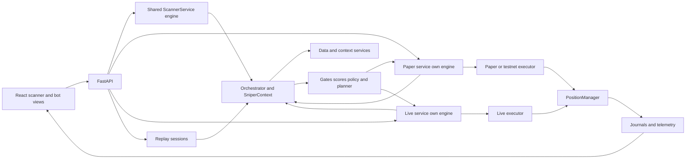
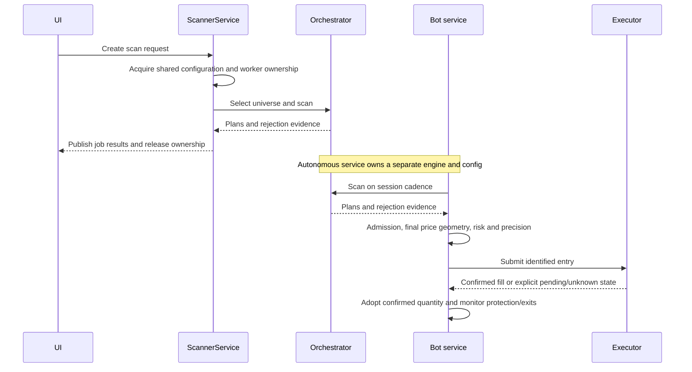
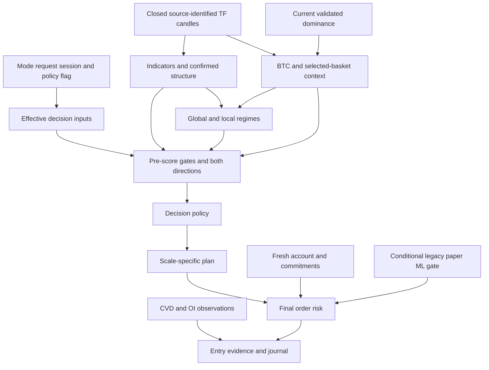
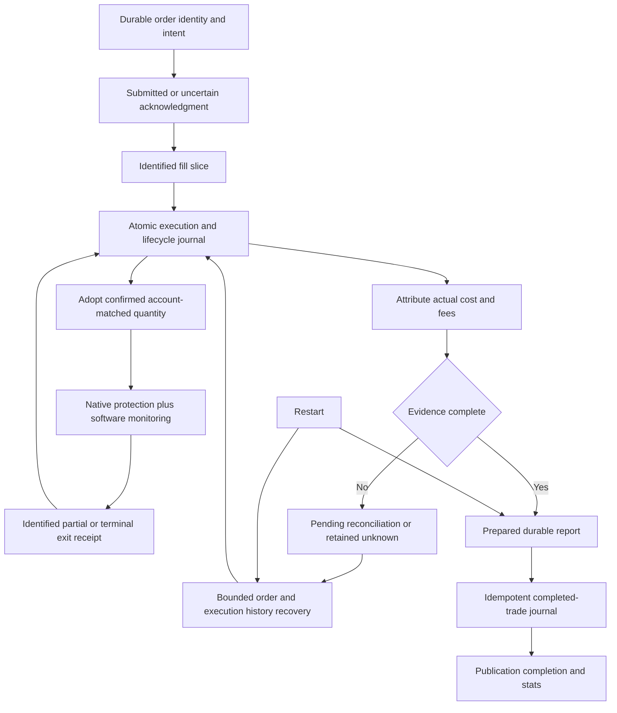

# SniperSight: current navigation

Reviewed 2026-10-08. Local work builds on commit
`140f42e92addec5e66e8547cbb9b800bb24e4f43`, branch
`claude/decision-core-heart`. This document describes that **working tree**, not
a deployed release. Source hashes and inspection boundaries are in the
[coverage ledger](audits/SYSTEM_DISCOVERY_2026-10-07_coverage.json).
The initial discovery commit and earlier checkpoints remain historical evidence.

The offline review and bounded repair pass are complete. This is a navigation
map of the product's critical paths, not a claim that every inventoried file,
strategy branch, exchange protocol or historical trade has been certified.
Start with the [current findings and next work](audits/SYSTEM_DISCOVERY_2026-10-07.md#current-disposition-and-follow-up-plan).

## Entry points and state owners

| Area | Implementation / key symbols | Responsibility and boundary |
|---|---|---|
| Development startup | [package.json](../package.json), [Vite config](../vite.config.ts), `backend.api_server:app` | `npm run dev:all`: API **8001**, UI **5000**. Other scripts/overrides may differ. API import loads environment and constructs adapters/stores; use guarded verification. |
| UI | [App](../src/App.tsx), [ScannerContext](../src/context/ScannerContext.tsx), [ScanController](../src/components/hud/ScanController.tsx), [API client](../src/utils/api.ts) | Scanner inspection settings and bot session settings have separate owners. |
| Scan requests | [scanner routes](../backend/routers/scanner.py), [ScannerService](../backend/services/scanner_service.py) `create_scan`, `_execute_scan` | In-memory jobs; configuration, adapter/universe selection, scan and publication serialized on the shared engine. Cancellation does not release ownership while its worker is still running. |
| Paper / training | [PaperTradingService](../backend/bot/paper_trading_service.py) `start`, `_run_scan`, `_process_signal` | Own config, orchestrator, scan/monitor/CVD tasks, pending plans and session logs. `use_testnet` selects the shared live executor; the name “paper” alone does not identify execution safety. |
| Live | [LiveTradingService](../backend/bot/live_trading_service.py) `start`, `_run_scan`, `_process_signal` | Own engine, account reconciliation, WS/backfill workers, executor and position manager. No live session was started for this review. |
| Universe and data | [pair_selection](../backend/analysis/pair_selection.py) `_select_symbols_impl`; [Phemex](../backend/data/adapters/phemex.py); [ingestion](../backend/data/ingestion_pipeline.py); [cache](../backend/data/ohlcv_cache.py) | Ranked symbols/categories, canonical market identity, normalized candles, completed-bar boundary and source/depth-aware reuse. Category backfill/reporting conflict remains documented. |
| Decision pipeline | [Orchestrator](../backend/engine/orchestrator.py) `scan`, `_process_symbol`; [SniperContext](../backend/engine/context.py); [decision policies](../backend/engine/decision.py) | Global inputs, per-symbol context, gates, both directional scores, policy, plan and rejection aggregation. Read the effective config, not just mode defaults. |
| Features | [indicator service](../backend/services/indicator_service.py), [SMC service](../backend/services/smc_service.py), [SMC detectors](../backend/strategy/smc), [regime detector](../backend/analysis/regime_detector.py) | TF-specific indicators/structure/mitigation, private regime caches. Formation-time checks do not certify every detector's confirmation-bar convention. |
| Score and plan | [confluence service](../backend/services/confluence_service.py), [scorer](../backend/strategy/confluence/scorer.py), [planner](../backend/strategy/planner) | Weighted evidence/gates and cascade geometry. `ranking_heuristic` preserves the previous score/RR ordering; it is uncalibrated. |
| Account and orders | [AccountRuntime](../backend/bot/executor/accounting_runtime.py), [LiveExecutor](../backend/bot/executor/live_executor.py), [PaperExecutor](../backend/bot/executor/paper_executor.py), [PositionManager](../backend/bot/executor/position_manager.py) | Account snapshot owns financial state; identified execution evidence owns fill quantities; manager owns strategy triggers. See the [detailed accounting map](audits/SYSTEM_DISCOVERY_2026-10-07.md#current-execution-and-accounting-map--2026-10-08). |
| Durable evidence | [ExecutionJournal](../backend/bot/executor/execution_journal.py), [reports](../backend/bot/executor/execution_reports.py), [trade journal](../backend/bot/trade_journal.py), [telemetry](../backend/bot/telemetry) | Atomic execution/lifecycle evidence, retryable reports, deduplicated completed trades, scan events. Schema-v3 cutover is explicit; actual stores were not migrated. |
| Diagnostic UI | [Gauntlet](../src/components/hud/GauntletBreakdown.tsx), [RejectionPanel](../src/components/hud/RejectionPanel.tsx), [accounting view model](../src/services/accounting.ts) | Recorded rejections and honest denominators; unknown financial outcomes remain unknown. Threshold comparison is not another mode's replay. |
| Replay / research | [ReplayEngine](../backend/engine/replay_engine.py), [replay routes](../backend/routers/replay.py), [ML](../backend/ml) | Replay owns sessions and causal navigation. Missing historical macro inputs produce unavailable analysis, not present-day substitution. ML is a conditional paper admission gate in legacy policy; it is not a scanner score factor. |



## Decision contracts and configuration precedence

These are code-inferred contracts with selected offline regression evidence.
They are not assertions about the currently running process or exchange.

| Stage / owner | Inputs → outputs; units and time | Freshness / authority / consumers |
|---|---|---|
| Configuration: service + `apply_mode` | Mode → profile, critical TFs, planner TF, thresholds; request/session overrides follow | Scanner accepts a positive request score override after mode application. Paper applies sensitivity/custom score, soft floor, planner and macro overrides; live applies sensitivity/custom values and STEALTH. Both bots enable fusion; scanner defaults differ. No threshold retuned in this pass. |
| Policy: `decision.py` | Process flag → legacy or thesis policy; thesis uses structural direction and abstention | Engine caches policy at construction; some cascade/bot gates reread the flag. Mid-session mutation can mix policies. Persist an immutable effective snapshot in a future contract change. |
| Universe: selector + caller filters | Adapter ranking/category/market/leverage → symbols and drop reasons | Fallback lists and heuristic perp detection exist. Backfill may select an excluded category. Paper/live add admission checks. Selected basket also influences macro breadth. |
| Candles: adapter/ingestion/cache | Canonical exchange market + TF → UTC OHLCV; timestamps are bar opens, prices in normalized quote units | Closed when open + duration ≤ as-of; unfinished rows removed. Weekly grid is seven days. Cache namespaces include public source identity and require requested depth. Chart raw-forming candles do not contaminate analysis cache. Monthly `1M` normalization remains unresolved. |
| Indicators: indicator service | Completed TF frames → RSI/ADX/MACD, price-unit ATR, bands and volume features | Warm-up varies by indicator; full warm-up/NaN matrix is not certified. Percentage volatility is ATR / reference price ×100. Invalid ATR/price now rejects; no raw-unit fallback. Daily volatility bands reused on other TFs still need calibration evidence. |
| Structure: SMC service/detectors | TF OHLCV → OB/FVG/BOS/CHoCH/sweeps/levels; price levels and timestamps | Strict UTC rows after formation own mitigation/FVG fill/lifecycle. Two-sided pivots require later bars within the supplied prefix; event-time vs confirmation-time semantics need a separate causal fixture matrix. |
| Macro: orchestrator + dominance service | BTC one-hour price change, selected alt-basket changes, real dominance percentages → context | Dominance must be finite 0–100, sum consistently and within existing TTL. Stable-flow “velocity” is a breadth proxy here, not observed stablecoin flows. Alternative macro helper's dominance deltas have different units/provenance. Missing required overlay inputs reject. |
| Regimes: private detector | Global and per-symbol TF indicators + macro → dimensional labels and scores | Service/engine ownership isolated. Global derivatives dimension currently supplies balanced/50, not live funding evidence. Some RegimePolicy fields are declarative only. |
| Gates and scores: confluence service/scorer | Structural and market context → rejection or LONG/SHORT breakdown | Pre-score gates and directional tie handling run before thesis policy. HTF composite, regime alignment, post-score bonus, macro and sizing can reuse correlated evidence. Bonus field mismatch reproduced; no arbitrary +5 activation. |
| Plan: direct/cascade planner | Direction + scale + price/ATR/structure → entries, stops, targets, RR | Cascade candidates share source context but differ in scale. Replay carries as-of price/time; live snapshots have separate freshness checks. Current replay cannot certify historical strategy outcomes without missing macro inputs. |
| Bot admission/sizing | Plan + risk percentage + account/session limits → final quantity and limit/stop prices | Final planned stop risk respects configured budget, applicable reductions, free margin and precision in selected tests. Fees, gaps and adverse execution are not bounded by this calculation. ML and countertrend checks differ by policy/service. |
| Execution/accounting | Identified acknowledgments/fills + raw combined account observation → lifecycle, reservations, priced receipts | Unknown/partial/duplicate events remain explicit. Wallet/free/used/equity use account evidence; trade costs/fees require actual execution attribution. No profit inference from account equity change. |
| Outcomes/UI | Completed quantities + actual costs/fees → prepared/published report; logs → rejection counts | Financial incompleteness blocks complete actual P&L. Diagnostics and universe exclusions do not inflate scored rejection totals. Historical records still have missing provenance and some fabricated fallback direction. |







Restart recovery above restores evidence/report delivery; it does not authorize
automatic strategy resumption or adopt unrelated exchange positions as owned trades.

## Reproducible verification and evidence

Use the project virtual environment, in separate processes:

```powershell
.\backend\venv\Scripts\python.exe -B backend/diagnostics/offline_verify.py backend
.\backend\venv\Scripts\python.exe -B backend/diagnostics/offline_verify.py contracts
.\backend\venv\Scripts\python.exe -B backend/diagnostics/offline_verify.py smoke
.\backend\venv\Scripts\python.exe -B backend/diagnostics/offline_verify.py inputs
```

[offline_checks.json](../backend/diagnostics/offline_checks.json) identifies the
selected backend modules; this is not the full repository suite. The wrapper
clears process configuration, denies credential-file reads/external transport and
child processes, and confines store writes to temporary fixtures. Backend tests
allow loopback for Python's async runtime. It is a guard against accidental side
effects in trusted checks, not a security sandbox for arbitrary extensions.

Frontend scope: `accounting.test.ts`, `liveLifecycle.test.ts`,
`scanHistoryService.test.ts`, `marketInputRejections.test.ts`,
`rejectionEvidence.test.ts`, excluding `**/.claude/**`; also `tsc --noEmit`.
No browser/visual snapshot pass or real-exchange test is implied. Earlier temporary
runners appended 130 test rows to the real telemetry DB; see the
[isolation correction](audits/SYSTEM_DISCOVERY_2026-10-07.md#verification-isolation-correction--material-exception-to-earlier-claims)
and [exclusion manifest](audits/SYSTEM_DISCOVERY_2026-10-07_test_telemetry.json).
The portable wrapper corrects that isolation gap; existing rows were preserved.

[Historical evidence](audits/SYSTEM_DISCOVERY_2026-10-07_historical.json) contains
the sanitized sample: 384 valid unique journal IDs, selected session records and
three complete telemetry runs. Original revision, frozen decision inputs and
execution-fee attribution are missing for historical performance reconstruction.
Recorded wins/losses alone cannot assign causality or validate current edge.

For changes: identify the affected contract and producer/consumer owners here,
read the current implementation, reproduce the assumption, make a bounded diff,
run relevant checks, and update this index plus the audit ledger when behavior
changes. Use symbols rather than treating old line numbers or diagrams as truth.
