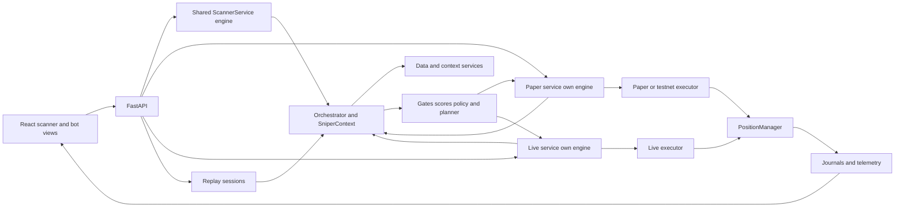
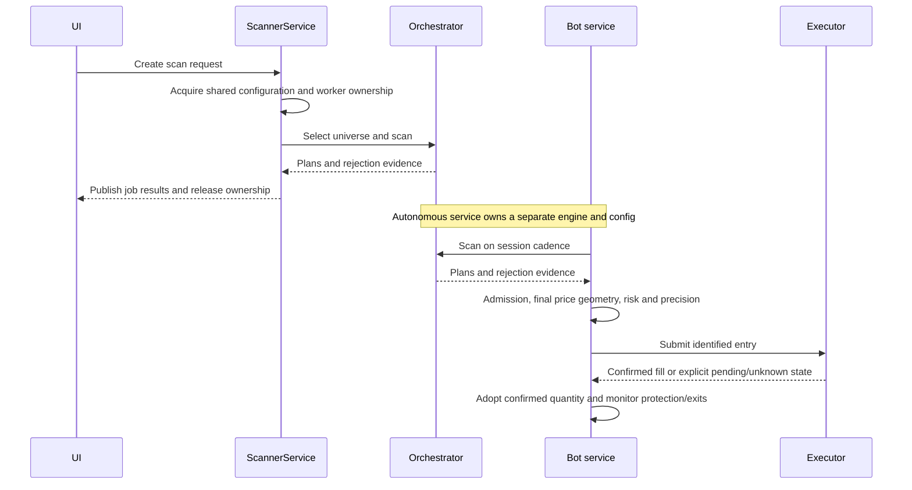
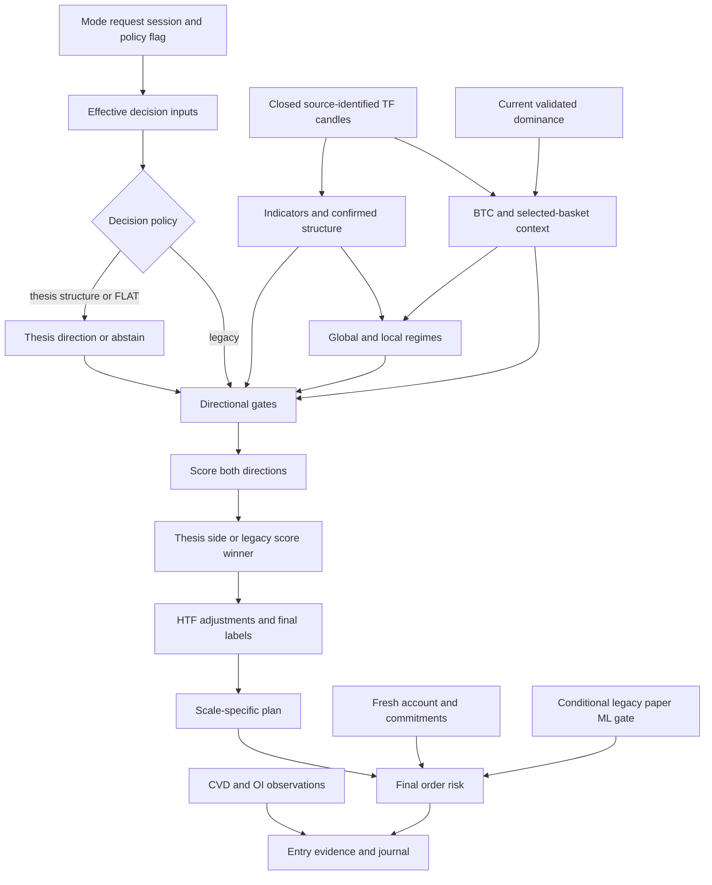
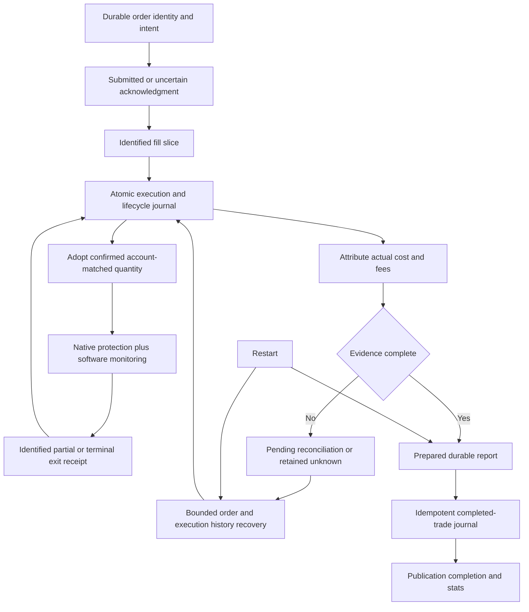

# SniperSight: current navigation

Contributor guidance: [AGENTS.md](../AGENTS.md). The 2026-10-08 stale-file cleanup
replaced the old rubric and retired obsolete setup, API/security and forensic
playbooks. See [the removal manifest](audits/STALE_FILES_2026-10-08.json).

Reviewed 2026-10-09. Local work builds on commit
`ace4bc3d9923d31f252ef9710b5f425ee26ba79d`, branch
`claude/decision-core-heart`. This document describes that **working tree**, not
a deployed release. Source hashes and inspection boundaries are in the
[coverage ledger](audits/SYSTEM_DISCOVERY_2026-10-07_coverage.json).
The initial discovery commit and earlier checkpoints remain historical evidence.

Restart follow-up (2026-10-09): the [UTC handoff correction](../backend/diagnostics/decisions/2026-10-09__utc-candle-handoff.md)
normalizes exchange timestamps before ingestion gap filling and publication.
The first real restart exposed a naive/aware boundary missed by earlier synthetic
fixtures. The dominance provider also now requires an API key; unavailable mode
advice remains an explicit runtime limitation until that source is configured.

The offline review and bounded repair pass are complete. This is a navigation
map of the product's critical paths, not a claim that every inventoried file,
strategy branch, exchange protocol or historical trade has been certified.
Start with the [current findings and next work](audits/SYSTEM_DISCOVERY_2026-10-07.md#current-disposition-and-follow-up-plan).

## Entry points and state owners

| Area | Implementation / key symbols | Responsibility and boundary |
|---|---|---|
| Development startup | [package.json](../package.json), [Vite config](../vite.config.ts), `backend.api_server:app` | `npm run dev:all`: API **8001**, UI **5000**. Other scripts/overrides may differ. API import loads environment and constructs adapters/stores; use guarded verification. |
| Windows desktop / phone access | [Windows launcher](../scripts/start_windows.ps1), [local access evidence](audits/LOCAL_ACCESS_2026-10-08.json) | Starts API **8001** and UI **5000** on localhost without reload; reuses healthy services, logs outside checkout. Host Tailscale Serve forwards private HTTPS **8446** to the UI. Dashboard startup leaves bots idle; this is separate from offline review evidence. |
| UI | [App](../src/App.tsx), [ScannerContext](../src/context/ScannerContext.tsx), [ScanController](../src/components/hud/ScanController.tsx), [API client](../src/utils/api.ts) | Scanner inspection settings and bot session settings have separate owners. |
| Scan requests | [scanner routes](../backend/routers/scanner.py), [ScannerService](../backend/services/scanner_service.py) `create_scan`, `_execute_scan` | In-memory jobs; configuration, adapter/universe selection, scan and publication serialized on the shared engine. Cancellation does not release ownership while its worker is still running. |
| Paper simulation | [PaperTradingService](../backend/bot/paper_trading_service.py) `start`, `_run_scan`, `_process_signal` | Own config, orchestrator, scan/monitor/CVD tasks, pending plans and session logs. Fixed mode is default. Opt-in adaptive simulated paper uses shared advice, an allowed list and two increasing4h observations to confirm changes. Stand-aside pauses new scans while monitoring continues. `use_testnet` selects the live executor and rejects adaptive selection. |
| Live | [LiveTradingService](../backend/bot/live_trading_service.py) `start`, `_run_scan`, `_process_signal` | Own engine, account reconciliation, WS/backfill workers, executor and position manager. Honors the selected fixed mode; adaptive selection is rejected before credentials/execution setup. No live session was started for this review. |
| Universe and data | [pair_selection](../backend/analysis/pair_selection.py) `_select_symbols_impl`; [Phemex](../backend/data/adapters/phemex.py); [ingestion](../backend/data/ingestion_pipeline.py); [cache](../backend/data/ohlcv_cache.py) | Ranked symbols/categories, canonical market identity, normalized candles, completed-bar boundary and source/depth-aware reuse. Category switches strictly filter the ranked pool; each unique candidate is selected or dropped once. |
| Decision pipeline | [Orchestrator](../backend/engine/orchestrator.py) `scan`, `_process_symbol`; [SniperContext](../backend/engine/context.py); [decision policies](../backend/engine/decision.py) | Global inputs, per-symbol context, gates, both directional scores, policy, plan and rejection aggregation. Read the effective config, not just mode defaults. |
| Features | [indicator service](../backend/services/indicator_service.py), [SMC service](../backend/services/smc_service.py), [SMC detectors](../backend/strategy/smc), [regime detector](../backend/analysis/regime_detector.py) | TF-specific indicators/structure/mitigation, private regime caches. Formation-time checks do not certify every detector's confirmation-bar convention. |
| Score and plan | [score policy](../backend/shared/config/score_policy.py), [evidence allocation](../backend/strategy/confluence/evidence_policy.py), [confluence service](../backend/services/confluence_service.py), [scorer](../backend/strategy/confluence/scorer.py), [planner](../backend/strategy/planner) | `family-evidence-v2` has eight fixed budgets, explicit eligibility and shared cutoff bands. The [whole-policy decision](../backend/diagnostics/decisions/2026-10-09__score-policy-balance.md) supersedes the earlier unchanged-cutoff conclusion. Scores and score/RR ranking remain uncalibrated. |
| Account and orders | [AccountRuntime](../backend/bot/executor/accounting_runtime.py), [LiveExecutor](../backend/bot/executor/live_executor.py), [PaperExecutor](../backend/bot/executor/paper_executor.py), [PositionManager](../backend/bot/executor/position_manager.py) | Account snapshot owns financial state; identified execution evidence owns fill quantities; manager owns strategy triggers. See the [detailed accounting map](audits/SYSTEM_DISCOVERY_2026-10-07.md#current-execution-and-accounting-map--2026-10-08). |
| Durable evidence | [ExecutionJournal](../backend/bot/executor/execution_journal.py), [reports](../backend/bot/executor/execution_reports.py), [trade journal](../backend/bot/trade_journal.py), [telemetry](../backend/bot/telemetry) | Atomic execution/lifecycle evidence, retryable reports, deduplicated completed trades, scan events. New signal/position/completion records include strategy provenance; historical rows stay unchanged. Schema-v3 cutover is explicit; actual stores were not migrated. |
| Diagnostic UI | [Gauntlet](../src/components/hud/GauntletBreakdown.tsx), [RejectionPanel](../src/components/hud/RejectionPanel.tsx), [accounting view model](../src/services/accounting.ts) | Recorded rejections and honest denominators; new paper/live scan rejections preserve absent direction as UNKNOWN. Unknown financial outcomes remain unknown. Threshold comparison is not another mode's replay. |
| Market display / mode hints | [MarketRegimeService](../backend/services/market_regime_service.py), [SerializedWorker](../backend/shared/async_worker.py) | One private daily BTC snapshot with named weekly/4h context, source close times and expiry. Display and advice share it through SerializedWorker. [Mode advice](../backend/analysis/mode_recommendation.py) returns an allowed mode, stand-aside or unavailable; scanner choices remain manual. |
| Replay / research | [ReplayEngine](../backend/engine/replay_engine.py), [replay routes](../backend/routers/replay.py), [ML](../backend/ml) | Replay owns sessions and causal navigation. One admitted route worker retains ownership through cancellation; status/delete/GC coordinate with navigation. Missing historical macro inputs produce unavailable analysis, not present-day substitution. Pre-existing ML code has a conditional legacy paper hook, but its activation was not established. The user excludes ML implementation/training from this work. |



## Decision contracts and configuration precedence

These are code-inferred contracts with selected offline regression evidence.
They are not assertions about the currently running process or exchange.

| Stage / owner | Inputs → outputs; units and time | Freshness / authority / consumers |
|---|---|---|
| Configuration: service + `apply_mode` | Mode → profile, critical TFs, planner TF, thresholds; request/session overrides follow | All callers apply the selected complete playbook before indicators, including MACD, entry/trigger roles, planner settings and fixed VAP horizon. [Strategy policy](../backend/shared/config/strategy_policy.py) clamps scanner/bot overrides to the mode minimum. Paper passes its qualified sizing floor into the core and keeps its full-size gate for entry. Live uses its admission gate. Profile-only fusion and STEALTH cross-profile cascade are disabled; STEALTH swing entries remain excluded. |
| Policy: `decision.py` | Process flag → legacy or thesis policy; thesis uses structural direction and abstention | Engine caches policy at construction; some cascade/bot gates reread the flag. Mid-session mutation can mix policies. Plans now record mode/policy provenance, inherited by positions and completed records; this is not a full replayable configuration snapshot. |
| Universe: selector + caller filters | Adapter ranking/category/market/leverage → symbols and drop reasons | Initial fallback candidates pass all filters; disabled categories are never backfilled. The limit is a maximum; all switches off includes all categories. Paper/live stop empty or failed selection before the engine and add their own admission checks. Selected basket also influences macro breadth. |
| Candles: adapter/ingestion/cache | Canonical exchange market + TF → UTC OHLCV; timestamps are bar opens, prices in normalized quote units | Closed when open + duration ≤ as-of; unfinished rows removed. Weekly grid is seven days. Cache namespaces include public source identity and require requested depth. Chart raw-forming candles do not contaminate analysis cache. Monthly `1M` normalization remains unresolved. |
| Indicators: indicator service | Completed TF frames → RSI/ADX/MACD, price-unit ATR, bands and volume features | Warm-up varies by indicator; full warm-up/NaN matrix is not certified. Percentage volatility is ATR / reference price ×100. Invalid ATR/price now rejects; no raw-unit fallback. Daily volatility bands reused on other TFs still need calibration evidence. |
| Structure: SMC service/detectors | TF OHLCV → OB/FVG/BOS/CHoCH/sweeps/levels; price levels and timestamps | Strict UTC rows after formation own mitigation/FVG fill/lifecycle. Two-sided pivots require later bars within the supplied prefix; event-time vs confirmation-time semantics need a separate causal fixture matrix. |
| Macro: orchestrator + dominance service | BTC one-hour price change, selected alt-basket changes, real dominance percentages → context | Dominance must be finite 0–100, sum consistently and within existing TTL. Stable-flow “velocity” is a breadth proxy here, not observed stablecoin flows. Alternative macro helper's dominance deltas have different units/provenance. Missing required overlay inputs reject. |
| Regimes: private detector | Global and per-symbol TF indicators + macro → dimensional labels and scores | Service/engine ownership isolated. Global derivatives dimension currently supplies balanced/50, not live funding evidence. Some RegimePolicy fields are declarative only. |
| Gates and scores: confluence service/scorer | Structural and market context → rejection or LONG/SHORT breakdown | Thesis retains its selected side; legacy prefers a sole eligible side before score/tiebreakers. V2 separates numeric pass from usable anchor, allowed structural shift, required data and immediate-wall eligibility. Eight fixed family budgets own positive credit; correlated alternatives, missing data and macro overlays cannot enlarge them. Risk deductions and final labels reconcile through metadata. Scanner gates are75/65/70/65 for OVERWATCH/STRIKE/SURGICAL/STEALTH; explicit bot values/presets can tighten these minimums. Both legacy and thesis policies enforce qualification. Raw factors have zero weight. Model/policy, actual scoring mode, family contributions and eligibility propagate to rejection consumers. Calibration and full causal detector availability remain unverified. |
| Plan: direct/cascade planner | Direction + scale + price/ATR/structure → entries, stops, targets, RR | Cascade candidates share source context but differ in scale. Replay carries as-of price/time; live snapshots have separate freshness checks. Current replay cannot certify historical strategy outcomes without missing macro inputs. |
| Bot admission/sizing | Plan + risk percentage + account/session limits → final quantity and limit/stop prices | Final planned stop risk respects configured budget, applicable reductions, free margin and precision in selected tests. Fees, gaps and adverse execution are not bounded by this calculation. ML and countertrend checks differ by policy/service. |
| Execution/accounting | Identified acknowledgments/fills + raw combined account observation → lifecycle, reservations, priced receipts | Unknown/partial/duplicate events remain explicit. Wallet/free/used/equity use account evidence; trade costs/fees require actual execution attribution. No profit inference from account equity change. |
| Outcomes/UI | Completed quantities + actual costs/fees → prepared/published report; logs → rejection counts | Financial incompleteness blocks complete actual P&L. Diagnostics and universe exclusions do not inflate scored rejection totals. Scanner cards read canonical history scores/directions and the recorded score gate/result; unknown scores remain absent through history conversion, and scores use /100, not win probability or symbol-seeded confidence. Historical records still have missing provenance and some fabricated fallback direction. |







Restart recovery above restores evidence/report delivery; it does not authorize
automatic strategy resumption or adopt unrelated exchange positions as owned trades.

## Paper execution boundary

Pure-paper exits return cumulative priced receipts and reuse a pending market
order across partial fills. The manager holds the logical reduction until it is
complete; actual account equity and displayed exposure use executor fills.
Entry remainders are cancelled before reductions. Pending fills cannot bypass
the position cap, and adoption failures retain their plans for retry.
Shutdown executes before publishing; incomplete shutdown prevents start/reset
from discarding unresolved positions. Journal retries reuse frozen per-position
cash P&L. The testnet accounting flow remains separate.

The checkpoint's optional `paper_execution` object records actual positions,
pending reductions and unpublished trades. It is forensic output, not an automatic
paper-session restoration contract. See the
[50-case integration boundary](../backend/tests/integration/test_paper_workflow.py)
and [follow-up evidence](audits/SYSTEM_DISCOVERY_2026-10-07.md#paper-workflow-integration--2026-10-08).

## Raw-candle integration boundary

The [joined core tests](../backend/tests/integration/test_core_workflow.py) run
synthetic candles through the actual legacy-policy STEALTH paper scan,
domain services, worker function, planner/risk checks, paper entry, stop/target
management and cash/journal settlement in both directions under the existing
aggressive preset. A separate admission matrix retains balanced LONG rejection
and SHORT acceptance on the original tapes, plus aggressive acceptance for both.
After evidence deduplication, the original LONG scores about 62.5 and no longer
meets balanced 65. The tests explicitly preserve this change; production cutoffs
were not reduced to recover admission. They also exercise
missing critical data and structural-anchor rejection before scoring. Worker
inputs/results are serialized, but execution is serial; exchange transport,
process spawning, API/UI startup and automatic restart remain outside this test.

The [follow-up decisions](../backend/diagnostics/decisions/2026-10-08__raw-candle-workflow.md)
record UTC age repairs, corrected FVG formation overlap and preservation of the
parent's resolved worker configuration. FVG supply and actual admission can change;
no weight, mode or threshold constant was retuned. Paper's existing balanced
preset was 65/55 at that checkpoint. The 2026-10-09 integration now clamps both
values to the selected mode minimum (STEALTH65/65). Dormant cycle activation remains open.

Worker diagnostics now cross the process boundary in a detached third return value;
public scan and direct-symbol returns remain pairs. Parent summaries retain symbol-
labelled feature failures even when the worker produces a plan. Heartbeat terminal
counts exclude these diagnostic occurrences, preserving outcome conservation.
Planner declines
carry per-attempt reasons; the scanner owns terminal rejection telemetry so an
unsuccessful candidate cannot falsely reject a later successful plan. See the
[worker evidence decision](../backend/diagnostics/decisions/2026-10-08__worker-rejection-evidence.md)
and [fault-injection tests](../backend/tests/integration/test_scan_rejection_evidence.py).

## API read ownership boundary

Current-market display has a fixed private Phemex swap source independent of
scanner settings. Display and advice share daily BTC analysis and weekly/4h
context, with one captured dominance observation, source close times and expiry.
Invalid evidence remains unavailable. The optional market `symbol` parameter
still returns global context; basket shares are not observed capital flows.

Replay admits one complete route operation before entering the thread pool.
Queued cancellation submits no worker; a cancelled active step can finish
advancing the session. Cancelled creation removes the otherwise unreachable
session once loading finishes. Engine navigation/status/delete acquire the
session lock and revalidate registry identity; idle cleanup skips locked sessions.
This is process-local ownership, not multi-worker persistence or rollback of
cancelled computation. See the
[ownership decision](../backend/diagnostics/decisions/2026-10-08__api-read-ownership.md).

## Reproducible verification and evidence

Use the project virtual environment, in separate processes:

```powershell
.\backend\venv\Scripts\python.exe -B backend/diagnostics/offline_verify.py backend
.\backend\venv\Scripts\python.exe -B backend/diagnostics/offline_verify.py contracts
.\backend\venv\Scripts\python.exe -B backend/diagnostics/offline_verify.py smoke
.\backend\venv\Scripts\python.exe -B backend/diagnostics/offline_verify.py inputs
```

[offline_checks.json](../backend/diagnostics/offline_checks.json) identifies the
selected backend modules; this is not the full repository suite. The wrapper
clears process configuration, denies credential-file reads/external transport and
child processes, and confines store writes to temporary fixtures. Backend tests
allow loopback for Python's async runtime. It is a guard against accidental side
effects in trusted checks, not a security sandbox for arbitrary extensions.

Frontend scope: `accounting.test.ts`, `liveLifecycle.test.ts`,
`scanHistoryService.test.ts`, `marketInputRejections.test.ts`,
`rejectionEvidence.test.ts`, excluding `**/.claude/**`; also `tsc --noEmit`.
No browser/visual snapshot pass or real-exchange test is implied. Earlier temporary
runners appended 130 test rows to the real telemetry DB; see the
[isolation correction](audits/SYSTEM_DISCOVERY_2026-10-07.md#verification-isolation-correction--material-exception-to-earlier-claims)
and [exclusion manifest](audits/SYSTEM_DISCOVERY_2026-10-07_test_telemetry.json).
The portable wrapper corrects that isolation gap; existing rows were preserved.

[Historical evidence](audits/SYSTEM_DISCOVERY_2026-10-07_historical.json) contains
the sanitized sample: 384 valid unique journal IDs, selected session records and
three complete telemetry runs. Original revision, frozen decision inputs and
execution-fee attribution are missing for historical performance reconstruction.
Recorded wins/losses alone cannot assign causality or validate current edge.

For changes: identify the affected contract and producer/consumer owners here,
read the current implementation, reproduce the assumption, make a bounded diff,
run relevant checks, and update this index plus the audit ledger when behavior
changes. Use symbols rather than treating old line numbers or diagrams as truth.

Scoring/confidence corrections and current verification: [2026-10-09 decision record](../backend/diagnostics/decisions/2026-10-09__scoring-confidence.md).


## Mode and regime integration — 2026-10-09

The [implementation decision](../backend/diagnostics/decisions/2026-10-09__mode-regime-integration.md)
supersedes earlier descriptions of separate weekly recommendation analysis, forced
STEALTH bots, fusion, cascade and bot presets bypassing mode minimums. Daily
OHLCV validity is shared by core and advice. ADX uses one Wilder implementation;
structural trend confirmation advances on increasing daily closes while current
risk/volatility remains visible. Advice is a versioned hypothesis, not an estimate
of win probability. Fixed profiles retain some existing planner heuristics and
intraday volatility bands whose market calibration is still unverified.

Scanner: choose a mode (optionally apply the fresh suggestion), scan, inspect and
manually trade. Bot: choose a fixed mode, or opt into simulated-paper adaptive
selection with allowed modes. Each new scan resolves a complete playbook; pending
and open trades retain their originating mode. Live/testnet adaptive is disabled.
The [integration evidence](audits/MODE_REGIME_INTEGRATION_2026-10-09.json) records
checks, intentional contract drift and forward-paper limitations.
