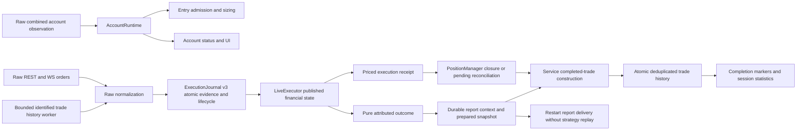
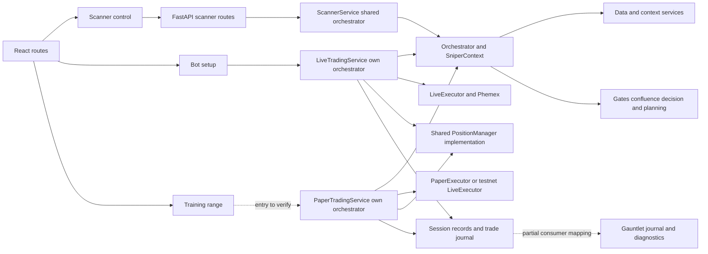
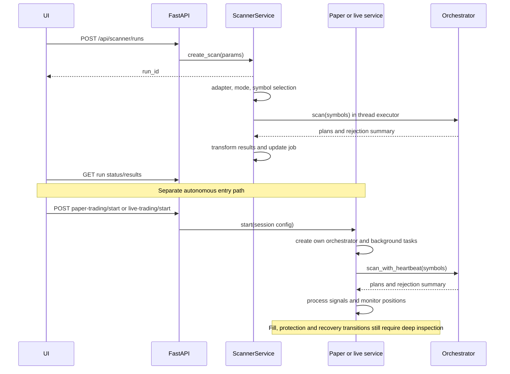
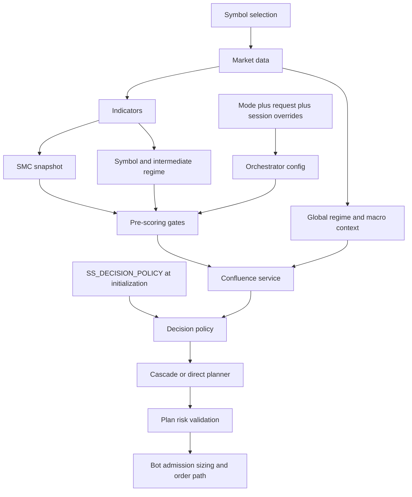
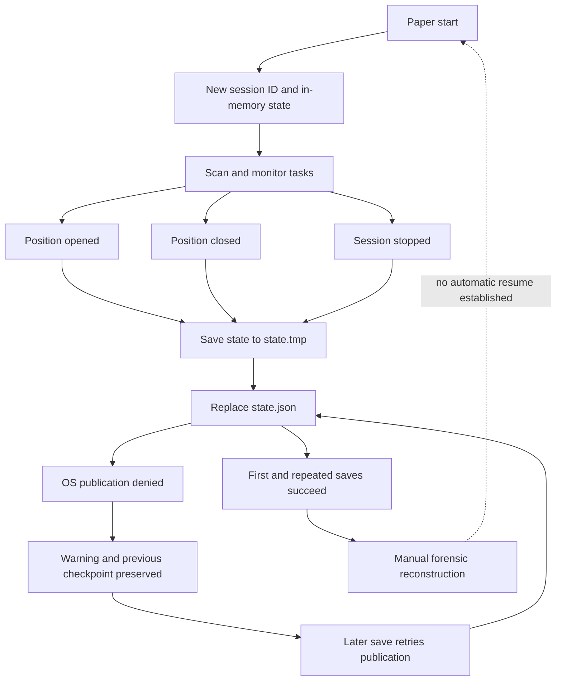
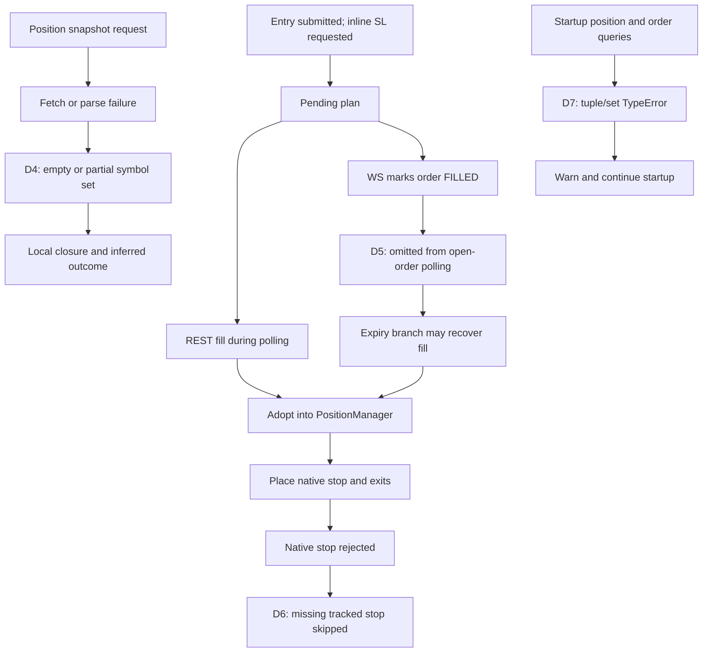

# SniperSight system discovery — first checkpoint

Audit date: **2026-10-07**, America/New_York. This is a bounded Phase 1 checkpoint, not a completed system audit or trading-performance assessment.

**Current navigation, 2026-10-08:** discovery observations and their original commit remain below as history. The local execution/accounting work now extends committed baseline `140f42e92addec5e66e8547cbb9b800bb24e4f43`; use the [current execution/accounting map](#current-execution-and-accounting-map--2026-10-08) and the final checkpoint entries for current source ownership and verification. The completed offline review and explicit coverage limits are summarized in the current index and disposition below. Current implementation work is local, not deployed.

**First finding, now fixed locally in the approved batch: paper checkpoint replacement failed on Windows.** Discovery reproduced the actual `_save_state` method in isolation: first save succeeded; second save left `state.json` stale and logged `WinError 183`. Existing logs contain the same failure. The approved fix changes checkpoint publication from `Path.rename` to `Path.replace`; seven isolated checks pass, including warning/preservation on denied publication and successful retry. No credentials were loaded, bot started, orders submitted, deployment performed, or Git commit/push made. Broader system inspection remains partial.

## Fresh-review scope reset — 2026-10-07

The user explicitly superseded project-local rules and skills as stale: **“we're taking a new look at everything instead.”** Treat historical instructions, audit gates, protected-tool rules, mode/threshold calibration and past decisions as hypotheses/context to verify. They do not constrain this fresh assessment. Existing raw audit results are historical verification evidence, not current authorization gates. Do not infer that a behavior is sound because old guidance calls it a standing fix.

The original user-authored audit boundaries remain: preserve the recognizable product and historical records; no live orders, production credentials, deployments, pushes or destructive operations; propose bounded production implementation changes before applying them. No project-wide guidance file has been rewritten. The D2 checker-edit permission requirement is superseded; its technical defect remains recorded. **D3 sizing, D4/D7 reconciliation, D5/D6 adoption/protection, D8 valuation/reservations, D9 acknowledgment recovery and approved D10A/D10B lifecycle and durable recovery are locally verified. Latest: 465 focused backend tests, 11 process-death checks, 16 lifecycle checks, 7 checkpoint checks and structural smoke pass. A's 27 frontend tests/typecheck remain its last verification; B changes no frontend files. New execution-journal tables are an expected contract delta; D2 historical-row drift remains unresolved.**

## Latest local checkpoint — 2026-10-08

The offline review and bounded repair pass are complete; start with the
[current architecture index](../ARCHITECTURE_INDEX.md) and
[current disposition](#current-disposition-and-follow-up-plan).
Execution/accounting recovery, request isolation, candle/source integrity,
replay honesty, formation-time validity, evidence labels, volatility validity
and final paper/testnet risk have selected regression coverage.

Latest verification: **1,691 selected backend tests**, **36 selected frontend
tests**, clean TypeScript, four clean contract groups and eight clean smoke
categories. Backend warnings: 47 existing deprecations. No full-repository,
browser, real-exchange or production-readiness claim.

**Material correction:** earlier broad tests appended 130 test-time rows to the
real telemetry DB because their guard omitted SQLite connections. The exact
[ID manifest](SYSTEM_DISCOVERY_2026-10-07_test_telemetry.json) and corrected runner
are recorded below. No historical repair was attempted; trade-journal and other
protected hashes remain unchanged. Current work is local, with no new push or
deployment.

## Evidence and baseline

- Repository: `NobleWolf412/snipersight-trading`; checkout `C:/Users/macca/snipersight-trading`.
- Branch: `claude/decision-core-heart`; commit: `f57f95cd918200e02e9ca134a21b795fbd22373e` (commit timestamp 2026-08-03T18:52:23-04:00).
- Pre-existing changes: modified `.claude/settings.json`; untracked `.agents/`, `.codex/`, `AGENTS.md`, and `backend/diagnostics/decisions/2026-07-01__ss2-book-runner-pivot.md`. Preserved.
- [Coverage ledger](SYSTEM_DISCOVERY_2026-10-07_coverage.json): original discovery SHA256 per inventoried file, tracked-diff hash, exact untracked inventory, inspection scope and status; approved-batch changes are recorded separately so the original baseline remains reproducible. The SHA alone does not identify this working tree.
- Inventory: **1,211 tracked + 134 pre-existing untracked files**. Tracked code includes 437 Python, 75 TypeScript, 220 TSX, 6 JS and 14 JSX files. These are inventory counts, not verified coverage.
- Original inventory classification: 9 inspected guidance/config/history files; 29 partially inspected files; 1 generated artifact; 1,306 unverified files. Later selected inspections are recorded in the ledger's incremental review sections. No subsystem is claimed fully behaviorally inspected. Tool/skill assets are included in this broad Git inventory; they are not all application-owned source.
- Ignored dependency/build roots are excluded from file-level inventory; runtime evidence was sampled separately. Folder names such as `archive`, `_archive` and `prototype` do not prove unreachability.
- [Reproduction evidence](SYSTEM_DISCOVERY_2026-10-07_evidence.json) contains sanitized results and evidence-source scope.

Labels used below: **code-verified** means identified source bodies/ranges were read; **reproduced** means an isolated operation was executed; **located** means only an overview/call site was found; **unverified** means behavior has not been established. None means the running production configuration has been inspected.

## Startup, configuration and verification entry points

| Source | Verified observation | Remaining uncertainty |
|---|---|---|
| `C:/start-sniper.bat` | Prepends Node 22.14.0 and `backend/venv/Scripts`, changes to this repo, runs `npm run dev:all` | Actual running process environment not captured |
| `package.json` scripts | Backend is `python -m uvicorn backend.api_server:app --host 0.0.0.0 --port 8001 --reload`; frontend port 5000 | Other launch paths may differ |
| `vite.config.ts` | `/api` proxy defaults to `http://localhost:8001`; `BACKEND_URL` overrides it | Actual override value unverified; comment still mentions 8000 |
| `backend/api_server.py:7` | Loads `backend/.env`; module bootstrap constructs adapters, risk objects and the shared scanner orchestrator | Environment values deliberately not read; importing the app is not a side-effect-free inventory operation |
| `backend/api_server.py:199` | Startup launches a daemon thread to refresh live symbol classification | Network failure/restart behavior not exercised |
| `backend/shared/config/defaults.py`, `scanner_modes.py`, `planner_config.py` | Separate sources for scan defaults, mode/profile configuration and planner configuration | Full precedence/override table still required |
| `backend/engine/decision.py:225` | `SS_DECISION_POLICY=thesis` selects the thesis policy; everything else defaults to legacy. Orchestrator stores the policy during initialization | Current environment and historical session flag values unverified |
| `PaperTradingService.start:696`, `LiveTradingService.start:133` | Each builds its own scan config and orchestrator; both enable fusion. Paper adds session planner overrides and forwards macro overlay | These paths are not behaviorally interchangeable |
| `requirements.txt`, `pyproject.toml`, `package-lock.json` | Two Python dependency declarations; root requirements additionally include TA/ML packages. Node lockfile exists | Reproducible Python dependency lock not established |
| `.github/workflows/ci.yml` | Ubuntu CI converts smoke, lint and Vitest failures to successful echo commands | A green workflow cannot establish those checks passed; Windows replacement semantics are not covered by that OS |

The prescribed venv is Python **3.12.9** with FastAPI 0.135.3, uvicorn 0.44.0, pandas 3.0.2, numpy 2.4.4, ccxt 4.5.49 and pytest 9.0.3 (metadata inspected without importing the app). The shell's global Python has different package versions. Use the venv explicitly for future checks; the checkpoint reproduction was rerun with it.

Existing checks: pytest is configured in `pyproject.toml` for `backend/tests`; frontend has Vitest and Playwright visual scripts in `package.json`. `backend/diagnostics/capture_contracts.py` and `pipeline_smoke.py` exist, alongside four contract snapshots and `pipeline_smoke_golden.json`. The original discovery ran only the offline checkpoint diagnostic. The approved fix batch adds isolated contract/smoke checks: ordinary contract imports load environment/exchange/store initialization, so the checks require a guarded subprocess and temporary telemetry path. See the verification decision entry and evidence JSON for exact results and limits; the application test suites were not run.

Guidance drift: `AGENTS.md` references `.Codex/ROUTER.md` and `.Codex/AUDIT_RUBRIC.md`; the discovered files are under `.claude/`. Graphify queried successfully but warns its older node-ID scheme can collide on same-name files. Graph output was used only to orient. Historical architecture prose and the untracked 2.0 pivot note are background, not current authorization; this review preserves the original product as requested.

## Architecture index

### Current execution and accounting map — 2026-10-08

This supplement describes the current local changes, not a new production deployment. Exact source hashes and scope are in the incremental evidence/coverage entries; the discovery map below remains pinned to its original working tree.

| Owner / key symbols | Responsibility and contract | Current limit |
|---|---|---|
| `backend/bot/executor/accounting_runtime.py:AccountRuntime` | Validated combined account observation owns wallet, free/used margin, mark equity and exposure; revision/freshness/commitments govern entry admission | No local fill-based cash mutation; no claim that equity change is strategy profit |
| `backend/data/adapters/phemex_accounting.py:normalize_account, normalize_order, normalize_execution` | Raw USDT unit-one linear-contract evidence; decimal quantity/cost/fees, explicit absence/conflicts | Unified inferred fields and unsupported units cannot establish financial completeness |
| `backend/bot/executor/execution_journal.py:ExecutionJournal.record_execution` | Schema-v3 lifecycle and financial evidence commit atomically before publication; immutable parent entry in exit intent | Actual older user stores are not automatically upgraded; unparented history remains unallocated |
| `backend/bot/executor/live_executor.py:LiveExecutor` | Shared live/testnet order identity, reservations, protection, durable financial projection and restart recovery | Restart restores evidence, not strategy ownership |
| `backend/bot/executor/execution_outcomes.py:ExecutionReceipt, calculate_outcome` | A priced confirmed slice; pure attributed cost/actual-fee outcome with exact quantity reconciliation | Funding/transfers excluded; incomplete fees/costs cannot produce complete P&L |
| `backend/bot/executor/position_manager.py:PositionManager` | Trigger evaluation and managed quantities; verified execution progress precedes late-adoption publication; runtime callbacks return receipt prices; simulation keeps boolean callbacks | Owned native TP/stop slices reconcile once after account matching; ambiguous changes remain pending |
| Both trading services: `_execute_exit_order`, `_sync_closed_positions` | Carry entry/exit IDs and explicit remainder links; preserve uncertain requests; persist history before completion/stats; rollback failed derived statistics | Runtime reports require actual complete execution outcomes; simulation retains its original path |
| `backend/bot/trade_journal.py:TradeJournalService.upsert` | Identical-ID retry, conflict visibility, OS writer exclusion, fsync/atomic JSONL replacement; existing bytes retained | Completed trades only; full-file write cost scales with history; no actual history repair |
| `PhemexAdapter.fetch_execution_history_page`, live `_run_backfill_once` | Scoped raw v2 history log, bounded page/count consistency and durable dedupe | Retained available history is not proof of complete exchange retention or a remote snapshot |
| `PhemexAdapter.fetch_trade_execution_page`, `LiveExecutor.import_execution_history` | Explicit-window identified trade/fee evidence feeds the same durable reducer | Bounded worker in both services; missing retained fees remain pending |
| `src/services/accounting.ts`, bot/training status views | Shared null handling and account-mark versus simulation basis | No browser-render or real-exchange proof is implied by unit/type checks |



| Decision/state input | Units / time and freshness | Source of truth → consumers |
|---|---|---|
| Account wallet/free/used/equity | USDT; one combined observation; monotonic receipt age bounded by twice configured account interval | Validated raw account → admission, sizing, status. Unknown remains null |
| Order execution and fees | Decimal contract/base quantity for supported multiplier one; raw cumulative value in USDT; actual fee currency preserved | Identified raw order/fact → transactional reducer → receipts. Overlapping cumulative and individual evidence is compared, not added |
| Exit receipt | Exact quantity and known average execution price; terminal/priced slice required | Durable evidence → software stop/target/age/shutdown settlement; trigger quote cannot supply missing fill cost |
| Attributed outcome | Gross and execution-fee-adjusted USDT; entry/exit quantities must balance; every required cost/fee known | Explicit immutable entry parent → pure outcome. Funding and transfers remain outside this basis |
| Trade-history query | Explicit millisecond start/end and offset; raw execution timestamp is nanoseconds | Documented raw API → known-order facts. A page alone establishes neither retention completeness nor a closed trade |
| Completed report | Existing serialized trade shape; publish only after durable identical-ID upsert | Service candidate → JSONL → completion/stats. Runtime financial fields come from complete execution evidence; funding/transfers excluded |

### Original discovery index

All paths are relative to the pinned working tree. Parentheses identify inspection depth; see the ledger for precise scopes.

| Subsystem | Entry points / key symbols | Responsibility and state ownership |
|---|---|---|
| UI routing and configuration | `src/App.tsx`, `src/context/ScannerContext.tsx` (partial) | `/scanner`, `/bot/setup`, `/bot/status`, `/training/range`, `/training/replay`, `/intel`, `/journal`, `/settings`; scanner and bot configuration are separate |
| Scanner control/API client | `ScanController.startRun` in `src/components/hud/ScanController.tsx:346`; `src/utils/api.ts:903` (selected body / endpoint located) | Selected inspection mode → background scan request; UI polls run state |
| Scanner route/job service | `backend/routers/scanner.py:create_scan_run:498`; `ScannerService.create_scan:149`, `_execute_scan:245` (bodies read) | In-memory jobs, task creation, adapter/mode selection, orchestration and signal transformation |
| Paper/training bot | `backend/api_server.py:start_paper_trading:1205`; `PaperTradingService.start:696` (bodies read) | Session-local config/orchestrator/executor, scan/monitor/CVD tasks, pending plans, stats and log directory |
| Live bot | `src/pages/BotSetup.tsx:449`; `backend/api_server.py:start_live_trading:3149`; `LiveTradingService.start:133`, `_run_scan:1009` (bodies read) | Phemex adapter/executor, reconciliation, scan/monitor tasks, WebSocket fills and periodic fill backfill |
| Universe admission | `backend/analysis/pair_selection.py:select_symbols:912` and filter helpers (symbols located; callers read) | Shared selector plus caller-specific filtering; paper has additional account/depth admission locations still untraced |
| Market data | `backend/data/ingestion_pipeline.py`, `ohlcv_cache.py`, `adapters/*` (located) | Exchange candles/tickers/volumes, fetch/cache/retry behavior; freshness semantics unverified |
| Pipeline | `backend/engine/orchestrator.py:scan:359`, `_process_symbol:1134`, `scan_with_heartbeat:870`; `context.py:SniperContext:20` (partial) | Global context, worker dispatch, per-symbol context and rejection aggregation |
| Features and context | `backend/services/{indicator,smc,confluence}_service.py`; `backend/analysis/*`; `backend/strategy/smc/*` (calls/symbols located) | Indicators, SMC/liquidity/cycles, global/symbol/intermediate regimes, macro/dominance and confluence |
| Decision selection | `backend/engine/decision.py:active_decision_policy:234`; orchestrator call at 1963 (selector/body range read) | Legacy/thesis decision policy writes direction metadata consumed by planning; policy internals unverified |
| Planning and risk | `backend/strategy/planner/{planner_service,entry_engine,regime_engine,risk_engine}.py`; `backend/risk/{position_sizer,risk_manager}.py` (located) | Entries/stops/targets, plan validation and risk support; distinguish these from bot sizing before consolidation |
| Orders and position management | `backend/bot/executor/{paper_executor,live_executor,position_manager}.py` (overviews only) | Orders/fills and shared position lifecycle; live protection and partial-fill accounting need full traces |
| Durable outcomes and telemetry | `backend/bot/trade_journal.py`, `telemetry/{events,logger,storage}.py`; bot session writers (partial) | JSONL journal, session activity/signals/trades, paper checkpoint and SQLite events |
| Existing diagnostic UI | `src/components/hud/{GauntletBreakdown,RejectionPanel,PipelineTracer,CycleHeartbeat}.tsx` (first three located) | Bot `signal_log` stages, scanner rejection summaries, traces and cycle outcomes; classifier completeness unverified |
| Replay, research and ML | `backend/engine/{replay_engine,backtest_engine}.py`, `backend/routers/replay.py`, `backend/ml/*`, `backend/diagnostics/*` (mostly located) | Separate replay sessions, backtests, model training and forensic tools; causal fidelity and runtime influence unverified |

### Component map

Solid arrows below show the inspected entry/wiring relationships; downstream engine/execution boxes remain partial, not certified.



### Scanner and bot sequence



### Decision data dependencies

This records call locations, not a claim that every branch or fallback is correct.



### Session/checkpoint lifecycle



## Decision-contract scaffold

This is a navigation table. Unverified unit/freshness semantics remain explicit; existing `backend/diagnostics/contracts/` snapshots remain the contract baseline.

| Stage | Inputs → output | Units / timeframe / freshness | Owner and consumers |
|---|---|---|---|
| UI/API configuration | Selected scanner mode or bot config → request → effective scan/session config | Mode names and scores; risk fields named percent. Full precedence and validation not yet checked | ScannerContext / request schemas / start methods → service |
| Symbol admission | Adapter, mode, universe flags → symbol list | Market type, quote currency, volume windows and missing-volume policy need verification | `pair_selection`, caller filters → ingestion |
| Ingestion | Symbol/timeframe requests → `multi_tf_data` | Candle timezone, close timing, resampling and age limits unverified | Ingestion/adapters/cache → indicators/context |
| Indicators/SMC | Multi-TF data → indicator set / SMC snapshot | TF-bearing structures; ATR units, warm-up and causal availability unverified | Indicator/SMC services → regimes, gates, scoring, planner |
| Macro/regime | BTC/context plus symbol indicators → regime/context metadata | Global vs symbol vs intermediate ownership identified; scales and freshness unverified | Orchestrator/regime services → gates, weights, planning and bot sizing |
| Pre-score gates | Structure, direction, BTC impulse, cycle and config → gate pass/rejection | Cascade defers regime evaluation to per-scale context at orchestrator 1673; all branches unverified | `run_pre_scoring_gates` → rejection or scoring |
| Scoring/decision | Context → confluence breakdown → policy decision | Scores are not calibrated win probabilities; two policy implementations exist | Confluence service / DecisionPolicy → direction and planning |
| Planning | Context, direction and trade scale → TradePlan | Entries/stops/targets in price units; geometry/ATR/RR consistency unverified | Planner → plan validation / service / bot |
| Plan risk and bot sizing | Plan + account/session limits → quantity / admission / order | Percent, notional, leverage and contract-unit conservation unverified | Risk manager + separate bot paths → executors |
| Execution/management | Orders/fills/prices → position states and exit orders | Partial fills, fees, precision, stop ownership and timeouts unverified | Executors / shared PositionManager → journal and exchange |
| Observability | Plans, rejections, fills, outcomes → UI/JSONL/SQLite/checkpoint | Event schemas vary across sampled sessions; retention/freshness not certified | Service loggers/journal → Gauntlet, diagnostics and manual reconstruction |

## Evidence availability

- **68 paper-session directories and 12 live-session directories** exist. The three latest directory mtimes in each category were sampled; mtime is not asserted to be the session event timestamp or a representative sample.
- Paper samples: `session_fb282a6a`, `session_42df73ab`, `session_6117c631`. Activity, signals, anomalies and checkpoint files exist; the first two also have config/stats/trades files. The third has config nested inside state. All three contain `state.tmp` as well as `state.json`.
- Live samples: `session_0f03fdbc`, `session_e6c0e76e`, `session_a0cc0018`. They contain signals, activity, session info/config and Phemex fill records; completed-trade file availability differs.
- Canonical located journal: `backend/cache/trade_journal.jsonl`, **384 lines**, 428,074 bytes. This is not a claim of 384 distinct valid completed trades; deduplication/classification remains pending.
- Default telemetry store: `backend/cache/telemetry.db`, **1,509,486,592 bytes**. Read-only schema inspection found `telemetry_events(id, event_type, timestamp, run_id, symbol, data_json, created_at)`. The root `telemetry.db` is zero bytes with no tables; do not accidentally analyze that file as the main store.
- Sampled schemas have config and decision fields, but a complete decision-time package (code revision, policy flag, raw multi-TF candles, macro/dominance inputs, cache state, account state, execution randomness/seed) has **not been established**. Do not call rerunning current code against newly fetched history an exact reproduction.
- Existing tools include `session_debrief.py`, `rejection_coverage_audit.py`, `direction_selection_audit.py`, `cycle_heartbeat_audit.py`, `stop_in_pool_audit.py`, `replay_diagnostic.py`, contract capture and pipeline smoke. These were located, not exhaustively evaluated; inspect the suitable tool before adding telemetry.

## Findings and investigation queue

### D1 — confirmed defect, fixed locally: stale paper checkpoint on Windows

- Producer: `PaperTradingService._save_state`, `backend/bot/paper_trading_service.py:3777`; original failing operation `tmp_path.rename(state_path)` at **3831**, now `tmp_path.replace(state_path)` at **3833**.
- Upstream calls: position-open path at 3049; closed-position sync at 3667; stop at 1030.
- Downstream impact: the existing `state.json` retains old balance, stats, pending orders and position snapshots after later saves; the new snapshot remains in `state.tmp`. Failure is logged, not silent. The method explicitly describes restore as manual/future: this does **not** prove live exchange state loss, automatic-resume failure, or causation of historical trading losses.
- Reproduction: [checkpoint_write_diagnostic.py](../../backend/diagnostics/checkpoint_write_diagnostic.py) parses and executes only the real method against temporary empty-position state. Before the fix, first balance 100 persisted; second expected balance 90 did not replace it; warning was WinError 183. After the fix, all **7/7** checks pass with exit **0** using the startup venv: first write; replacement; consumed temporary file; publication failure attempted, preserved previous bytes and logged; successful retry. The original failing result remains in the evidence JSON.
- Corroboration: `rg -c 'State checkpoint save failed.*WinError 183' logs/backend.err.log logs/dev_servers.log` returned **54** and **52** respectively. Logs can overlap; do not sum them as distinct failures.
- Confidence: **high for replacement failure on this Windows host**; full crash/concurrency recovery not tested.
- Approved first implementation batch: changed only checkpoint publication semantics and its explanatory comment/docstring, retained warnings, and extended the diagnostic. No order/scoring/threshold change. [Verification decision entry](../../backend/diagnostics/decisions/2026-10-07__checkpoint-replacement-verification.md) records the contract-check isolation and pre-existing journal drift. Rollback: revert this bounded source diff; never overwrite historical session files as part of the fix. It does not add power-loss durability or multi-writer synchronization.

### Implementation checkpoint — final-entry risk sizing (D3)

**Authorization:** the user's “Ok go” approved the proposed D3 sizing repair. Only `LiveTradingService._process_signal` and its Decimal import changed in production for this batch. New tests, the prior reconciliation fixture and audit artifacts accompany it. Changes remain local/uncommitted; no live orders, credential use, deployment, push, historical-data write or baseline capture.

**Behavior:** select the existing planned entry, apply the existing proximity snap, then normalize entry and native-stop prices using the installed CCXT exchange's local precision routines. Validate that the stop remains on the loss side. Compute the configured equity-percentage budget once, divide by the final stop distance, and truncate quantity with CCXT amount precision. Decimal arithmetic checks that the result stays within the budget. Because software monitoring retains the original planned stop, use the farther of that stop and the rounded native stop when calculating the distance. The scanner plan is not mutated.

The position-size cap now evaluates the final rounded quantity × submitted price. The real executor still applies its existing aggregate-open-exposure and minimum-balance checks. Invalid/nonfinite input, zero-rounded quantity, unavailable precision, or upward rounding beyond the budget yields an explicit filtered signal. Unit assumptions are enforced: current executor/PositionManager accounting supports linear stablecoin-settled contracts with contractSize=1; inverse/non-unit contracts are rejected rather than silently mis-sized. No scanner thresholds, percentage defaults, cap settings, leverage policy or snap thresholds were tuned.

**Observable output:** `entry_risk_sized` records equity, configured percentage, budget, planned price-distance risk, entry, native/planned stops, quantity and notional before executor admission. It is a sizing diagnostic, not confirmation of placement or a fill. Existing risk/size rejection categories remain. The generic activity path retains its pre-existing persistence-error limitation.

With equity $1,000 and a 1% budget ($10), both directions now produce:

| Scenario | Previous planned stop risk | Current planned stop risk |
|---|---:|---:|
| Market-price control | $10.0000 | $10.0000 |
| Snapped entry | $20.0000 | $10.0000 |
| Nearby unsnapped entry | $11.0000 | $9.9990 |
| Pullback snap | $4.9986 | $9.9990 |

Snap quantity changes from 25 to 12.5; the limit prices remain 99.8 LONG / 100.2 SHORT. Values exclude fees, funding, exit slippage and gaps. This repairs request geometry, not a guarantee of realized loss.

**Verification:** **183 tests passed** (76 new risk cases plus the preceding 107), exit 0. New cases use actual CCXT Phemex precision code with in-memory markets and the real dry-run executor preflight, including both directions, trade types/scores, tick/lot precision, software/native stop distance, wrong-side or collapsed stops, invalid equity/input, unavailable/unsupported market metadata, final notional caps, existing-position aggregate-cap boundaries, minimum balance, leverage and fee treatment, and an improved entry-fill fixture. An isolated before/after runner executed the exact pre-batch method and current method for eight paired scenarios and confirmed the numeric table. No exchange transport occurred.

Pipeline smoke is **8/8 clean**. API/telemetry/pipeline contracts remain clean; DB diff still reports only D2's pre-existing **45→25 journal-key** mismatch (exit 1). No rebaseline. Syntax, JSON/hash validation and `git diff --check` pass. Source hashes, original method, runner source and results are retained under `final_entry_risk_fix` in the evidence/coverage JSON.

**Paper comparison:** paper sizing uses near-entry initially, adjusted risk percentage, sensitivity/regime modifiers and a margin cap. Its snap rescales from that same near-entry reference, and it additionally has paper-specific RR handling. This differs from the live defect's market-versus-planned-entry mismatch; the paper path is unchanged and equivalence is not claimed.

**Boundary at the end of D3:** budgets depended on the executor's equity estimate and price freshness, and aggregate exposure excluded pending entry reservations. The subsequent D8 batch below repairs missing/stale valuation and local reservation accounting; account-equity semantics remain unresolved. Protection acceptance, ambiguous order acknowledgments, actual exit prices/fees, post-fill gaps and persistence remain open. These checks do not establish live safety or strategy edge.

### D9 — ambiguous acknowledgments and unconfirmed local closure repaired within a session

**Authorization:** the user's “Ok go” approved the next acknowledgment repair. Production scope is `live_executor.py`, `live_trading_service.py` and one client-ID lookup helper in `data/adapters/phemex.py`. No live orders, credentials, deployments, commits, pushes, baseline capture or historical-record writes.

**Reproduced before editing:** eight LONG/SHORT regression cases failed while the existing 251 tests passed. A placement timeout marked the order REJECTED and released its reservation; later WS fills were ignored because the order was already terminal. Cancellation with no remote order ID returned success. Retrying a native stop after its response was lost created another request. Finally, `_close_all_positions` marked a position closed despite a false exit result.

**Request identity and recovery:** uncertain placement, lookup and cancellation outcomes remain PENDING (or retain known partial quantity), preserve entry commitments and block new entry risk. Definite insufficient-funds/invalid-order rejection still releases the reservation. Every new executor session generates a distinct client-ID prefix; recovery looks up the original client ID through the installed CCXT Phemex client and checks the returned identity. A missing/lagging lookup is not treated as rejection. Late WS events bind the remote ID and recover the original order, including a WS confirmation arriving before the REST timeout.

The active live monitor checks unresolved requests and cancellation intents on a five-second cadence. Cancel requests remain tracked in the executor even when the service retires an old protection reference; observing the order still open causes another cancellation attempt. Native stop/TP/trailing submissions with uncertain outcomes reuse their original request. A separate pending-stop reference links recovery back to the position, preventing a duplicate after a REST/WS acknowledgment between monitor ticks.

**Execution evidence:** REST and WS now share cumulative-quantity validation. Missing terminal fill quantity, invalid/regressing quantity, zero reported fill on a “filled” response, or missing execution price for newly reported quantity remains unresolved. An accepted open response with no fill data does not invent an execution. Native protective-order observations update their order state without also applying an entry fill to position accounting. Remaining cumulative-average pricing issues are explicitly outside this claim.

**Exit behavior:** the service remembers an outstanding software exit and polls it on repeated callbacks instead of sending another market order. It returns success only after the complete requested quantity is confirmed; partial cancellation and changed caller quantity require reconciliation. Native protection stays in place until a full exit is confirmed, and partial target exits retain protection for the remainder. Cleanup failure cannot turn a confirmed fill into a failed exit callback. The kill switch now cancels entry orders only before attempting exits; it previously cancelled native protection despite its comment saying otherwise. `_close_all_positions` retains local positions after an unconfirmed exit.

**Caller scope and observability:** live scan admission, pending-entry adoption, WS/REST processing, protection placement/replacement, exit callbacks, kill switch and completion cleanup are affected. Shared LiveExecutor behavior also changes paper/testnet callers; their full exit/restart workflow is not certified. Existing PENDING enum values are reused; no FastAPI route/model or DB schema changes. New/revised activity uses `order_submission_unknown`, `exit_unconfirmed`, `exchange_tp_pending` and `exchange_trailing_pending`; logs include `ORDER_OUTCOME_UNKNOWN` and `ORDER_OUTCOME_RESOLVED`. All real error/rejection diagnostics remain visible.

**Verification:** **339 tests pass**: 71 new acknowledgment cases, the previous 251 cases, and 17 existing position-manager exit/paper-testnet configuration cases. Both directions cover late WS recovery, timeout/not-found/malformed acknowledgment, explicit rejection, client-ID mismatch, terminal quantity validation, cancellation retry, native-protection deduplication, recovery between ticks, partial exits, preserved protection, kill-switch filtering and session-ID uniqueness. Historical fixtures were corrected to report the already observed cumulative fill and the simulated accepted stop's remote ID. Expectations that missing cancellation quantity released the plan were changed to require explicit recovery.

Pipeline smoke is **8/8 clean**. API, telemetry and pipeline contracts are clean; DB diff still reports only D2's pre-existing **45→25 journal-key** mismatch (exit 1). Compilation and `git diff --check` pass. Evidence, guarded runner, original selected methods and before/after hashes are under `acknowledgment_recovery_fix` in the evidence/coverage JSON. The journal, checker, DB baseline and prior paper checkpoint fix are unchanged.

**Remaining boundary:** recovery state is held in memory. Stop/kill halts the recovery tasks before one-shot close requests; unresolved orders are retained locally but do not continue retrying after shutdown, and reset/restart discards the session maps. A never-found order blocks further entry risk rather than being retried blindly. Partial-exit ownership, exchange snapshot/fill ordering, actual close prices/fees and account-equity semantics remain unresolved. These tests do not establish durable exactly-once execution, successful emergency flattening or live readiness.

**Next bounded proposal:** trace and repair shutdown/reset/restart handling so unresolved order identities and observed fills survive, new sessions cannot forget outstanding exposure, and shutdown clearly distinguishes a stopped scanner from confirmed flat exposure. Keep account-equity and outcome-provenance work next in the queue.


### D8 — valuation validity and pending exposure repaired locally

**Authorization and scope:** the user's “Ok resume” continues the approved D8 service/executor batch. Changes remain local and uncommitted. No credentials, live orders, deployment, push, historical-record rewrite or baseline capture. The earlier D8 discovery is retained in the evidence JSON as the pre-repair baseline.

**Valuation:** `LiveExecutor.get_equity` now returns unavailable (`None`) when balance state is unknown or an open position lacks a valid price/cost. It no longer substitutes a zero price. Both long and short positions use the same signed-quantity calculation. Balance responses must contain a finite, nonnegative free-USDT value; zero is valid, while malformed responses preserve the previous cash value but invalidate its use for sizing.

The live service refreshes prices for executor-held positions as well as managed positions, pending plans and the candidate symbol. This covers reconciled positions with no PositionManager entry. Failed refreshes remove the affected price's validity timestamp and emit `valuation_price_unavailable`; older values remain available to the existing display/monitor paths. New risk uses only successful local price observations no older than 30 seconds and balance observations no older than two configured reconciliation intervals (120 seconds at the default). A price that expires during metadata work also blocks entry. Missing valuation blocks new sizing and skips peak/drawdown updates while preserving completed-trade counters. These are operational validity windows, not strategy calibration.

**Exposure:** the existing aggregate cap now includes open positions at entry cost plus the unfilled portion of pending non-reduce-only entries. Admission reserves its candidate under an `RLock` before transport, counts it once, and rejects the next request if combined commitments exceed the configured cap. Fill accounting transfers quantity from the reservation into position exposure under the same lock. Confirmed cancellation releases the unfilled remainder; unconfirmed cancellation retains it. Order-ID allocation and protective-order registration also use the lock. Explicit reduce-only exits bypass entry risk caps and minimum/known-balance checks; fixed stops, TPs and trailing stops do not consume entry reservations.

The isolated before/after comparison uses a $1,000 balance, one unit entered at 100, and a separate $1,000 pending entry:

| Observation | Before | After |
|---|---:|---:|
| LONG with missing price | $900 equity | Unavailable |
| SHORT with missing price | $1,100 equity | Unavailable |
| Either direction after price recovery | $1,000 equity | $1,000 equity |
| Pending entry exposure | $0 | $1,000 |

**Verification:** **251 focused tests pass** (66 D8 cases, 76 sizing, 54 adoption/protection, 46 reconciliation, seven over-cap adoption and two leverage-rejection tests). Coverage includes both directions, missing/invalid/expired prices, failed/expired balances, orphan positions, recovery, partial/full fills, cancellation/rejection, reduce-only exits, and concurrent admission. The concurrency fixture runs eight entry attempts alongside 24 native protective orders: one $100 entry fits a $150 cap, seven are rejected, every order ID remains distinct, and protection does not consume entry exposure. No exchange transport or real account data is used.

Pipeline smoke is **8/8 clean**. API, telemetry and pipeline contracts are clean; DB diff still reports only D2's pre-existing **45→25 journal-key** mismatch (exit 1). No rebaseline. The last code adjustment only extends lock coverage; focused tests, syntax compilation and `git diff --check` pass after it. The historical journal, contract checker, DB baseline and previous paper checkpoint fix retain their hashes. Results, isolated runner source and file hashes are recorded under `valuation_exposure_fix` in the evidence and coverage JSON.

**Callers and limits:** `_run_scan → _process_signal → _valuation_equity/get_equity → place_order` governs live admission; `_update_stats` uses the same valuation validity. `get_equity/get_pnl` have an internal nullable result; no route/model schema changed. PaperExecutor is unchanged. LiveExecutor is also used by the paper service's testnet mode, so its shared admission checks change there too; paper/testnet exit callers without `reduce_only=True` remain subject to entry checks and need separate review. The live status payload still uses its previous display calculation.

Remaining account/exchange issues are material:

- The cash basis is still **free USDT plus local unrealized P&L**, not a verified exchange-equity definition. Reserved margin, wallet/total semantics and other settlement assets remain unresolved.
- Price age measures local receipt of a last/close ticker value, not the exchange's source timestamp or authoritative mark price. Software monitoring still uses last-known cached values.
- Open exposure uses entry cost, not current marked notional. Position/order snapshots arriving in different sequences can conservatively double-count; the lock does not reconcile network event ordering.
- A generic order-submission exception still sets REJECTED. If the exchange accepted the request but its response was lost, that classification can release exposure prematurely. Native-stop retry has the related duplicate-request risk. This batch does not establish safe handling of unknown remote outcomes.
- Reduce-only requests can still fail later leverage/transport handling. Confirmed exits, partial-fill ownership, actual execution prices/fees and journal outcome provenance remain open.

**Next bounded investigation:** reproduce accepted-but-unacknowledged submission and exit/cancellation responses, trace each reservation/local-closure consequence, then define explicit unknown-outcome handling and retry/reconciliation rules. Review the account-equity basis before drawing sizing or performance conclusions. No live-readiness or strategy-edge claim follows from these tests.

### Implementation checkpoint — pending-fill adoption and native-stop recovery

**Authorization:** the user's “Ok” accepted the proposed D5/D6 batch. Changes are local and uncommitted. No live order, credential use, deployment, push, baseline capture or historical-record write occurred. This extends the prior D1 and D4/D7 batches; it does not restore stale project governance.

**D5 repair:** `LiveTradingService._monitor_loop` now delegates pending-entry handling to `_monitor_pending_entries`. It looks up every pending order directly, including terminal orders already updated by WebSocket. REST polling, WS updates and expiry cancellation converge on the same adoption helper. The session tracks adopted entry IDs before awaiting exit placement; repeated updates and a replay after local closure cannot create a second position. An existing PositionManager entry can also be recovered after a partially completed adoption. Invalid price/quantity and adoption exceptions retain the plan and emit a diagnostic; one failed entry does not skip monitoring of other positions.

Terminal REST/WS cancellation and rejection responses now ingest their reported cumulative fill quantity before finalizing the order. A partial cancellation adopts only the filled amount. Missing cancellation quantity does not imply a full fill; an unacknowledged cancellation retains the pending order. Known nonterminal partial fills remain pending and bypass the position-only fallback, which cannot establish that their remainder has finished. Order sizing, cap policy and strategy thresholds are unchanged.

**D6 repair:** fixed-stop placement has one helper, `_ensure_exchange_stop`, shared by initial placement and synchronization. A missing stop ID or level triggers placement; a known unchanged tracked stop does not. Failure is logged with an `exchange_stop_failed` activity and a five-second retry deadline per position. This is an API retry interval, not a trading threshold. Recovery uses the remaining quantity and does not repeat TP1 or trailing placement. A moved stop is placed and tracked before cancelling the old stop; rejection retains the old reference. Closed positions are not reprotected. Invalid/zero remaining quantity never falls back to the original size.

**Boundary and consumers:** the changed state flows from executor WS/REST responses and cancellation acknowledgments → pending-entry monitor → PositionManager → fixed-stop/TP/trailing placement, local monitoring, position-cap checks and completion/journal paths. `LiveExecutor.cancel_order` is also used by kill-switch, software-exit protection cleanup, and closed-position cleanup; those callers keep their existing behavior, including the remaining risks below. New activity names are `entry_adoption_deferred`, `order_cancelled` and `exchange_stop_failed`; existing placed/updated activity payloads remain compatible and add stop context. No named downstream event consumers were found in the searched backend/frontend code. API models, DB schemas and strategy configuration are unchanged.

**Verification:** **107 passed** in the final guarded run: **54 new lifecycle cases**, the prior 46 reconciliation cases, and 7 existing over-cap/adoption cases. New tests import the real service, executor and PositionManager; only transport, scheduling and stop-placement responses are fixtures. They exercise LONG/SHORT, WS before the next monitor tick without a cached price, REST/WS/expiry replay, terminal partial cancellation, rejected/unknown cancellation, invalid fill retention, adoption retry, stop rejection/exception, retry timing, remaining quantity, replacement ordering, and duplicate-exit prevention after an acknowledged stop. Replacing three methods in memory with their exact pre-batch versions makes the six selected D5/D6 cases fail as expected; repository sources were never reverted.

The pipeline smoke remains **8/8 clean**. API/telemetry/pipeline contract snapshots are clean; DB diff still reports the single pre-existing journal sampling mismatch (**45→25 keys**, D2, exit 1). No rebaseline. Compilation, JSON parsing and `git diff --check` pass. Source hashes, runner code, commands, limitations and verification outcomes are in `fill_protection_fix` in the evidence/coverage JSON. Original LF source endings were preserved after semantic edits. Historical journal, checker, DB baseline and prior paper checkpoint fix hashes remain unchanged.

**Limits and follow-up:** this establishes bounded local lifecycle behavior, not exchange safety or exactly-once delivery across restart. Adoption IDs are session-local. Native-stop creation still conflates transport failure with rejection and creates a new client ID on retry: an accepted request with a lost response can therefore leave duplicate reduce-only stops. Existing tracked stops are not queried for remote liveness here. Failed old-stop cancellation is logged but not durably retried. Partial fills with a working remainder still lack full PositionManager adoption. The position-based fallback for an order with no recorded fills can still infer terminality from exposure; general cumulative-average pricing and missing-field fill inference remain for outcome/accounting review. The tests use equal fill prices and do not prove those calculations. No full-suite, exchange-protocol or concurrent-delivery validation was run.

**Subsequent D3 batch is implemented above:** quantity is computed from final submitted prices and checked after precision; separate D8 valuation/reservation gaps are now recorded. Actual close prices/fees, ambiguous-order recovery, protective-order liveness and persistence remain subsequent execution-review work; strategy-edge conclusions remain unsupported.

### Implementation checkpoint — exchange-state validity and restart recovery

**D4 and D7 are repaired locally; verification is offline, and nothing has been deployed.** The user resumed the proposed first repair batch. Production changes are limited to `backend/bot/executor/live_executor.py` and `backend/bot/live_trading_service.py`; regression coverage adds `backend/tests/unit/test_live_reconciliation.py` and updates the existing fill-adoption fixture's readiness flags. The earlier paper checkpoint fix is preserved.

Current entry points/contracts:

- `LiveExecutor.reconcile_positions:1005` returns **None for failed/invalid/unsupported observations**, versus a set for a validated snapshot (including an empty set). It validates every row before changing cached quantities/prices; no partially parsed response is published. Successful snapshots synchronize side and entry price and clear absent cached quantities.
- `LiveTradingService._startup_reconcile:768` leaves admission blocked until position and order observations succeed. It validates the whole order list before cancelling plain entry limits, preserves protective/conditional orders, checks cancellation acknowledgments, and observes positions again to catch fills during cleanup. Preserved-order symbols remain blocked for that session.
- `_monitor_loop:1014` retries unresolved startup reconciliation at the existing interval. Normal failed snapshots preserve managed positions and protection and block new entries until a successful snapshot. Newly observed unmanaged positions also block their symbols.
- `_entry_reconciliation_ready:764` guards `_process_signal` before sizing (:1223) and again immediately before order submission (:1384), covering loss of readiness during awaited price fetching. Existing position management continues; no automatic cancellation of already-submitted entries is added.
- `_detect_exchange_closed_positions:1772` defensively ignores None. Valid-empty closure behavior and its inferred price/reason are unchanged and remain a separate review issue.

Observability: `exchange_reconciliation` activity records carry `known` and `reason`; refused entries use `exchange_state_unknown`; startup resolutions carry order ID/symbol/status under `orphaned_order_resolved`. Searches found no named backend/frontend consumer of the former cancellation-event name. Generic activity-record structure is unchanged; historical records are untouched.

**Verification:** 46 new regression cases and 7 existing fill-adoption cases pass (**53 total**, exit 0). Coverage includes both directions, timeouts, invalid/partial snapshots, valid empty results, same-size side changes, startup retry, protective-order preservation, unconfirmed cancellations, fills during cancellation, and state loss during a price-fetch await. The combined run also imports the real service for the existing tests; the new fixtures extract actual methods to avoid bootstrap side effects.

All eight structural pipeline smoke checks pass. API, telemetry and pipeline contract snapshots are clean; DB contracts retain only the known **45→25 journal-first-row mismatch**, exit 1. No baseline was rewritten. `git diff --check` and compilation pass. Original LF endings were preserved. Source hashes, guarded runner code/results and limitations are saved under `exchange_reconciliation_fix` in the evidence JSON.

Limits: no exchange traffic, real fills, full-app suite or concurrency stress; simultaneous same-symbol positions are rejected as an unsupported snapshot rather than collapsed into a net position. Successful-schema validation does not prove an exchange response is fresh/complete. At this earlier checkpoint, D3, D5, D6 and actual close-price/fee provenance remained open. The subsequent D5/D6 batch is recorded above; D3 and outcome provenance remain unresolved.

Rollback: revert only this batch's two production-file diffs and test changes; preserve the earlier D1 fix, original working-tree changes and all historical data. **The following D4–D7 descriptions retain pre-repair source locations and reproduction results pinned in `live_lifecycle_review`; they are historical baseline evidence.**

### D4 — position-fetch failure closes trades locally; repaired locally above

`LiveExecutor.reconcile_positions` (`backend/bot/executor/live_executor.py:1004`) catches a fetch/parse exception and returns the accumulated symbol set (:1041–1043), including an empty set after a total failure. `LiveTradingService._monitor_loop:988–989` forwards it to `_detect_exchange_closed_positions:1725` as though it were a successful complete snapshot.

The detector marks absent symbols closed at a stored stop level or cached price, removes stop/TP/trailing tracking, and calls the real `PositionManager.close_position:534`, which zeroes remaining quantity and sets CLOSED (:556–557). This bookkeeping operation does not establish an exchange closure or send an exit. `_has_position:1809` then returns false for the locally closed trade. The executor can still retain its nonzero quantity.

**Reproduced for LONG and SHORT:** a simulated timeout with locally open quantity 10 becomes CLOSED/quantity 0 in the position manager, records -$10 at the stored stop, clears tracked protection, and clears the service's duplicate-entry check. The executor retains +10/-10. Successful open-position snapshots preserve OPEN and the entry block. Successful empty snapshots also close the trade, confirming that API failure and genuine absence are indistinguishable to this caller. Six cases.

Downstream: `_sync_closed_positions:1862` converts locally closed records into CompletedTrade and calls journal upsert (:1960) on a later monitor cycle. That persistence path is code-verified, not executed in this fixture. Actual order submission after the entry block clears is not tested; other caps can still reject it. No historical incident or actual exchange loss is claimed.

Root concern: **failure to observe exchange state is represented as observed absence**. Successful absence also does not establish exit reason or fill price; outcome reconstruction remains open.

### D5 — WebSocket fill skips immediate position adoption; locally repaired above

Startup binds WS updates to `executor.apply_ws_fill` (`live_trading_service.py:275`). That method records quantity and sets FILLED (`live_executor.py:906–959`). The monitor gets candidates only through `get_open_orders:611`, which returns OPEN/PARTIALLY_FILLED, and adopts fills inside that loop (`live_trading_service.py:872–921`).

**Reproduced for LONG and SHORT:** a full WS fill before the next monitor tick is recorded in the executor but gets zero adoption calls; the plan remains pending. The corresponding REST fill during polling gets one adoption call and clears pending state. At simulated intraday expiry (121 minutes), the WS-filled order is recovered through the expiry branch (:934–964). Six cases cover WS, REST and expired-WS paths.

This delays PositionManager monitoring and post-fill native-stop/TP/trailing setup; the entry's inline SL may still exist. The fixture does not establish that the exchange position is completely unprotected. TTL constants are 10 minutes scalp, 120 intraday and 240 swing; only intraday immediate/expiry behavior was executed.

Root concern: **execution status and local adoption status are conflated**. A terminal exchange order can still require local adoption. Confirmed fills need exactly-once adoption independent of polling eligibility, including partial/cancelled/rejected paths.

### D6 — rejected initial native stop is never retried by synchronizer; locally repaired above

`_open_filled_entry:1477` adopts the position and calls `_place_exchange_stop:1589`. A rejected native stop leaves no `_exchange_stop_levels` entry. `_sync_exchange_stops:1682` skips when that entry is missing (:1692), contradicting the helper's claim that it retries missing protection next cycle.

**Reproduced for LONG and SHORT:** real `place_stop_order` with an in-memory rejecting adapter makes one failed attempt; three real synchronization calls make no additional attempts. The software position remains open and no native stop is tracked. Successful placement controls retain one stop without duplicate placement; moving it triggers replacement and cancellation of the old order. Four cases.

This proves a missing retry, not absence of the original inline SL or all software protection. Exchange persistence of inline stops remains unverified. The existing `test_overcap_filled_entry_adoption.py:97` mocks placement and verifies adoption only; it never exercises the promised retry. It was inspected, not run.

### D7 — restart cleanup aborts on any nonempty order list; repaired locally above

`_startup_reconcile` (`live_trading_service.py:749`) evaluates `("limit",) | protective_types` at :805. Python cannot union a tuple with a set. Any nonempty order list reaching this expression raises TypeError and exits through a warning misleadingly labeled “could not fetch open orders.” The method returns normally; `start:262–264` then starts the scan task.

**Three current-code fixtures:** an empty order list completes; a leftover limit entry produces the warning and zero cancellations; an existing position plus stop also produces the warning while retaining the orphan-symbol block from the earlier position phase. Orphan positions are blocked from new entries, not reconstructed into full PositionManager state.

**A one-line type correction is insufficient.** Two counterfactual fixtures compile a tuple→set correction solely in memory: with a successful position query, the protective stop is preserved; when the query raises, the method continues with an empty protected-symbol set and cancels the stop. No repository source changed. The selector correction needs an explicit unknown-position-state policy before cancellation.

### Live lifecycle coverage and bounded repair sequence

These findings use **19 current-code fixture cases plus 2 counterfactual cases**, exit 0 with expected-state assertions. They confirm defects, not a healthy application. Actual methods/order and position models were extracted without application bootstrap. Synthetic adapters are in-memory fixtures only. No exchange traffic, credentials, production edits or historical writes occurred. Six source hashes, the script and raw logs are under `live_lifecycle_review` in the evidence JSON.



Implementation sequence (**batches 1–3 and the additional D8 guard batch applied locally above; ambiguous exchange acknowledgments and account-value semantics precede batch 4**):

1. **Exchange-state validity (D4 + D7's failure-state handling).** Distinguish a complete successful snapshot from failure/incomplete data. Preserve positions/protection on unknown state, block unsafe new admissions until recovery, and abort restart cancellation when the protecting-position set is unknown. Correct the tuple/set operation with successful and failed-query cases. Affected production files: `live_executor.py`, `live_trading_service.py`; use a small explicit internal result contract if needed. Tests: timeout, malformed/partial responses, valid empty snapshot, recovery, orphan entries and protective orders. Confirm every caller before changing the return type.
2. **Fill adoption and protection (D5 + D6).** Dispatch confirmed fills from pending entries regardless of polling status; make adoption idempotent across REST/WS/expiry and partial-cancel paths. Distinguish missing protection from an unchanged accepted stop; retry failures with observable bounded behavior. Affected service/executor methods above, plus focused tests. Verify identifiers/quantities, rejected placement, repeated events, restart gaps and stop replacement.
3. **Final order risk (D3).** Resolve entry/stop first, compute quantity from that geometry, then round and enforce risk/exposure limits; assess fill-time deviations. Compare paper/live paths explicitly. Keep threshold/strategy tuning separate.
4. **Recorded outcomes and strategy evidence.** Establish actual close quantity, fill prices, fees and cause before trusting journal-derived results. Revisit successful-empty reconciliation, WS/REST cumulative-fill accounting, native TP partial fills, and persistence/retry after journal errors. Then resume wider decision-system and historical-performance review.

Production batches require the user's implementation approval under the original audit scope. Obsolete project audit/skill gates are not reinstated. Roll back code/diagnostic changes only; never rewrite historical trades to fit expectations.

### D10A — approved shutdown/reset containment implemented locally

The user's **“Yes”** approved the first batch of the linked D10 proposal. Stop/Kill now freeze new entries and retain one recovery supervisor, including original order identity, cancellation intent and unmatched partial exits. Reset/Start cannot discard an unresolved session. Late scan/task callbacks are generation guarded. Reset re-observes the account and returns HTTP 409 when recovery/exposure prevents it. The UI shows pending requests and distinguishes shutdown requested from the last confirmed flat observation; unresolved live state takes priority over paper activity.

The installed Phemex client requires a symbol for open-order queries, so the previous symbol-less startup query was unusable. A adds a validated adapter snapshot that refreshes market inventory, queries active orders for every USDT perpetual symbol, and observes USDT positions. Missing/truncated data remains unknown. Its account scope is explicitly USDT perpetuals, and foreign exposure is surfaced without liquidation. It can require many REST requests and is not an atomic snapshot across external actors. It runs off the API loop; shutdown HTTP responses do not cancel ongoing recovery.

**Changed contract:** existing live status/start/stop/kill responses add `lifecycle` (phase, entry admission, recovery required, last account state/time, reset eligibility, original requests, unmanaged symbols, account orders and reason). Existing lifecycle routes report conflicts with HTTP 409; Reset awaits fresh validation. `liveTradingService.ts`, active-session selection, BotStatus/Index/Setup and the scanner beacon consume it. The current static API capture does not infer fields inside dynamic dictionaries, so dedicated tests cover these additions.

**Verification:** 396 guarded backend tests pass (339 prior + 57 new); 27 frontend tests pass; TypeScript checking and structural smoke pass. API/telemetry/pipeline contract snapshots are clean; pre-existing D2 DB journal drift remains. Installed-CCXT parser tests use scripted response data, not exchange requests. The standalone lifecycle diagnostic improves from 16 failures to **two remaining failures**, both fresh-executor identity loss deferred to B. It intentionally exits 1 while those remain. No browser runtime or real process-crash claim is made.

**Boundary at the A checkpoint (subsequently addressed by B below):** A provided current-process containment only. Durable identity, read-only preflight separation and the paper-testnet shared owner were B work. Unknown/not-found and unmatched partial exits may keep recovery blocked rather than trigger speculative replacement orders. Account equity and actual fill-price/fee provenance remain separate open work. See the [decision and implementation checkpoint](../../backend/diagnostics/decisions/2026-10-07__live-lifecycle-recovery-proposal.md) and `lifecycle_containment_fix` evidence/coverage records for exact changes and rollback. No historical records, contract baseline, thresholds or strategy weights were changed. No commit, push, deployment or live order was made.

### D10B — approved durable execution recovery implemented locally

The user's **“Ok go”** authorized B after the A checkpoint. Execution identity and request intent now persist before submission/cancellation in a versioned SQLite store under `.live_trading/`, with separate testnet/production files and a credential fingerprint that contains no key material. A flushed initialization marker distinguishes missing expected storage from first bootstrap. Schema, binding, corrupt/missing storage and persistence failures block mutation. The store has one local owner across both live and paper-testnet services, enforced by an OS lock and same-process registry. This does not fence another machine or another checkout/store.

Original request IDs, cumulative fill watermarks, cancellation intent, service/session ownership and observation provenance survive process death. Recovered fills do not replay into fresh account positions or cash. Interrupted sessions start recovery-only, preserve native protection, cancel known entry remainders and expose unmanaged account exposure. Unknown/not-found remains unresolved; strategy positions/plans and historical P&L are not guessed. Fresh admission requires a complete flat account observation. Startup now preserves foreign plain limit orders as well as conditional/protective orders. Reset preserves durable records and releases ownership only after verified shutdown. Flat checkpoints check that execution did not change during the observation.

Preflight now uses a separate read-only function; it no longer creates an executor/journal or changes account position mode. Paper-testnet shares the lease and durable executor, serializes lifecycle transitions and blocks replacement/reset of unresolved execution. A restored interrupted journal refuses paper-testnet strategy startup and directs recovery to live-testnet. Paper-testnet status/repeated Stop expose execution recovery. Its full shutdown supervisor/strategy resumption is still absent: an unresolved stopped paper-testnet owner must be recovered via a process restart and the live service on testnet, preserving the store. Simulation fee/execution checks and the D1 Windows checkpoint replacement remain passing.

**Verification:** 465 focused backend tests passed in 34.99 seconds using a guarded temporary workspace (prior 396 plus one revised-startup positive case, 36 durability/integration cases and 32 paper execution/fidelity checks). Independent process-death diagnostic: 11/11, including Windows competing-owner refusal/lock release and both sides of five interruption windows. Lifecycle diagnostic: 16/16, now with durable reconstruction. Windows checkpoint diagnostic: 7/7. Structural smoke: 8/8. No real exchange, credentials or application trading session was used. This is selected regression coverage, not a full backend suite or exchange integration claim.

**Contract disposition:** API, telemetry and pipeline shapes remain clean. Database diff has exactly five changes: the pre-existing D2 journal keys 45→25, new `metadata`, `requests`, `events` tables, and table count 2→5. The three tables/count are intentional B additions and directly tested; the existing DB baseline/checker and historical journal were not edited. No baseline capture was performed.

**Limits and next work:** recovery starts when a matching-environment Start is requested, not automatically at API boot. Read-only `execution_recovery_diagnostic.py --inspect <store-path>` inspects without credentials or ownership. Deleting both marker/database cannot be detected, nor can the journal recover old in-memory requests lost before B was installed. Operator rebind/unknown-order resolution, strategy resumption and storage retention need later work. Tests establish process interruption on this host, not power-loss or distributed/account-wide guarantees. Actual account equity, cumulative-average fill pricing and close-price/fee provenance remain the next execution-accounting review. Broader scanner/configuration/strategy correctness remains unverified.

See the [B decision and implementation detail](../../backend/diagnostics/decisions/2026-10-07__live-lifecycle-recovery-proposal.md) and `durable_execution_recovery_fix` evidence/coverage records. Pre-B state is backed up at `C:/Users/macca/AppData/Local/Temp/snipersight-durable-b-kb08p9ce`. Original 1,345-file inventory counts and unrelated user changes are preserved. All changes remain local and uncommitted.

### D10 — original shutdown/reset/restart discovery (superseded for A/B by the repairs above)

**Stopping the scanner does not establish that orders are cancelled or the account is flat.** The current service can then Reset away the only copy of unresolved execution state. This is the boundary beyond D9's within-session repair.

Offline reproduction: `backend/diagnostics/live_lifecycle_diagnostic.py`, run with `backend/venv/Scripts/python.exe -B`, reports **16 violated safety conditions: eight scenarios × LONG/SHORT**, exit 1 intentionally. It compiles actual selected source definitions with scripted adapters, blocks writes/external networking/subprocesses, and confirms unchanged source hashes. It imports no application or exchange modules. Cancellation and unconfirmed-exit controls pass. These are defect reproductions, not 16 passing repair tests.

| Reproduced condition | Observed result |
|---|---|
| Stop with acknowledged entry | Entry remains OPEN; zero cancellation attempts |
| Stop with unknown submission | Entry remains PENDING; zero cancellation/identity lookup attempts |
| Stop recovery lifetime | Monitor cancelled while the request remains unresolved |
| Kill with uncertain cancellation | Cancellation intent retained, but monitor cancelled; response is `kill_switched` |
| Reset after unresolved shutdown | Executor reference and pending exit/stop maps discarded |
| Reset while Stop awaits background-task cancellation | Reset succeeds, closure never reaches the original manager, Stop returns `idle` |
| Fresh executor plus empty scripted account snapshots | Old client identity absent, zero identity queries, startup reports ready |
| Unknown entry status display | $1,000 remains reserved while `pending_orders` is empty |

The restart scenario is an in-process reconstruction of the new-executor boundary, not an actual process crash or exchange-consistency experiment. The race uses Stop's real await of a cancelled background task; it does not assume asynchronous exchange transport in the current exit callback. No historical incident/loss attribution is established.

Downstream source inspection: `src/pages/BotStatus.tsx:1080` announces “all positions closed” whenever `kill_switched` is set. `src/services/activeSession.ts:108` can select a running paper service over stopped-but-unresolved live execution. `BotIndex`, `BotSetup` and `ScannerContext` use `running` as the relevant active-state test. No browser runtime test was performed. The current API preflight also constructs `LiveExecutor`, whose non-dry constructor attempts to change account position mode; this is a source-confirmed concern for the read-only preflight redesign, not an executed account operation.

[Proposed architecture and bounded batches](../../backend/diagnostics/decisions/2026-10-07__live-lifecycle-recovery-proposal.md):

1. **A — shutdown/reset containment and truthful status.** Freeze entries, serialize lifecycle ownership, cancel entry remainders, preserve/recover original requests, guard Reset/Start, and distinguish scanning stopped from observed account flatness across API and existing UI. This is the next proposed implementation batch.
2. **B — durable execution identity.** Commit request intent before transport in a versioned local execution journal; restore original identities conservatively, enforce one local mutation owner across live and paper-testnet callers, and separate read-only preflight. No automatic strategy-position resumption or historical P&L reconstruction is proposed.

The decision record compares guards-only, atomic JSON, SQLite and a separate execution service, lists affected files/contracts/consumers, and specifies fault tests and rollback. **Extra High is recommended for this architecture phase.** Production implementation requires approval under the original user audit brief; stale project-local gates are not reinstated. This checkpoint adds only the diagnostic, proposed decision and audit artifacts. Previous repairs, historical records and contract baselines remain unchanged. The 339-test repair suite and structural checks were not rerun for this diagnostic/documentation-only checkpoint; their previous results remain historical evidence.

### D3 — confirmed isolated order-sizing defect; locally repaired above

**A configured 1% risk budget can become 2% planned stop-loss risk after live-service entry adjustment.** This is reproduced in isolated current methods, with synthetic inputs and the executor's real dry-run preflight. It is not evidence of an actual exchange fill or explanation of a historical loss.

User control path: `src/pages/BotSetup.tsx:689` labels the slider “Risk per Trade”; :458 sends `risk_per_trade`; `backend/api_server.py:3100` validates the request and :3169 forwards it. `LiveTradingService._run_scan:1177` calls `_process_signal`. In that method, :1238–1245 sizes quantity using **market-to-stop distance**, :1276–1278 selects the planned entry, and :1299–1307 rescales quantity using **planned-entry-to-stop / adjusted-entry-to-stop**. Those are different starting distances.

Ignoring lot rounding, on the snap branch:
`final stop risk = configured risk amount × |planned entry − stop| / |current market − stop|`.
Thus the ratio can exceed or fall below 1; it is not a cap at the user-selected risk. With no snap, quantity still uses market distance although the submitted limit can differ from market.

Offline fixture: equity **$1,000**, configured risk **1% = $10**, market **100**, score **75**, intraday, lot **0.001**, position cap **$5,000**, total cap **$10,000**, no existing positions/orders. These non-default exposure limits are within the API's accepted ranges.

| Case | Planned entry | Stop | Submitted entry | Quantity | Planned stop risk |
|---|---:|---:|---:|---:|---:|
| Long control | 100 | 99 | 100 | 10 | $10 |
| Short control | 100 | 101 | 100 | 10 | $10 |
| Long snap | 101 | 99 | 99.8 | 25 | $20 |
| Short snap | 99 | 101 | 100.2 | 25 | $20 |
| Long pullback snap | 99 | 98 | 99.8 | 2.777 | $4.9986 |
| Short pullback snap | 101 | 102 | 100.2 | 2.777 | $4.9986 |

Two additional near-entry cases yield $11 planned risk for the $10 budget. Actual fill prices can improve on submitted limits; this table concerns submitted-price geometry. Fees, gaps and slippage are excluded.

`LiveExecutor.place_order:147` checks notional, aggregate exposure and minimum balance before its :229 dry-run return; it does not recalculate the requested equity-risk percentage. All eight cases reached OPEN in the real dry-run method and pending in the service. Protective-order/fill handling downstream of that return is not exercised. The default $100 position cap can reject these particular fixtures; a notional cap is not equivalent to a percentage-risk cap.

Evidence: AST-extracted `_process_signal`, `place_order`, actual order types and `round_to_lot`; no application imports, adapter instance, credentials or networking. Eight assertions pass with lot-distance tolerance, exit 0. Five source hashes match before/after. Initial harness tolerance failure and its correction are retained in `live_entry_risk_review` in the evidence JSON. Synthetic equity/price/metadata are verification fixtures only. Planner reachability across modes and historical incidence remain unverified.

**Next bounded proposal:** settle the final entry/stop geometry before computing quantity, floor to the exchange lot, then enforce the configured risk budget and existing notional/exposure checks against that final request. Validate both directions, snap/non-snap, stale/wrong-side geometry, cap boundaries, fees and fill-price changes. Compare the paper path separately: it sizes from `near_entry`, applies streak/regime modifiers, and has its own snap logic; equivalence is not established. A production fix requires a separately approved batch; this turn changes audit artifacts only.

### D2 — confirmed contract-sampling defect; implementation proposed, not approved

At the audited commit plus the approved D1 storage fix, `capture_db_contracts` (`backend/diagnostics/capture_contracts.py:175`, first-row read at :234) derives journal keys from mutable historical data. Its 45-key baseline is compared with the first historical row's 25 keys. Read-only census: **384 valid object records, ten distinct shapes**, ranging from 25 to 55 keys. The 45-key shape occurs at line 350. No malformed JSON or non-object rows were found in this snapshot. Cohort provenance and value correctness remain unverified.

Current source declares **60 writer keys**: `CompletedTrade.to_dict` (:479) emits 54, `TradeJournalService._classified` (:89) adds `session_id`, and `exit_classification.classify` (:112) adds five. This is code-inferred shape coverage, not an end-to-end execution claim. All 45 baseline keys remain; 15 additional keys are listed in evidence. Field presence does not prove meaningful values, especially for live-constructor defaults.

The actual sampler functions, AST-extracted without application imports and executed against temporary fixture files, returned **25 keys for old→new rows, 55 for new→old, no journal entry for a blank first line, and no entry for an absent journal**. Exit 0; hashes confirm the checker, baseline, producer files and historical journal were unchanged. Latest-row sampling would omit current classifier fields; a union of historical keys could conceal a current field removal. Neither is the proposed correction.

Blast radius: paper completion (:3685) and live completion (`live_trading_service.py:1960`) serialize through the same journal service. API query (`api_server.py:1388`) forwards rows to `tradeJournalService.ts:85`; UI fields, CSV export (`trade_journal.py:268`), ML dataset building (:207) and autopsy (:123) consume them. Exchange backfill writes a separate fills log; the optional classifier backfill writes copies. Mixed-cohort UI/CSV compatibility is a risk requiring reproduction, not a confirmed failure. No trading-path edit is proposed.

**Proposed bounded batch, subject to approval:**

1. Change only the canonical trade-journal contract in `backend/diagnostics/capture_contracts.py` to derive keys deterministically from the real current serializer and journal enrichment using isolated synthetic fixtures. Keep other contract categories and their diagnostics visible. Avoid importing application bootstrap; fail explicitly if producer extraction becomes unsupported. Do not hand-maintain a second list of writer keys.
2. Add focused tests in `backend/tests/diagnostics/test_capture_contracts.py` for history-order/absence independence, a real producer-key addition/removal, both classifier branches, and extraction failure. A standalone diagnostic in `backend/diagnostics/journal_contract_diagnostic.py` should separately report historical cohorts, parse failures and required consumer-field/type compatibility, preserving row-count conservation and refusing to rewrite data. Synthetic fixtures are offline verification only.
3. Review the exact resulting delta before an explicitly authorized re-baseline: currently anticipated **45→60 keys, 15 additions and no removals**, limited to the canonical journal entry in `backend/diagnostics/contracts/db_contracts.json`. New types/meaning are not guaranteed by this existing key-only snapshot. A same-day decisions entry must record the reason and downstream disposition; capture must abort approval scope if additional contract deltas appear.
4. Run focused regression tests and guarded contract diff/pipeline smoke without credentials, networking or production writes. Recheck every historical-file hash. Independent audit must clear the exact diff; preserve any unrelated drift. Update this map/evidence/ledger in the same batch. Rollback is the bounded checker/test/baseline diff; no historical-record rollback or mutation.

Affected files are the checker, two new diagnostic/test files, one existing DB snapshot, a same-day decision entry, and this report/evidence/coverage set. Benefit: the verification gate reflects current writers and reports historical compatibility separately. Risk: extraction/fixture coverage can itself miss writer branches; explicit failure and mutation tests are mandatory. No API, UI, bot, scoring or threshold implementation change belongs to D2.

**Superseded workflow restriction:** the earlier checker-edit permission/capture requirement came from a project-local skill, which the user has now declared stale. It is no longer a blocker on the fresh review. The technical drift is still unresolved; no D2 repair or capture has occurred, and replacing a baseline would not itself prove correctness. Keep D2 as a verification-tool proposal while prioritizing D4–D7 lifecycle integrity and D3 risk sizing. Reproducible fixture code and immutable-file hashes are saved under `journal_contract_review` in the evidence JSON.

### R1 — verified verification weakness, RISKY

`.github/workflows/ci.yml` masks failures in smoke, lint and Vitest with `|| echo`. The runtime consequence is not a broken trade by itself, but CI can appear green without those checks passing. Prioritize after D1's approved resolution; propose required checks separately, with a known baseline and no unrelated lint cleanup.

### R2 — architectural risk requiring reproduction: shared mutable scanner jobs

`ScannerService.create_scan` starts an independent task per job; `_execute_scan` mutates one shared orchestrator's mode, thresholds, adapter and ingestion pipeline before awaiting symbol selection/scan. API bootstrap shares that orchestrator with route dependencies. No per-job isolation/scan lock is visible in these inspected methods. Controlled overlapping scans are needed to establish cross-job leakage and affected consumers; it is not yet a reproduced wrong-signal finding.

### R3 — configuration differences requiring intent and unit review

Scanner and bots use different fusion, macro and planner setup. Scanner request min-score handling and bot sensitivity overrides need comparison with standing threshold rules. `SS_DECISION_POLICY` changes the decision implementation independently of four scanner-mode names. Record effective configuration and policy in reproductions before attributing differences to strategy quality. No threshold tuning is proposed.

### M1 — confirmed documentation/environment drift

Port 8000 guidance versus actual 8001 startup/proxy defaults, stale instruction paths, older graph IDs, and two different Python package environments can misdirect an audit. This checkpoint records the observed truth without silently changing guidance or startup configuration.

## Staged coverage plan and resumption checkpoint

1. **D1 approved storage-only fix is implemented locally.** Repeated-save and failure/retry checks pass; final audit/contract disposition is recorded with this batch. Do not claim full crash recovery from a replacement fix or silently expand it to restart/automatic resume.
2. **Trace risk through execution and persistence.** For paper, testnet and live separately: UI limits → API/config → sizing/quantity → exchange constraints → pending/partial fills → protective orders → position exits → journal/balance. Include duplicate prevention and restart reconciliation. Read-only trace first; order-capable execution requires explicit authorization.
3. **Reproduce scanner job isolation and review verification gates.** Use isolated adapters/fixtures without replacing integrated runtime data. Trace job cancellation and process-worker configuration snapshots. Keep this separate from scoring changes.
4. **Trace decision/configuration cohesion.** Complete the contract table with actual units, timestamps, defaults and consumers. Inspect both decision policies, global/symbol/intermediate regimes, fusion/cascade behavior, gates and countertrend paths. Assess bullish and bearish cases explicitly; revalidate historical standing-fix claims against the current code and evidence rather than treating them as settled requirements.
5. **Evaluate historical evidence and cleanup.** Choose accepted/rejected and win/loss cases with their original provenance; explicitly mark unavailable reproductions. Require representative/out-of-sample evidence before strategy conclusions. Only then classify deletion/consolidation candidates with dynamic/config usages checked.

For each next subsystem, completion requires traced entry points, decision/state owners, upstream inputs and downstream consumers, failure/restart paths, verification commands/results and remaining uncertainty. Symbol inventory alone never counts as full inspection.

Measured navigation hotspots: scorer **5,985 lines**, orchestrator **4,973**, paper service **4,395**; generated API types **5,118** are a different category. Size is an investigation-cost indicator, not evidence for a rewrite. Prefer precise symbols, the coverage ledger, current contracts and existing diagnostics; do not copy stale architecture prose.

### D11–D15 — accounting and price-feed failure review; repairs proposed

**The next priority is a confirmed false-close path that can remove native protection.** In an offline fixture with an old position and a missing cached price, the actual service price callback returns zero. `PositionManager.monitor_all_positions` skips ordinary monitoring but its orphan branch (`position_manager.py:599–628`) then zeroes remaining quantity and marks an emergency exit without calling the executor. `LiveTradingService._sync_closed_positions` (`:2250`) records a completed trade and cancels the native stop. Both LONG and SHORT reproduce: **zero exit submissions, one completed trade, one stop cancellation**. This establishes the conditional code defect, not historical frequency or loss attribution. The final diagnostic exercises the real service callback; the initial exception-based manager probe is retained separately in evidence.

The accounting trace also confirms these independent problems:

| Evidence | Expected | Observed |
|---|---|---|
| D12: $1,000 wallet; $250 reserved; no P&L | Equity $1,000; P&L $0 | Equity $750; P&L −$250 |
| D12: complete 10-unit position snapshot, then delayed fill for that same order | 10 units | 20 units, both directions |
| D12: balance snapshot already includes $1 execution fee, then fill arrives | $999 | $998 |
| D12: failed ticker refresh retains old positive cache | No new successful-price timestamp | Manager stamps a new successful observation; risk valuation separately rejects the value |
| D13: 4 units at 100, then 6 at 110; cumulative average 106 | Cost 1,060; average 106 | Cost 1,036; average 103.6, both directions |
| D14: reported execution fee 0.20 | Actual fee 0.20 | Modeled fee 1.00 |
| D14: long closes at confirmed 109; cached quote 110 | Gross $90; net $87.91 with fixture fees | Journal $100; exit price 110 |
| D14: short closes at confirmed 91; cached quote 90 | Gross $90; net $88.09 with fixture fees | Journal $100; exit price 90 |
| D14: position absent from a valid account snapshot | Price/cause unresolved until execution evidence | Planned stop used as exit price; stop-loss reason assigned |
| D15: documented AOP `snapshot`/`incremental` frames with `orders_p` | Order callback delivered | Zero callbacks |

The installed **CCXT 4.5.49** balance parser maps account balance to `total`, reserved balance to `used`, and derives `free = total − used`; this was executed offline. `LiveExecutor._fetch_balance_from_exchange:401` selects `free`. `get_equity:977` adds local unrealized P&L, `_valuation_equity:2158` feeds risk sizing and drawdown, while `get_status:664` separately uses manager positions and still displays finite equity when balance validity is false. Allocation, account equity, session return and spendable margin are therefore mixed. The free-margin floor may be intentional policy; it must be distinguished from an equity threshold rather than silently changed.

`_process_exchange_order:774` multiplies the new quantity by the latest **cumulative** average, and `reconcile_positions:1342` does not couple snapshot application to order watermarks. Restart-restored order IDs have B's conservative replay suppression, but the same-process snapshot/delayed-fill counterexample remains. These findings do not invalidate the narrower prior tests; they expose previously untested accounting boundaries.

The Phemex [official AOP protocol](https://github.com/phemex/phemex-api-docs/blob/master/Public-Hedged-Perpetual-API.md#subscribe-account-order-position-aop) supplies the envelope shape used in D15. Frames are synthetic and shaped from documentation, not captured traffic. Direct handler tests additionally show `priceRp` is substituted for execution average when average fields are absent, even when cumulative cost is available. A subsequent terminal REST observation does not correct that price. Fixing dispatch alone would expose this second problem. No endpoint availability or live delivery claim is made.

Source-only follow-ups: the shared manager applies modeled stop slippage after confirmed execution; pure-paper journal dollars prefer executor net P&L while percentage still comes from manager gross P&L; paper-testnet falls back to manager P&L. Exchange fill backfill writes a separate raw log rather than reconciling completed trades. Backfill completeness, funding, deposits/withdrawals, cross/inverse collateral and historical attribution remain unverified.

**Verification:** `python -B backend/diagnostics/live_accounting_diagnostic.py`, using the repository venv, exits **1 intentionally**: **37 checks, 24 violated invariants, 13 passing controls**. These counts include directional cases and are not independent defect counts. The harness fails with exit 2 for a broken control or harness exception. It denies credentials, external networking/DNS, nested subprocesses and writes outside its temporary directory; logging and SQLite fixtures stay there. All nine inspected production/vendor source hashes were identical before/after. Raw outputs, current hashes, scope and protected-file verification are recorded under `accounting_authority_review` in the evidence and coverage JSON. The previous 465-test B suite is historical evidence; it was not rerun for diagnostic/documentation-only work.

[Bounded repair proposal and ownership/contracts](../../backend/diagnostics/decisions/2026-10-07__accounting-authority-proposal.md): **H first** preserves open exposure and protection on an orphan timeout. Subsequent separately scoped work covers normalized execution cost/fees and WS handling, account observations versus local projections, and execution-backed trade outcomes. No accounting or position-manager production repair is applied by this checkpoint.

### D11 / H — orphan timeout containment implemented after approval

The user's **“Yes”** approved the bounded H repair above. Only `backend/bot/executor/position_manager.py` changes production behavior: missing/invalid prices preserve the position; the timeout emits `ORPHAN_PRICE_FEED_UNAVAILABLE` instead of manufacturing an exit. Remaining quantity, prior P&L and status stay intact, so live and paper completion paths cannot archive this unresolved position or cancel its protection on the strength of this timeout. Nonfinite, nonnumeric and boolean prices are also rejected before changing P&L or the successful-monitor timestamp. No API or storage schema changes are introduced.

Upstream: each service's price callback and monitor loop. Downstream: position tracking, confirmed-exit callbacks, native-protection cleanup, completed trades, journal/telemetry, statistics and UI. Existing valid-price stop/exit behavior remains; a retained stale positive cache is still a separate unresolved issue. The safety consequence is that failed-feed positions remain visible and require recovery instead of appearing complete.

**Verification:** the new zero-price regression first failed on the original source with fabricated closure/P&L. After repair, **84 new regressions pass** across both directions, OPEN/PARTIAL states, ten invalid-price/failure inputs, repeated cycles, timeout boundaries, valid-price recovery and live/paper-testnet/paper completion consumers. The broader selected backend suite passes **549 tests in 37.89 seconds**. Existing tests verify that unknown/partial exits do not trigger full settlement or premature protection cancellation.

The unchanged accounting diagnostic has **37 checks: 15 invariants hold (including 13 controls), 22 violations remain**, exit 1 intentionally. Exactly the two directional orphan containment cases changed from failure to success; other results are unchanged. Pipeline smoke is clean (8 checks). API, telemetry and pipeline contracts are clean; DB drift is unchanged from B (D2 journal sample plus three B tables/table count). No baseline or history rewrite. Protected files and prior B implementation files remain unchanged.

`orphan_feed_containment_fix` in the evidence/coverage JSON records hashes, before/after diagnostic results, runners, outputs, scope and the pre-H backup. This is a local verified repair, not deployment or whole-system trading validation. The preceding D11–D15 section remains the original discovery record.

### F/V architecture and D16–D17 — proposed, no new production edits

The accounting ownership design is now concrete in the existing [decision record](../../backend/diagnostics/decisions/2026-10-07__accounting-authority-proposal.md#fv-architecture-decision--ready-for-review-implementation-not-yet-approved). It separates **account observations** (wallet, free/used margin, current positions and mark UPnL), **identified execution records** (order quantities, costs and fees), and **strategy positions** (planned management and receipt-backed outcomes). Snapshot and fill consumers must stop writing the same money/quantity state. The record includes proposed types/units, freshness and completeness, a Mermaid dependency diagram, event ordering and mismatch handling, conservative reservations, transactional durable observations, schema migration, cash-flow/return distinctions and rollback/verification boundaries.

New source tracing and guarded offline probes confirm two additional defects:

| Finding | Current path | Controlled result |
|---|---|---|
| D16: account position used to invent an order fill | `LiveExecutor.check_fill_via_positions:720`, called by `LiveTradingService._monitor_pending_entries:1166` | An identified ten-unit order still reports OPEN/zero filled. A three-unit same-side **or opposite-side** account position then makes it FILLED for three units. Four BUY/SELL cases reproduce. |
| D17: fill-history cursor skips a full-page boundary | `LiveTradingService._run_backfill_once:874` | 201 unique fills at one timestamp; two calls save 200, because the next request advances to timestamp +1. No pagination/completeness proof prevents the gap. |

These are conditional offline counterexamples, not historical loss attribution. D16 is not repaired by B's restored-order exclusion because it also affects ordinary in-process orders. D17's fixture does not claim an observed exchange sort order; equal timestamps and bounded pages require a consumer policy that does not drop records.

Installed CCXT parser checks demonstrate additional contract requirements: normalized cost can be inferred from order limit when raw executed cost is absent; raw zero order fee becomes null; a nonzero parsed order fee can remain a string; invalid raw position side becomes short. Raw-value validation/provenance is therefore required before normalized values become financial authority. These are observations of the installed parser, not new claims about malformed production responses.

The [documented combined account endpoint](https://github.com/phemex/phemex-api-docs/blob/master/Public-Hedged-Perpetual-API.md#query-account-positions-with-unrealized-pnl) provides account and mark-based position P&L fields, with high request weight. An offline route/parser control produced wallet 1,000, free 750 and equity 1,060 with UPnL 60 from one scripted response. This supports the proposed observation boundary, but does not prove global exchange atomicity, sequence comparability or bounded mark-price lag. The design keeps those limitations explicit.

**Verification:** `python -B backend/diagnostics/accounting_contract_diagnostic.py` via the repository venv: **12 checks, seven passing controls, five reproduced violations**, intentional exit 1. Failed preliminary harness expectations about fee type and calculated average were corrected using observed parser behavior; raw failed runs are retained in evidence. Credentials/network/subprocesses and writes outside the temporary fixture are blocked. All nine production/vendor source hashes were unchanged. No test-suite rerun is claimed for this diagnosis/documentation-only turn; H's 549-test result remains historical evidence.

**Next proposed batch F0:** remove position-based fill attribution from the pending-entry path in `live_trading_service.py`; make the legacy executor helper use only original-order identity recovery, preserving reservations and unresolved plans. It changes two production files plus tests/diagnostic/docs, no schema or threshold. The four D16 cases must pass after the change; other accounting failures must remain visible. After separately approved F0, FV1 establishes typed/durable evidence and observations, FV2 cuts consumers over together (including WS handling and valid account status), and R1 repairs outcome attribution/history completeness. FV1 alone must not be presented as repaired live accounting.

**Checkpoint at proposal time:** `accounting_boundary_review` recorded the F/V design and F0 approval request; H was the latest production batch. The approved F0 result below supersedes that pending request.

### D16 / F0 — original-identity fill recovery implemented after approval

The user's **“Yes”** approved F0. Only `backend/bot/executor/live_executor.py` and `backend/bot/live_trading_service.py` change production behavior. The pending-entry monitor no longer infers execution from account positions. Its legacy executor helper delegates to original exchange/client-ID recovery. An unrelated position cannot set the order's quantity, price or terminal status. Unknown identities preserve reservations and pending plans; confirmed partial fills, expiry/cancellation and native protection retain their existing paths. Restored requests update durable identity state without replaying account cash or automatically resuming strategy positions.

The new test first failed on the original source with an invented three-unit fill at 105 and a 0.315 fee. After repair, **50 new tests pass**, covering BUY/SELL, same/opposite positions of smaller/equal/larger size, malformed rows, delayed identified fills, identity errors, partial cancellation, restart recovery and repeated monitor cycles without duplicate fills/protection. The selected backend suite passes **599 tests in 42.15 seconds**. This includes the unchanged 549-test H baseline. A test's initial cancellation-status expectation was corrected to the established partial-terminal convention; financial quantity and reservation assertions remain explicit.

The unchanged boundary diagnostic now passes **11 of 12 checks**: exactly the four D16 counterexamples are repaired; D17 pagination remains unresolved, so exit 1 remains intentional. The broader accounting diagnostic's 37 results are unchanged (15 hold, 22 failures). Lifecycle diagnostic: 16/16 hold. Pipeline smoke: eight clean checks. API, telemetry and pipeline contracts are clean. The five DB differences remain exactly as recorded after B; no contract baseline or historical record was changed.

`identified_fill_recovery_fix` in the evidence/coverage JSON contains the pre-F0 backup, exact verification commands/runners, raw results, current hashes and protected-file checks. Compatibility retains the old position-recovery metric key at zero; valid identity recovery counts as REST. Exchange order-history lag may delay adoption, and the existing account/fee/outcome defects remain open. This batch establishes order identity as a prerequisite, not complete financial correctness.

**Checkpoint after F0:** the repair is complete locally; `identified_fill_recovery_fix` records its production scope and verification. The next planning result follows below.

### FV1 — foundation scope and migration evidence ready for review

The existing [accounting decision record](../../backend/diagnostics/decisions/2026-10-07__accounting-authority-proposal.md#fv1-implementation-plan--exact-foundation-batch) now defines the exact next batch: **five production files**, comprising three new modules (typed evidence, pure merging rules, raw Phemex normalization) plus explicit adapter and journal capabilities. The active executor is deferred to FV2 because it currently combines order confirmation, position quantity, fees and account-balance mutation. FV1 is deliberately inactive in the existing startup/monitor paths; default stores remain v1 and no actual user store is migrated. This checkpoint adds the proposal and a diagnostic, not production behavior.

The plan specifies account/quantity/cost/fee provenance, missing and conflicting data, cumulative versus individual execution overlap, transactional financial projections, a stable marker version, an explicitly invoked schema upgrade with verified backup, replay, compatibility, failure cases and rollback limitations. It maps callers/consumers and assigns file ownership. Two new financial tables use the existing exclusive journal owner and event stream. Existing request records and trade journals are retained. Executor, WS, risk and UI activation remain the coordinated FV2 batch.

**New diagnostic evidence:** `backend/diagnostics/accounting_foundation_diagnostic.py` runs ten offline probes against actual source and disposable SQLite sketches. All ten match their expected observations; exit 0 confirms the probes, not accounting correctness. Confirmed constraints include: legacy storage cannot represent positive fill quantity with unknown price; a simulated persistence failure in both trade directions leaves newly published in-memory financial state ahead of durable state while correctly blocking new risk; a constant-only schema bump blocks existing stores; and a context-manager-only migration sketch fails to roll back DDL, whereas explicit `BEGIN IMMEDIATE` rolls it back. Parser probes also confirm that normalized UPnL can be derived without the raw field and bonus treatment requires explicit policy.

No migration code is active or claimed complete. The proposal's required verification includes transaction/write/commit faults, real process interruption, backup failure, old-reader rejection, raw-field and precision validation, unknown financial evidence, duplicates/conflicts, both directions and the existing 599-test baseline. The previously passing F0 suite was not rerun for this diagnostic/documentation-only step; production hashes are identical. Existing accounting defects and their diagnostic failures remain open.

`accounting_foundation_plan` in evidence/coverage records the report, source hashes, inspected boundaries, official protocol reference, protected-file checks and proposed batch. Original inventory/coverage counts remain unchanged; this is deeper inspection of already-partial accounting paths, not a claim of whole-file or whole-system coverage.

**Checkpoint at proposal time:** F0 was the latest completed production batch and `accounting_foundation_plan` recorded the exact FV1 approval request. The approved implementation result below supersedes that pending request.

### FV1 — inactive accounting foundation implemented after approval, 2026-10-08

The user's **“Approved”** authorized the five-file foundation. `accounting_models.py` defines immutable decimal evidence; `accounting_reducer.py` merges overlapping order/execution records without double counting; `phemex_accounting.py` validates raw account, quantity, cost and fee provenance. `PhemexAdapter` adds an explicit combined-account reader, and `ExecutionJournal` adds an optional v2 financial store with exclusive offline migration, verified backup and atomic evidence/projection commits. Existing services and the live executor do not call the new APIs; default stores remain v1. No actual user database was migrated.

**Verified results:** **708 tests pass** (599 existing plus 109 new), **10 process-crash/compatibility checks pass**, lifecycle **16/16** and pipeline smoke **8/8** pass. Crash cases cover interruption before and after commit, owner exclusion and the actual old reader rejecting v2. Missing financial evidence, conflicting IDs/costs, partial outcomes, actual zero/rebate fees and separate currencies are explicit. Unknown or conflicting evidence cannot silently become complete trade accounting. Historical request records, the stable marker and protected trade history retain their prior values.

The accounting and boundary diagnostics retain all prior active-path results: 22 accounting violations and D17 pagination remain unresolved. A separate diagnostic-only correction allows valid local SQLite fixture URIs through the offline guard; a new positive control proves schema checks reach the database. The earlier two version/reader probes alone were insufficient evidence because the guard could have caused rejection; actual old-reader rejection is now independently reproduced. The updated foundation diagnostic has 11 expected observations, not 11 financial-safety passes.

API, telemetry and pipeline contracts are clean. DB checking reports eight textual differences, comprising existing D2/B drift, the two new production tables, and a scratch-table declaration from the preceding foundation diagnostic. The checker also counts scratch metadata and cannot fully parse nested SQL constraints. Real v2 column, foreign-key and integrity inspection is saved alongside the tests. Baselines remain unchanged.

The [decision record](../../backend/diagnostics/decisions/2026-10-07__accounting-authority-proposal.md#fv1-implementation-and-verification--2026-10-08) and `accounting_foundation_implementation` evidence/coverage entry contain the exact files, hashes, runners, outputs, backup and limits. The code is local and inactive; financial consumers have not switched over.

**Resume here:** honor the fresh-review override. FV1 is complete within the approved five-file boundary; `accounting_foundation_implementation` is the latest implementation/evidence entry. Stop before FV2, which must coordinate executor/account ownership, risk eligibility, paper-testnet, WS and status consumers. R1 outcomes/history, stale-positive-price monitoring, D2 checker accuracy and broader scanner/configuration coverage remain open. Extra High remains appropriate for the coupled runtime work. No live orders, production credentials, actual store migration, deployment or publishing occurred. Whole-system correctness and strategy edge remain unverified.

### FV2 — concrete integration plan prepared, 2026-10-08

The user subsequently authorized commit/push of the completed audit work: `140f42e92addec5e66e8547cbb9b800bb24e4f43` is verified on `origin/claude/decision-core-heart`. Their next “Ok” accepted preparation of the FV2 integration plan. Earlier no-push and local-only statements above describe their historical checkpoints.

The [FV2 decision record](../../backend/diagnostics/decisions/2026-10-07__accounting-authority-proposal.md#fv2-decision-record--coordinated-runtime-integration-2026-10-08) specifies **17 production files** and a coordinated account/execution/risk/status cutover. It includes paper-testnet, the shared training screen and preflight display, alongside live execution. New integration constraints: legacy durable state cannot represent confirmed quantity with unknown cost; lifecycle and financial publication need one transaction; raw WS execution quantity needs an alias; repeated `execSeq` cannot be treated as a unique order revision. Proposed schema v3 makes the compatibility change explicit; automatic real-store migration is excluded.

The new offline `accounting_cutover_diagnostic.py` ran **14 design probes**, covering both directions with positive controls: all match expected results and inspected production source hashes remain unchanged. These reproduce integration gaps rather than proving repaired accounting. The script constructs no service, exchange client or actual store. Existing 708-test verification remains the prior FV1 result; it was not rerun or presented as verification of an unimplemented FV2.

**Current resume point:** `accounting_runtime_plan` in evidence/coverage contains source anchors/hashes, the exact proposed production scope, raw diagnostic result and exclusions. Preparation is complete. FV2 production implementation awaits approval of the concrete plan under the original Phase 4 boundary. R1 receipt/history work and broader scanner/configuration review remain later stages. No production code, actual account/store, baseline or historical journal changed in this preparation; no further commit/push occurred. Extra High remains recommended.

### FV2 — offline runtime integration, 2026-10-08

The user's subsequent instruction grants authority to complete successive sessions without approval check-ins. This supersedes the preceding pending-batch checkpoint. Continue bounded work at Extra High; exchange requests, actual-store migration and deployment remain outside this offline review.

The 17-file integration now gives validated account observations sole ownership of wallet/free margin/mark equity/positions. Raw order and execution evidence commits with lifecycle state in schema v3 before publication. Unknown cost remains null; fees come from actual execution evidence. A bounded WS queue invalidates entry eligibility before processing and drains before ownership release. Service sizing, freshness, pending entries and shared status/UI use this boundary. Pure simulation retains its arithmetic. Late-priced entries retain protection; a triggered protector prevents resurrection. Orphan reduce-only stops block further entries until cancellation is confirmed. No existing user store was upgraded.

**Verification:** 748 guarded backend tests pass, TypeScript passes, 20 frontend tests pass, 11 runtime crash/old-reader cases pass, nine foundation crash cases pass, 16 lifecycle checks pass and eight structural smoke checks are clean. API/telemetry/pipeline contracts are clean; the same eight known DB textual differences remain. At 10,000 disposable requests, FULL-synchronous publication is approximately 8 ms and full replay 3.62 seconds. A real-journal 200-event duplicate burst retains one fill and an event-loop heartbeat below the test's 0.5-second bound. Full consistency validation still detects unexpected internal or external SQLite writes.

The evidence/coverage entry `accounting_runtime_implementation` records exact hashes, guarded commands/artifacts, preservation checks and limitations. The lifecycle diagnostic's old fixture was migrated to v3/raw evidence after it correctly failed the new reader boundary. Older accounting discovery scripts still contain pre-runtime fixtures; their historical results are not presented as current verification. No browser-render or real exchange guarantee is inferred from unit tests. Connection sequence is not assumed contiguous or comparable across channels.

**Resume here:** FV2 is integrated and verified offline within its bounded scope. Continue R1 completed-outcome/fee attribution and fill-history completeness; then D2 checker accuracy and the remaining scanner/configuration/strategy/replay coverage. Completed-trade values remain explicitly legacy estimates pending R1. Preserve the original inventory and incremental evidence rather than claiming whole-system completion. All current edits are local; this session has not committed, pushed, deployed or restarted production.

### R1a history and R1b testnet Stop containment — 2026-10-08

R1a replaces the timestamp-plus-one backfill with explicit raw USDT history pages. The documented page/count envelope is validated before use; financial strings are retained without converting history enums into WS evidence. A sweep detects duplicate pages, count changes, identity conflicts and a changed first page, and stops after 50 pages. Consistency means the available history survived those checks, not that remote retention or snapshot isolation is proven. Raw rows are durably deduplicated in an account/environment-scoped log; no historical journal or user store was modified. The 201-equal-timestamp reproduction now saves all 201 executions across repeated sweeps. The updated boundary diagnostic passes all 12 checks; the selected backend suite passes 761 tests. Original full-run fixture failures were traced to a missing `asyncio.Lock` in an AST test namespace and corrected without weakening assertions.

A subsequent trace reproduced **D18: paper-testnet Stop locally closes positions without an exit request**, through `_stop_session -> _close_all_positions -> PositionManager.close_position`. Four LONG/SHORT confirmation cases failed before repair. The bounded R1b correction requires the existing original-ID reduce-only exit to complete, retains unconfirmed positions, resolves pending entry remainders and allows repeated Stop to retry while scanning remains stopped. Pure simulation retains its existing close behavior. Six focused tests and the expanded **767-test** suite pass. This fixes exposure confirmation, not final receipt-price/fee accounting.

Current next step: finish R1 execution-backed settlement and outcome persistence. Trade P&L remains labeled estimated; native-exit attribution, unknown fees, historical funding and persistence retry must not be represented as complete. The unused-by-static-callers `PositionManager.emergency_close_all` also appears to ignore confirmation; reachability and containment remain to be resolved. D2 and the broader decision-system review remain after execution correctness. Continuing authorization still applies; no new permission checkpoint is required.

### R1c — attribution and outcome foundation, 2026-10-08

The four-file foundation persists an immutable entry parent on reductions/protectors and validates it against original submission evidence on replay. It exposes exact-cost receipts and execution-fee-adjusted outcomes, with explicit incomplete reasons and funding/transfers excluded. Twenty-five focused tests and the expanded 792-test suite pass; 11 runtime crash cases and 16 lifecycle checks hold. The current 10,000-request profile measures 7.48–8.43 ms publication and 4.03-second replay. `execution_outcome_foundation` contains hashes and artifacts. Manager/report consumers still require integration; unknown fees are not zero, and historical rows remain unallocated.

Continuing next into receipt propagation and confirmed local settlement. Fourteen new regression cases reproduce trigger-price settlement and truthy-but-incomplete receipt errors before repair. This is an intermediate checkpoint, not whole-system completion.

The receipt handoff now passes **822 selected backend tests** (30 new cases), lifecycle 16/16, smoke 8/8, with API/telemetry/pipeline contracts clean and the same eight known DB text differences. Six additional counterexamples reproduced direction-flip/emergency closure without confirmation before repair. Runtime exits carry the entry ID and return a priced receipt. Stops, target slices, timed exits and shutdown use actual execution price. Missing/conflicting cost retains the request. A final target cannot erase an unfilled remainder. Native absence requires attributed execution evidence; unexplained partial changes suspend software exits with `exchange_close_pending` until reconciled. Historical rows and protected hashes remain unchanged. `execution_receipt_handoff` records exact scope/artifacts. Native partial reconciliation and final fee-backed reporting remain incomplete.

### R1d — retryable completed-trade publication, 2026-10-08

Both services now persist an identical, deduplicated trade before publishing completion/removing it from management. Failed writes retain retry state; derived-stat failures restore counters and peak equity. The JSONL writer uses an OS writer lock and same-directory fsync/atomic replacement, preserving prior bytes. It refuses conflicting trade IDs and damaged prior rows instead of silently skipping evidence. No actual journal was opened for mutation or migrated.

Thirteen pre-repair regression cases failed. **Twenty-two new publication tests pass; the expanded affected-path suite passes 911 tests**, including existing classification and journal metadata consumers (four existing `datetime.utcnow` deprecation warnings). Real child processes confirm old/new complete files after interruption before/after replacement, and cross-process writer exclusion. Lifecycle remains 16/16. A 10,000-row fixture using the actual trade serializer is 16.23 MB; publication took 285 ms. This synchronous full-file path is for completed trades, not fills. The test is not hardware power-failure proof; the POSIX directory-fsync branch was not exercised on Windows.

`trade_publication_recovery` records hashes, raw results and unchanged protected files. Continue R1 actual fee import, complete outcome reporting/restart recovery and native partial reconciliation; then D2 and the remaining decision-system review. Completed reports still carry the legacy-estimate label until those consumers are integrated. All new work remains local, with no further commit/push or deployment.

### R1e — identified fee-history contract, 2026-10-08

The raw per-symbol trade reader preserves execution quantity/value/fee strings in an explicit time window and rejects malformed envelopes, foreign symbols/currency, numeric history enums, missing identities and invalid times. The documented empty client ID is treated as absent; the exchange order ID must still establish ownership. The executor imports facts for one explicit known request through its existing atomic reducer. Missing fees stay unknown; zero/rebate fees and late enrichment are supported; conflicting fees invalidate completeness. Restart enrichment emits no strategy fill or cash delta.

The 29 new tests and the expanded **940-test** suite pass (four existing planner datetime warnings); lifecycle remains 16/16. `execution_fee_history_contract` records exact hashes and official protocol evidence. These methods are callable but not yet scheduled by services. Continuing next into bounded background recovery and final outcome consumers, without exchange requests or production activation during development.

### R1f — background recovery and shutdown ownership

Both services now own a bounded, fair history worker that keeps blocking reads off the monitor event loop and imports only identified execution facts. Exit requests run before history drain; storage ownership persists until the worker finishes. A new repeated-Stop counterexample failed before repair. Ten focused cases are covered by the **950 passing** selected tests (four existing planner warnings); lifecycle 16/16 and smoke 8/8 hold. API/telemetry/pipeline shape checks remain clean; known DB drift is unchanged. `execution_fee_recovery` records exact scope and protected hashes. No real transport/store operation occurred. Final outcome reporting, restart materialization and native partial reconciliation remain R1 work.

### R1g — actual outcomes and durable report delivery

Both services now publish runtime trade results only after identified entry/exits reconcile with known cost and actual fees. Missing evidence is pending and excluded from completed statistics. Report context, the prepared immutable snapshot, and delivery acknowledgement survive in the existing execution journal; retry never submits another order. Reports use stable account/entry IDs, decimal evidence, preparation time and metadata provenance. A later financial conflict remains visible alongside the original snapshot. Restart reconstructs opted-in reports without strategy positions; older requests without that reporting marker are not guessed or duplicated. The UI distinguishes pending/review-needed reports and states the exclusion of funding/transfers.

**984 selected backend tests pass**, including 34 new report cases; 25 frontend tests and TypeScript pass. Lifecycle 16/16, storage interruption/compatibility 11/11, and smoke 8/8 hold. The shallow contract checker retains the same eight DB differences. The 10,000-request runtime profile is 7.05–7.83 ms publication and 3.93 s replay; that is not a 10,000-report workload. `execution_report_outbox` records exact source hashes, contracts, artifacts and bounds. Protected historical data and baselines remain untouched. Continue partial-exit reconciliation and the remaining audit; this is not a whole-system completion or operational release.

### R1h — native target ownership and partial settlement

Eight LONG/SHORT counterexamples reproduced a software profit-taking request while an acknowledged, uncertain or filled native TP already owned the same slice. Runtime native TP identity now defers software profit targets until reconciliation; stop exits stay available. Cumulative owned exit cost/quantity, matched to a current combined account observation, updates remaining quantity and realized gross once. Partial/cancelled native TP leaves only its unfilled target quantity available; full native TP releases the next software targets. Periodic reconciliation runs before software monitoring, and an unresolved discrepancy is no longer overwritten by an unconditional successful state.

**1,015 selected backend tests pass**, including 31 new native/progress cases; lifecycle 16/16 and smoke 8/8 hold. `native_target_reconciliation` records exact sources and bounds. This finishes the explicit native-TP path, not all partial-exit recovery: terminal partial software requests, paper-testnet native stops and fixed-stop sizing/liveness are next. All work remains offline/local.

### R1i — terminal partial market reductions

Eight service/direction/quantity cases reproduced a cancelled partial exit that could never satisfy the original whole-request receipt. Remainder requests now retain immutable links to that original goal; the aggregate receipt uses actual fills/cost. Only terminal priced partials with a matching current owned/account position can submit the exact remainder. Working/unknown requests keep their IDs, rejected zero-progress attempts stop retry flooding, concurrent callbacks cannot duplicate a remainder, and pending manager exits survive trigger-price recrossing. The durable links replay without resuming strategy or allowing new requests after restart.

**1,048 selected backend tests pass**, including 33 new cases; lifecycle 16/16 and smoke 8/8 hold. Evidence key `terminal_partial_reduction` records scope, hashes and test repairs. Native-stop reconciliation and protection size/liveness are next; broader decision-system review remains incomplete. All work remains local/offline.

### R1j — adopted native stops and protection validity

Both runtime service paths now reconcile adopted native stops from original exit identities and a matching current account observation. Cumulative partial fills update quantity/gross once; working stop remainders defer duplicate software exits, while terminal partial stops preserve intent to close what remains. Live stop health now checks identity/status/quantity/level, and a delayed wrong-sized replacement acknowledgement cannot cancel the old protection. Shutdown and emergency closure first settle an already-requested target slice, then close the remainder.

**1,076 selected backend tests pass**, with 22 native-stop cases and six shutdown cases added; lifecycle 16/16 and smoke 8/8 hold. Evidence key `native_stop_reconciliation` records exact bounds and source hashes. Pre-adoption native fills and testnet protection replacement remain the next execution checks. The whole-system decision review is still incomplete; no operational deployment or historical-store change occurred.

### R1k — native fills before adoption and testnet protection maintenance

Eight early-native-fill cases reproduced entry plans retained indefinitely after their protector filled. Both services now initialize manager records from verified owned progress before publication: already-flat entries appear closed, partial exits appear with only actual remaining exposure/gross. Original entry identity and plan metadata are retained. Testnet protection tracks changed quantities and stop levels, preserves uncertain replacement IDs, accepts replacements before cancelling old protection, and retries orphaned older protectors after owned closure. Explicit replacement rejection leaves software risk management active.

**1,094 selected backend tests pass**, including 18 new cases; lifecycle 16/16 and smoke 8/8 hold. The new flat-cleanup test caught and corrected a protection-classification mismatch. Evidence key `pre_adoption_protection` records exact source/protected hashes and limits. Next are the obsolete accounting diagnostic and D2 contract checker, then the remaining scanner/regime/macro/decision/replay review. This checkpoint is local verification, not whole-system readiness.

### R2a — current accounting diagnostic

`python -B backend/diagnostics/live_accounting_diagnostic.py` now runs against the runtime schema and raw account/execution contracts. Its 37 current cases pass with five controls and unchanged source hashes; it previously stopped before testing at the obsolete-schema guard. It exercises identified actual fees and durable trade reports, cumulative/duplicate fills, late costs, account-versus-strategy values, feed failures, unverified closure and WS drain in both directions. Fixture logs and stores remain disposable. `runtime_accounting_diagnostic` records evidence; this does not establish real-exchange incidence or performance. Production logic is unchanged by this batch. D2 is next.

### D2 — persistence contract checker completed locally

The checker now inventories six production SQLite declarations with full constraints/columns and eleven selected JSONL writer implementation fingerprints. Historical rows never define the current contract; tests and diagnostic databases are excluded. Fingerprints and key hints explicitly do not claim complete JSON schemas. Unresolved captures cannot replace baselines or pass a matching diff, and duplicate route/table names cannot hide changes. Twenty-three focused tests pass after reproducing twelve original failures. The reviewed DB baseline was intentionally updated; API, telemetry, pipeline and persistence inventories now compare clean under the offline wrapper. Actual trade history and unrelated settings are unchanged. Exact old/new baseline hashes, source hashes, reproductions and limits are under `persistence_contract_inventory` in both ledgers. The broader decision-system audit resumes next.

### D11 — shared scanner request isolation

Two controlled reproductions proved concurrent requests and cancelled callers could replace an active scan's mode, leverage and exchange. The background service now shares the application engine lock with synchronous/debug scans and SMC updates; physical workers keep ownership until they return. Pending background requests wait outside the shared thread pool, and cancelled jobs cannot publish later results. Blocking routes run in workers so the API event loop remains available. Bot session engines and strategy thresholds are unchanged. Ten new regression cases pass; 47 combined scanner/contract cases and all structural checks pass. See `scanner_request_isolation` in the ledgers and the [decision record](../../backend/diagnostics/decisions/2026-10-08__scanner-request-isolation.md). Global bot-log attribution and mode/threshold precedence remain open review questions.

### D12 — candle boundaries and weekly grid

Seven reproductions showed valid Monday weekly observations could disappear during Sunday-anchored gap filling, while epoch-based close checks could accept unfinished weekly candles from Thursday onward. Duplicate timestamps, multiple future rows and off-grid row loss exposed related normalization failures. Weekly increments now preserve the supplied anchor, duplicates resolve before reindex, off-grid rows reject explicitly, and every known-duration row must satisfy `open + duration <= clock`. Existing gap-fill policy and score/gate thresholds are unchanged. Eleven new cases and 42 combined timing/cache/scanner tests pass; contract and structural smoke checks remain clean. Evidence and limits are under `candle_timing_contract`. This establishes local input invariants, not past signal performance. Cache source/depth and replay causality are next.

### D13 — OHLCV source identity and depth

Six reproductions confirmed cross-exchange/market/environment cache reuse, short-history reuse and a chart showing the wrong venue. The shared cache now requires matching public-source identity and adequate original fetch depth. Unknown sources skip shared reuse; anonymous compatibility reads cannot access scoped production data. Scanner/bot/replay ingestion, chart lookup and pure-paper fallback use their own source. Chart cold fetch uses the actual adapter signature and rejects an unconfigured market instead of substituting it. Cache-entry diagnostics add a source hash and requested depth. Fifteen new cases pass. The broader selected backend suite now passes **1,188 tests** (62.48 s), with six existing deprecation warnings; four contract inventories and eight smoke categories remain clean. `ohlcv_source_identity` records hashes, artifacts and limits. No live calls, historical rewrites or deployment. Replay causal state/time/price is the next focus.

### D14a — replay navigation and analysis-state isolation

Eight failures reproduced repeated/end-index crashes, later-state reuse after backtracking, cursor advance on failed computation, concurrent-step reordering and stale regime/macro reuse. Navigation now serializes per session, repeated positions return cached output, backwards resume rebuilds a fresh prefix, and failed computations do not advance the cursor. Replay owns its domain services and mode-aware regime detector without mutating live service registries or using wall-clock regime TTLs. Ten new tests and 56 combined replay/decision/worker/scanner tests pass; contracts and smoke remain clean. `replay_navigation_state` records evidence. **Replay is still not certified for historical decisions:** present-time dominance, prices and time-sensitive scoring remain open, and historical external context/original configuration are not supplied.

### D14b — replay time and price provenance

Thirteen failing cases reproduced current-clock or ticker contamination and mixed UTC timestamp errors. Replay time now reaches OB filter/aggregate freshness and session scoring; replay geometry and validation use the sliced candle price. Live ticker behavior remains separately tested. Nineteen new cases, 65 focused tests and 1,448 broader selected backend tests pass; contract and smoke inventories remain clean. An obsolete standalone HTF-proximity test also failed against committed HEAD; its replacement verifies bullish/bearish proximity through the existing single HTF Composite, with no strategy change. The `replay_analysis_inputs` ledger entry contains exact artifacts/hashes. Historical dominance/macro/original configuration remain absent, so these checks do not certify historical replay.

### D15a — decision-input ownership and mitigation

Controlled fixtures proved mode changes left SMC/detector settings at STEALTH and DataFrame truth evaluation skipped OB/FVG mitigation on 15m/1H frames. Selected modes now reach SMC and private detectors; actual mode changes reset cached/hysteresis state, repeated modes preserve it. Explicit frame selection restores existing mitigation/fill logic for both directions. Consumer tracing also repaired paper advisory ownership/dimension access and replay regime serialization. Nineteen new cases, 1,465 broader tests before the last two consumer repairs, and 65 final focused tests pass. Contracts remain clean. `decision_input_cohesion` records evidence and open issues.

The same diagnostic confirms unresolved input hazards: unavailable dominance becomes `alt_season` (85); arbitrarily stale dominance is returned without an age guard; current dominance changes a fixed replay bar; cycle context exceptions are suppressed. These are defects/evidence gaps, not proof that the trading strategy has or lacks an edge.

### D15b — unavailable input contract and honest replay

Missing dominance no longer becomes an alt-season score: current decision input must pass the existing one-hour TTL and percentage validity checks. Required global/macro inputs reject macro-enabled scans before scoring; technical-only scans retain their explicit option. Fixed historical candles no longer query present-day dominance. Replay preserves candle/SMC inspection, reports missing historical context/configuration, and cannot emit historical trade signals without that evidence. Its UI and signal-search response explain this limit. Market-regime API returns 503 when inputs are unavailable instead of fabricated neutral/dominance data. Twenty-five new cases, 1,490 broader tests before the two search cases, 71 final focused tests, clean contracts/smoke and TypeScript compilation establish this bounded behavior. `market_input_validity` records hashes and evidence.

D15b visibility addendum: Gauntlet and Scanner now display missing current/historical context. Four new UI cases and 32 scoped frontend cases pass; TypeScript is clean. Test selection included three old worktrees, now excluded in the verification command. The pre-existing scan-history test expected the wrong saved-entry identity; only its fixture changed. See `market_input_ui_visibility`.

### D15c — formation-time integrity

Mixed timezone awareness caused mitigation to evaluate the entire history, including candles before formation; lifecycle comparisons could fail outright. A shared UTC comparison now admits only later candles. Invalid timestamps raise through the service instead of leaving zones apparently fresh. Twenty meaningful pre-fix cases failed; six additional service cases initially had incomplete test data, corrected before verifying propagation. All 34 new cases and **1,526 selected backend tests** pass (31 existing deprecation warnings); contracts are clean. See `smc_formation_time`. This does not certify detector confirmation-time conventions or introduce trading-threshold changes.

### D16 — decision evidence labels and rejection arithmetic

The score-to-probability claim had no calibration: the same numerical tie-break now carries `ranking_heuristic` with `calibrated=false`; no active consumer reads it as probability/EV. Cycle failures now surface while the dormant path remains inactive. Gauntlet compares stored scores against catalog thresholds, without claiming mode replay or diagnosing causes from frequencies. Unknown reasons stay in the logged-rejection denominator. Scanner uses the backend run-rejection total, separates universe/feature diagnostics and preserves other/unknown gates. Three backend before-cases and four UI before-cases failed; 1,528 backend cases, 36 frontend cases and TypeScript pass. See `decision_evidence_labels`.

### Historical evidence sample — read-only

The complete journal contains 384 valid unique trade IDs across 43 sessions: 188 reported positive, 195 negative, one zero outcome. These are recorded results, not verified actual-fee profits. No journal row carries a frozen candle bundle, original code revision, configuration identity or identified exchange-execution/actual-fee package. Three latest-by-mtime sessions per service were read, not a representative performance sample. The paper samples contain 6,835 / 6,679 / 5,884 signal entries; `no_thesis` is the largest recorded rejection reason in all three. Their saved configuration has macro overlay off. Zero-score LONG filtered entries are numerous; current paper logging fabricates LONG when direction is absent, so these counts cannot establish bullish strategy bias.

The three latest inserted completed telemetry runs (3e55fe9f, 6df11171, bedfdc86) have matching generated/rejected event counts, one start event each, no missing-symbol outcomes and populated reason/gate fields. This sampled bookkeeping check is not full historical telemetry coverage. The [sanitized evidence report](SYSTEM_DISCOVERY_2026-10-07_historical.json) includes immutable file hashes, selected configs and accepted/rejected/reported positive/negative examples. Missing original inputs prevent exact causal replay; no current inputs were substituted. Journal hash remains unchanged. Local Git history places the dormant cycle expression and heuristic probability formula in initial commit 8e8f01e (2026-02-27); thesis-mode behavior was added in June, but sessions do not pin a revision/flag bundle.

### D18 — exact market sources and precision

Nine offline failures reproduced spot/swap source confusion and a direct REST fallback that parsed interval/previous-close fields as prices. Public market requests now resolve from explicit metadata, scanner transport/cache defaults agree, and failed CCXT candle reads remain unavailable. The faulty fallback no longer supplies analysis. Four more cases exposed integer tick-size interpretation and zero/missing precision substitution; one consumer case found the scanner swallowing that error. Explicit precision units and worker-level rejection now preserve the failure. Seventeen focused cases and **1,583 selected backend tests** pass (31 existing warnings); four contract inventories and eight smoke categories are clean. The [decision record](../../backend/diagnostics/decisions/2026-10-08__market-data-contract.md) explains source evidence, alternatives, availability impact and rollback. No real exchange request or operational change occurred. D17's read-only history diagnostic also passes eight fixture cases.

### D19 — volatility input validity

The raw-ATR fallback classified unknown price units as volatility, and missing
indicators could manufacture a normal/75 result. The detector now requires
finite nonnegative ATR and finite positive reference price; the planner bridge
passes its price explicitly. Existing percentage bands and expansion threshold
are unchanged. Eighteen focused cases pass (15 original failures), including
consumer checks in the selected suite. An available indicator frame supplies
its last close; legacy snapshots can still supply their band midpoint when no
price/frame is available. This is not a calibration of daily bands for every TF.

### D20 — paper/testnet final-entry risk

A 1.2 regime multiplier produced $12 planned loss for a configured $10 allowance.
Existing snap adjustment preserved that excess and could produce off-lot
quantities. Sizing now caps configured/adapted/sensitivity/regime risk, checks
finite inputs and directional stop geometry, and re-evaluates final price risk
and free margin before submission. Testnet prices/amounts use exchange precision;
the farther planned/native stop determines distance. Sixty focused cases cover
both directions, snaps, reductions, invalid values and exact order-block wiring.
The first attempt included six fixture-scope errors and four tests for the newly
introduced helper; forty failures directly exercised old sizing behavior.
The fixture errors were corrected before the final pass.

This bounds planned stop-price loss, not fees, gaps, slippage or total correlated
portfolio loss. It does not recalibrate regime policies. Roll back both initial
and final sizing together, with the regression tests, if this boundary changes.

### D21 — scoring failure preservation and reusable checks

An exception before fusion initialization was replaced by UnboundLocalError in
the finally block. A reproduction now proves the original reason survives and
the profile is unchanged. Fusion state initializes before the try block.

The portable offline wrapper and explicit 86-module manifest replace temporary
test commands. CI no longer turns smoke/lint/Vitest failures into success; smoke
uses the guarded pipeline check. This does not certify the full lint/test suite,
GitHub execution, dependency reproducibility or Windows CI. No remote job ran.

### Verification isolation correction — material exception to earlier claims

**Earlier claims that all historical stores remained untouched were too broad.**
The temporary broad pytest runner blocked Python file writes but omitted the
SQLite connection audit event. Default telemetry uses an absolute source-relative
database. Some tests therefore appended to the actual telemetry DB.

Read-only investigation found **130 test-time rows, IDs 2992099–2992228**:
128 info_message rows and two alt_stop_suggested rows for TEST/USDT. See the
[exact ID/payload-hash manifest](SYSTEM_DISCOVERY_2026-10-07_test_telemetry.json).
The creation-time/payload pattern ties these to the test runs; no pre-run full DB
hash exists to prove absence of every other mutation. No rows were removed.
Exclude the manifest IDs in future historical analysis; do not use a broad
date-based deletion. Physical repair would require a separate backed-up operation.

The trade-journal SHA256 remains
5a0365897575bb8b8c336a7459d77fbd78cf71e099581f37608ccdab913b629a.
The protected checker/baseline/user-setting hashes also remain unchanged from
their recorded post-D2 baseline. No orders, credentials, deployment or bot
startup were involved.

The portable runner now redirects default telemetry before consumer imports,
checks SQLite paths and file URIs, denies external writes/processes/transport,
and exercises seven denial events. Descriptor wrapping and in-memory/temporary
SQLite remain supported. After correcting the wrapper, **1,691 selected backend
tests pass (47 existing deprecation warnings)**. Earlier tests' pass counts
remain behavioral evidence but their stronger isolation claims are superseded.
A post-incident full telemetry hash is recorded for the remaining checks.

## Current disposition and follow-up plan

The requested offline system map, cohesion review, historical-evidence assessment,
bounded repairs, reproducible checks and contributor navigation are delivered.
Use [ARCHITECTURE_INDEX.md](../ARCHITECTURE_INDEX.md) for current ownership/contracts;
older sections above intentionally retain original observations and proposals.
No subsystem is certified exhaustively, and this is not a live-readiness verdict.

The remaining items below are explicit dispositions, not silent “passes.”
They need distinct contracts or evidence before another trading-behavior batch.
No scores, weights or threshold calibration were changed to increase signal count.

| Priority / type | Evidence and consequence | Concrete next batch / verification / rollback |
|---|---|---|
| Out of scope: pre-existing ML research code | Earlier synthetic inspection found chronology/label issues in repository code. The user confirms ML was never implemented in their workflow; no current model activation was established. | No ML implementation, training, activation, artifact invalidation or remediation is scheduled. Preserve the historical observation without treating an unused subsystem as an active product priority. |
| Resolved: conflicting universe contract | Strict inclusion now keeps selected and dropped disjoint, filters initial fallbacks, and terminates empty/error bot scans. Paper uses the adapter-owned market type. | See the strict-universe follow-up below: 82 targeted / 1,951 selected backend passes and independent review. Revert selector, caller, diagnostic and UI semantics together if needed. Global snapshot ownership remains a separate question. |
| Resolved in the bounded API ownership pass | Market/regime and recommendation now use private fixed-source contexts; replay work leaves the event loop, retains admitted workers through task cancellation, and coordinates navigation/status/delete/GC. | See the API read ownership follow-up and evidence ledger. Real ASGI/browser disconnect and deployment behavior remain unverified; revert the route/service/engine ownership batch together if needed. |
| Resolved for new scan evidence: rejection direction | Paper's wrapper was corrected in the worker-evidence batch; the 2026-10-09 follow-up corrects live's wrapper and log writer. Missing/null/empty direction now remains UNKNOWN. Historical samples still contain zero-score LONG rows whose provenance cannot all be reconstructed. | See live rejection-direction verification below: 175 focused passes and one documented storage implementation-hash delta; baseline preserved. UI already renders unknown neutrally. Do not rewrite or infer directional edge from old rows. |
| P1 evidence limitation: historical reconstruction | 384 unique journal IDs and three clean completed telemetry-run count reconciliations; frozen candles, revision, effective flags and complete execution-fee attribution are absent. Current replay correctly declares missing historical context. | Define minimal immutable decision package and retention before collecting a new paper baseline. Include source/as-of, effective config hash, revision, candidate/rejection identity and execution links. Reconstruct one accepted/rejected/winning/losing case exactly before claiming causal performance. |
| P2 confirmed field mismatch / strategy interaction | Confluence post-score bonus reads global_regime.trend although source is dimensions.trend: fixture gets +2, not intended +5. Trend already affects composite/alignment, macro, gates and sizing. | Decide whether this bonus should exist using controlled ablation. Fixing the field alone activates additional correlated weight. Keep existing value until that change has a measured baseline; rollback by explicit config version. |
| P2 config cohesion | Policy object and cached thesis flag are captured at construction while downstream branches reread environment. Mode → user score/sensitivity/soft-floor/planner/fusion overrides differ across scanner/paper/live. Some policy fields (allow_in_risk_off, rr_adjustment) have no active production reads located; adjustment helper is uncalled. | One immutable effective session configuration with provenance and a precedence table, then parity tests for intended differences. Do not merge modes or enforce a stale score floor by assumption. Preserve original resolved config for rollback. |
| P2 dormant cycles / causal clocks | Cycle context currently fails on DataFrame truthiness or missing names; failure is now visible. Separate symbol-cycle detection exists. Activating the dormant branch would affect decisions; related detector uses wall clock. | Choose supported cycle owner, add as-of/confirmation-time contracts, and baseline its effect before activation. Test prefixes and backward replay. Current pass exposes failure without activating an unmeasured strategy input. |
| P2 regime semantics / calibration | Volatility is now percentage based, but daily bands are used for other TFs. Global derivatives is balanced/50 by construction. Strong-down size substring maps to down before strong_down; clamp raises configured zero multiplier to .3. D20 prevents any >1 multiplier from raising the risk allowance. | Separate availability/proxy labels from observations; fix regime lookup semantics in a measured policy batch. Test every label and both directions, honor deliberate zero versus missing, and compare effective decision/size distributions. No arbitrary tuning in this review. |
| P2 macro redundancy hypothesis | Active macro uses BTC price change, selected-basket breadth and stable-flow proxy; another helper uses dominance change without elapsed-time normalization. Similar names do not establish equivalent inputs. | Record units/provenance first. Run factor/gate/macro ablations on frozen inputs before consolidation. Do not replace one with the other by name. |
| P2 market-data coverage | Phemex identity/normalization/precision verified with fixtures; other adapters, delistings, transport limits, monthly 1M normalization, complete warm-up matrix and all detector confirmation clocks remain partial. | Extend source/TF fixture matrix; reject unsupported TFs explicitly; require closed-prefix reproducibility. Adapter-specific contract edits and rollback, not a generic scale guess. |
| P2 operational evidence | Actual exchange acknowledgments, history retention, rate limits, adverse fills, account transitions and v3 store cutover were simulated only. | Separate backed-up cutover rehearsal and controlled paper/testnet verification under explicit operational authorization. Preserve store/version rollback; do not deploy this large local diff as an unreviewed release. |
| P3 diagnostic quality | session_debrief silently skips malformed records and mixes missing P&L with zero; factor matching is nearest symbol/direction/time; rejection audit health can overstate empty/negative coverage cases. New historical inspector is read-only and makes limited claims. | Unify validity and identity reporting without rewriting historical data. Test malformed/missing/duplicate/ambiguous records. Correlations remain hypotheses, not causal proof. |
| P3 verification/environment | Source tests, old nested worktrees and split dependency declarations complicate runs. CI false-green handling fixed, full lint/Linux/Windows/browser suites still not certified. | Pin reproducible dependency environments, keep old worktrees excluded from scope, add Windows storage job and route/visual checks. First establish real failures; no suppressions to make CI green. |

### Cleanup classification and bounded sequence

| Classification | Concrete scope | Disposition |
|---|---|---|
| Active | Scanner, paper/live services, orchestrator, decision/planner, Phemex data, executors, journals and current HUD | Keep; use contract-scoped edits. Giant service/engine decomposition comes after behavior fixtures. |
| Conditional | Thesis/legacy flag, fusion, macro toggle, testnet executor, ML gate, research/replay routes, CVD capture | Preserve flag and runtime call paths; locate actual use before deletion. CVD/OI is observational on the traced paper path, not a scored factor. |
| Legacy / test-only | Phemex _derive_fallback_scale after normalized fetch repair; archived MissionStats ev reader | No active production caller found in inspected references. Candidate cleanup only after CLI/dynamic/reference check; existing helper tests are still real callers. |
| Duplicated responsibility | Service-specific config/admission/sizing and context construction; old diagnostic parsers | Consolidate a contract at a time with parity fixtures. Similar function names are insufficient evidence of equivalent semantics. |
| Unreachable on reproduced path | Dormant cycle try-body cannot supply a valid context for exercised frames; uncalled regime-adjustment helper | Preserve as a documented design decision until activation/removal effects are tested. This does not prove every branch/file unreachable. |
| Unresolved | Other adapters, ML artifact versions, backtest/research variants, archived UI/CLI/plugin/dynamic modules | Inventory is not deletion evidence. No bulk deletion or recursive cleanup performed. |
| Generated/vendor | Dependency/build output and derived graph artifacts | Excluded from first-party behavior claims; do not confuse regeneration with source verification. |

Revised order after the user's scope correction: verify the existing scanner-to-paper
workflow and repair reproduced execution/persistence failures first; then resolve
universe reporting, unknown rejection direction and shared API ownership. Collect
reproducible inputs/configuration before evaluating strategy interactions. Cleanup
follows correctness. ML is outside this work. Each batch should update the existing index and
ledger, preserve exact rollback boundaries, and keep performance claims separate
from software correctness.


## Paper workflow integration — 2026-10-08

The user approved prioritizing the existing scanner/bot workflow after clarifying
that ML was never implemented in their workflow. This follow-up changes only
paper execution, its service wiring, isolated verification and this documentation.

The first joined test run reproduced **14 failures across LONG and SHORT**:
actual stop-fill price differed from the published price; a partial market exit
was treated as complete; the position cap was checked after a pending fill;
a partial entry could refill after closure; journal retries consumed a different
P&L value; and paper shutdown closed the manager without executing the order.
A further two cases reproduced double-counted equity during pending reductions.

The service now retains the same paper exit order until its cumulative priced
receipt is complete, cancels entry remainders before exits, checks admission
before simulated fills, and retains failed adoption for recovery. Shutdown
executes reductions with bounded retries and reports ERROR while unresolved;
start/reset cannot discard retained exposure or unpublished trades. Net cash P&L
is frozen per completed position before journal publication or replacement entry.
Equity, risk sizing, drawdown and status use executed holdings during partial
reductions. The manager retains the logical exit slice until receipt completion;
status views do not mutate that pending slice.

Producer/consumer scope: supplied scanner TradePlans → real bot scan wrapper and
signal admission → PaperExecutor orders/fills → PositionManager management
callbacks → completed-trade journal and statistics. Additional callers are
direction flips, stop/retry, status, risk sizing and session reports. The existing
testnet accounting branch and live executor were not redesigned.

[The integration module](../../backend/tests/integration/test_paper_workflow.py)
covers **50 cases**, including full/partial fills, partial targets then stops,
recrossed triggers, additional entry fills, failed immediate/resting adoption,
same-symbol replacement accounting, cap enforcement, cancellation, shutdown
failure/retry, before/after-write journal failures, checkpoint replacement and
journal reopening. The supplied scanner-result fixture exercises the actual
scan wrapper, accepted/no-plan handoff and stop-out callback.

Verification: **1,741 selected backend tests passed** (1,691 previous + 50 new);
four contract inventories and eight pipeline-smoke categories are clean.
The guarded runner denies external transport and production-store writes.
No frontend source, ML source/artifacts, scoring thresholds or live-order
execution files changed in this follow-up.

Run just this integration boundary:

```powershell
.\backend\venv\Scripts\python.exe -B backend/diagnostics/offline_verify.py backend -k paper_workflow
```

Limits: supplied plans/quotes are fixtures. This is not a raw-candle-to-profitable-
signal test or a real-exchange execution test. A fresh paper service does not
automatically resume a session. Its checkpoint now includes actual paper exposure,
pending exit orders and unpublished positions for inspection; no restoration
loader or historical-store repair was introduced. Current paper fee policy and
simulated fill probabilities were not recalibrated.


## Raw-candle workflow integration — 2026-10-08

The previous paper-result boundary is now joined to raw synthetic candles through
the actual worker, indicators, SMC, macro/regimes, pre-scoring gates, legacy policy,
cascade planner, risk validation, bot admission, paper settlement and journal.
Ten cases cover LONG/SHORT stop and profitable-target outcomes, missing 1h/4h
inputs and absent structural anchors. Positive cases assert all five indicator
sets, macro and both regimes, FVG/HTF evidence, risk approval, effective settings
and exact cash/journal reconciliation. No decision output or trade plan is supplied.

Four production modules repair reproduced root failures: UTC-aware candle ages
broke pool freshness and HTF scoring; FVG formation wrongly rejected the middle
candle's displacement body; worker construction overwrote resolved caller settings.
The raw FVG reproduction failed 10 cases before repair; the worker override
reproduction failed five. Dedicated regressions cover 27 timestamp, 18 FVG and
seven worker configuration cases, including cached refresh and mode changes.
The existing paper balanced preset remains 65/55. No gate constants or weights
were lowered to manufacture passing fixtures.

The [decision entry](../../backend/diagnostics/decisions/2026-10-08__raw-candle-workflow.md)
records input construction, blast radius, alternatives and rollback. The
`raw_candle_workflow` ledger entries hold exact validation and hashes. Focused
independent UTC, FVG symmetry and worker configuration reviews found no blocking
defect; final integrity review and guarded full-suite evidence supplement them.

Limits remain explicit: synthetic market/dominance/quote inputs; serial worker
execution despite input/output pickle; legacy STEALTH/balanced coverage rather
than every policy/mode; no external exchange, browser/API startup, auto-resume or
profitability claim. The dormant cycle branch stays unavailable and visible.
Actual journals and telemetry were not repaired or rewritten in this pass.

The next priority identified by this pass was evidence loss at the worker/rejection
boundary; the follow-up below addresses that boundary. The previously documented
universe-reporting conflict and shared API ownership remain. Cycle activation
requires its own causal-input design and behavioral baseline.

## Worker and rejection evidence — 2026-10-08

Fifteen initial regressions reproduced lost worker diagnostics, stale per-symbol
and per-attempt state, and missing terminal rejection direction. Workers now export
per-symbol snapshots, including partial and fatal service failures, and the parent
merges them once. Diagnostic occurrence counts do not create additional rejected
symbols; the legacy FEATURES rollup remains overlapping rather than a partition
of the rejection total.

Planner, risk and progress reports now preserve the actual cause and known side.
Sizing failures clear stale risk reasons. Cascade attempts keep separate evidence;
all-failed outcomes include every attempt, and later successes clear failure state.
The planner's optional `rejection_details` output preserves clean declines and
existing error details without changing plan-or-None behavior. Standalone callers
retain their old event behavior; orchestrated candidate failures do not emit a
terminal rejection before the cascade outcome is known. Error/warning logs remain.

The [decision entry](../../backend/diagnostics/decisions/2026-10-08__worker-rejection-evidence.md)
records alternatives, blast radius and rollback. The `worker_rejection_evidence`
ledger entries contain final counts, guarded artifacts and source hashes.
Tests cover both directions, all planner rejection-event sites, accepted signals
after failed candidates, real parent aggregation and cached worker isolation.

Two initial recovery-fixture assertions were corrected: the positive tape has
one valid scalp scale, so it cannot recover after that last candidate is deliberately
invalidated. The accepted-case regression instead uses the tape's natural earlier
trade-type rejection, then successful scalp plan. Separate tests exercise real
price-drift rejection and revalidation-metadata isolation. No production threshold
or candidate-selection rule was changed to make those tests pass.

Independent consumer review also closed feature-warning double counts in both
HUD summaries, missing feature-error text, incorrect post-plan trace classification
and the paper wrapper's fabricated LONG direction. Unknown side colors are neutral.
All existing planner error-event sites now respect scanner-owned terminal output;
standalone planner callers retain their old telemetry behavior.

The heartbeat consumer also treated feature occurrences as rejected symbols,
raising its conservation assertion after completed scans. Two dedicated before-
fix tests reproduced this with accepted and rejected outcomes. The reserved
`features` rollup is now excluded from heartbeat terminal counts and bottleneck
selection; the conservation assertion remains enabled. Every fault-injection scan
now runs through `scan_with_heartbeat` and verifies its stored counts.

The full audit rubric remains unavailable. These are selected offline tests with
synthetic inputs and serial pickled workers; actual process isolation, transport,
UI startup and live settlement are not certified. No historical stores were
rewritten. Failed telemetry persistence can leave duplicate cache observations
on retry; global exactly-once telemetry is not claimed. The separate live-service
missing-side fallback and the trace endpoint's live-buffer ownership remain open.
Next priority is the universe-reporting contract conflict, followed by shared API
ownership.

## Strict universe selection — 2026-10-08

This resolves the earlier universe-contract finding. Category switches now mean
strict inclusion and universe size is a maximum. Disabled categories cannot be
backfilled; initial fallback candidates pass all filters. Each exact symbol is
counted once and classified once, with one terminal selection/drop outcome.
Snapshots detach nested evidence, and the audit treats a fully excluded pool as
a valid empty result while rejecting overlap, duplicates and count mismatches.
All switches off preserves all-category eligibility and is explained in setup.

Paper/live callers stop before the decision engine on selection failure or an
empty result, including emptiness after admission filters. Independent review
found paper was passing unsupported `perp` to Phemex ranking; a real-adapter
fixture reproduced it, and paper now uses the adapter-owned `swap` market type.
Positive tests verify actual Phemex ranking and strict selection reach both bot
engines and ScannerService. No executor or external transport is used.

Reproduction: 24 of 28 new selector cases failed; ten caller stop-path cases
failed; the additional Phemex case failed for paper while live passed. Final
verification: **82 targeted tests**, **1,951 selected backend tests** (161
existing warnings, 260.29 s), four clean contract inventories, eight clean smoke
categories, TypeScript and diff checks. Follow-up independent review approves
the bounded change after both findings were resolved. Runtime history hashes
remain unchanged. See `strict_universe_selection` in both evidence ledgers and
[the decision record](../../backend/diagnostics/decisions/2026-10-08__strict-universe-selection.md).

The basket and basket-derived macro context can change; weights and thresholds
were not retuned. Cached/heuristic taxonomy, alias identity, 1x swap enforcement,
initial-fallback exchange recovery and process-global snapshot ownership remain
outside this verification. Changes are local and uncommitted. Shared API
ownership is the next bounded repair.

## API read and replay ownership — 2026-10-08

Market display no longer borrows the scanner's mutable mode/exchange/engine.
A private Phemex swap reader owns its pipeline, indicator services and two
detectors: startup STEALTH context for display, existing weekly context for mode
recommendation. Blocking adapter construction, fetching, calculation and response
construction run in an admitted worker. Recommendation uses validated dominance;
unavailable analysis retains a low-confidence warning without regime details.
The optional symbol hint still returns global context, now accurately documented.

Replay's five operations run off the event loop with one admitted worker across
sessions. A cancelled Python request cannot release a still-running worker;
cancelled creation cleans up its session after loading. A cancelled step may
still finish advancing. Navigation, status and deletion own the session lock and
revalidate registry identity; GC skips locked sessions and completed operations
refresh idle time. Status is a detached snapshot.

Before-cases reproduced six route ownership/blocking failures and three existing
session lifecycle failures; a fourth lifecycle case established the previously
missing status boundary. Initial focused checks passed 149 cases. Independent
review caught a pre-start cancellation gap in the first cleanup implementation;
the new fixture reproduced a stranded admission timeout. Executor-completion
callbacks now retain ownership through optional cleanup, with cause-bearing
logs for late worker/cleanup failures. Dominance failures also retain their
underlying cause. Follow-up review cleared both findings; backend-integrity
review found no downstream contract incompatibility.

Final guarded verification: **1,980 selected backend tests passed** (161 existing
warnings, 249.03 s), including 29 new ownership/lifecycle cases. All four contract
inventories and eight structural smoke groups are clean after the final fixes.

The final selected-suite and source-hash evidence are under `api_read_ownership`
in both ledgers and in the
[decision record](../../backend/diagnostics/decisions/2026-10-08__api-read-ownership.md).
Captured API/telemetry/pipeline/storage shapes remain unchanged. These tests
exercise Python task cancellation, not automatic ASGI cancellation on browser
disconnect. Lost-response retries, real server shutdown, transport, multi-process
sessions and live trading remain unverified. No strategy thresholds or weights
were retuned. Runtime histories were preserved.

This closes the shared/blocking market-read and replay-lifecycle repair boundary.
Process-global universe evidence and the live-only trace buffer still need an
explicit owner/source contract. Existing live rejection logging still fabricates
LONG for absent direction; paper logging was corrected in the earlier evidence
batch. Immutable effective configuration and historical decision packages remain
separate follow-ups; strategy activation/calibration requires measured evidence.

## Live rejection direction — 2026-10-09

The separate live fallback identified above is now repaired at the scan wrapper
and log writer. Missing, null and empty direction become UNKNOWN; explicit
LONG/SHORT/UNKNOWN remain unchanged. The same value reaches the in-memory entry,
signal ID, fixture JSONL and trace response. Existing UI types and both direction
badges already support unknown without classifying it as bullish or bearish.
There is no order, score, risk, strategy or historical-record change.

Twelve new joined regressions reproduced six failures before the correction.
**175 focused guarded tests passed** afterward. API/telemetry/pipeline inventories
and all eight smoke groups are clean. The storage inventory reports one expected
writer implementation-hash delta for `_log_signal`; its keys are unchanged and
the baseline was not overwritten. The contract command therefore exits 1 and
is not an all-clean result. No full-suite or live-exchange claim is made.

See [the decision record](../../backend/diagnostics/decisions/2026-10-09__live-rejection-direction.md)
and `live_rejection_direction` in both evidence ledgers. The running application
was checked read-only during this batch and was not restarted. Phone Tailscale
access still needs reconnection on the phone. Trace source ownership, global
universe provenance and immutable effective configuration remain separate work.

## Scoring and confidence — 2026-10-09

The requested deep scoring review now has bounded corrections across math,
thesis direction ownership, score explanations/final labels, bot settings and
frontend evidence. Neutral/strengthening indicator cases and current close
streaks are symmetric; invalid regime scores reject. Thesis trades and their
rejections retain the correct side and score. Explicit score/floor settings
resolve consistently, and drawdown cannot lower stricter settings. Scanner
history preserves unavailable scores, uses the backend gate result and displays
heuristic scores out of 100. Weights, scoring point constants and preset values
were not retuned. Corrected outputs and admission/sizing effects are intentional.

Verification: **2,088 selected backend tests passed**; the final additive gate
metadata then passed **96 focused tests**. **33 frontend tests** and TypeScript
passed. Independent reviewers cleared the scoped math, architecture and consumer
changes. All eight smoke groups are clean. Contracts retain only the previously
documented live-log writer fingerprint delta (exit 1); baselines are unchanged.
Trading journal and telemetry DB hashes match the pre-batch copies.

The [decision record](../../backend/diagnostics/decisions/2026-10-09__scoring-confidence.md)
and `scoring_confidence` in both ledgers retain reproductions, corrections, exact
source hashes and limitations. This does not certify profitability or live
execution. Conditional factor normalization, missing-data scoring, correlated
HTF bonuses, differing policy consumers and calibration remain explicit
follow-ups. No backend restart or historical-record rewrite occurred.

## Technical-analysis evidence duplication — 2026-10-09

The follow-up request examined whether the approximately 26 inputs supply
independent confirmation. Current source has 24 literal factor names and a
conditional Volume Profile factor; these include composites, context and
constraints rather than 25 independent indicators. The
[ownership and cutoff decision](../../backend/diagnostics/decisions/2026-10-09__evidence-deduplication.md)
records the full inventory and retained relationships.

The bounded repair removes repeated spike/relative-volume and acceleration/run
credit, duplicate HTF swing bias, MACD sign presented as slope, positive credit
for a passed MACD constraint, same-pivot divergence stacking, origin-sweep and
sweep/shift add-ons, repeated regime alignment and stacked positive cycle views.
Shared sequence chronology also governs conflict relief and scoped counter-HTF
confirmation. Divergence event quality is explicitly normalized to 0–100 so
existing confirmation consumers remain reachable after deduplication. This
normalization can raise a lone divergence's contribution; the change is not
uniformly subtractive.

Scanner/service/model/paper/live gate comparisons now share validated
one-decimal behavior. Four mode weight dictionaries and numerical cutoffs remain
provisional and unchanged. Preserving old acceptance by lowering every cutoff
would preserve the removed duplicate influence. The unchanged LONG candle
fixture now scores 62.545 and rejects at balanced 65; SHORT scores 65.412 and
passes. Both pass the supported aggressive 58 cutoff. That admission matrix
remains explicit while paper settlement and downstream fault injection use the
existing aggressive preset. Risk and settlement assertions are preserved.

The [machine-readable evidence](SCORING_EVIDENCE_2026-10-09.json) retains 16 paired
control cases, four raw-candle preset cases, exact verification and source hashes.
Final guarded verification: **2,180 selected backend tests passed**, with 208
warnings in 296.91 seconds; the preceding focused run passed 75 cases. All seven
guard-denial selfchecks passed and protected journal/DB hashes remain unchanged.
The new `evidence_deduplication` entries in both ledgers append this checkpoint
without replacing the prior scoring batch. Independent reviewers checked math,
cutoff/sizing consumers and backend compatibility; identified scale reachability,
legacy-exception and provenance gaps were repaired, and direct sequence-consumer
regressions were added.

Future raw scores and scored signal/rejection records carry
`score_model_version=evidence-dedup-v1` and `heuristic_uncalibrated`; unknown source
versions remain unknown. Completed-trade schemas and historical rows are unchanged.
Contracts have two intentional paper/live signal-writer fingerprints; API,
telemetry and pipeline inventories are clean, as are all eight smoke groups.
Contract baselines were not overwritten, so contract verification exits 1.

These are guarded offline fixtures, including serial workers, not live exchange
or profitability evidence. Variable denominators, related evidence families,
absolute score policies and representative threshold calibration remain open.
Historical records cannot establish an optimal new cutoff without frozen inputs,
effective configuration, execution/cost provenance and model-version separation.
No ML work, app restart, deployment, external orders, commit or push occurred.

## Whole scoring-policy balance — 2026-10-09

The user's subsequent clarification changed the scope from removing duplicate
credit to making the score scale, weights, cutoff and downstream workflow
coherent together. The earlier unchanged-cutoff conclusion above remains a
historical checkpoint, not the current policy.

The [new decision](../../backend/diagnostics/decisions/2026-10-09__score-policy-balance.md)
defines `family-evidence-v2` / `family-policy-v2`: eight fixed evidence budgets
sum to100, alternatives share their family's allowance, and missing evidence
cannot redistribute the denominator. OB or FVG can supply an entry anchor;
continuations need not collect reversal-only factors. Momentum alternatives no
longer stack RSI/StochRSI/MACD/K-D rewards; MFI remains descriptive. Negative
risk adjustments, usable structure/data requirements and immediate opposing
walls remain separately visible. Numeric pass alone is not admission.

Scanner gates are now OVERWATCH75, STRIKE65, SURGICAL70 and STEALTH65. Shared
bot presets are75/65,65/55 and60/50; explicit values retain precedence. Tiers,
planner confidence bands, startup defaults, paper tightening and entry checks
use the same policy units and rounding. Actual bot STEALTH/fusion execution,
custom numeric UI settings and paper/live policy differences remain explicit.
New logs preserve actual scoring mode and versioned eligibility; UI labels and
contribution charts reflect them.

Controlled strong OB/FVG cases previously scored roughly46–60 and missed their
original gates. The same reference shapes now score roughly87–90; weak cases
remain roughly33–40, and invalid evidence fails admission even with a zero
cutoff. Raw-candle integration also exposed two prerequisites: crossed levels
behind price were misclassified as opposing walls, and contracting swing seeds
favored highs over lows. Direction-aware wall filtering and symmetric ranging
seeds fix those bounded defects. The unchanged original raw LONG/SHORT tapes
now score76.5475/77.2475 and produce orders at balanced65. Exact reflected
15m detection produces five mirrored nonempty BOS events with equal grades and
times; this does not certify all swing-confirmation timing conventions.

[Machine-readable evidence](SCORE_POLICY_BALANCE_2026-10-09.json) and the appended
`score_policy_balance` entries in both ledgers contain final checks, scoped
hashes and independent review findings. Final verification: **2,374 selected
backend tests passed** (387 warnings,320.18 seconds), all seven guard checks,
**40 frontend tests**, and TypeScript. Historical records and captured
baselines are not relabeled to make checks pass. Contract writer fingerprints
and three smoke cutoff values intentionally differ from their old baselines.
The actual telemetry DB changed during this task; its responsible writer was
not established. An already-running API process was observed from the previous
evening, and guarded checks denied actual-store access, but those facts do not
prove the cause. Journal and baseline/capture hashes remained unchanged at the
review checkpoint; the artifact records exact before/after hashes.

This establishes software behavior against controlled and fixed raw-candle
fixtures, not market profitability, an optimal cutoff, live execution or
representative trade frequency. Version-separated replay/paper calibration
with frozen inputs and execution costs remains the next evidence step. No ML
implementation, app restart, external order, history migration, deployment,
commit or push occurred in this batch.


## Mode and regime integration checkpoint — 2026-10-09

[Plan and decision](../../backend/diagnostics/decisions/2026-10-09__mode-regime-integration.md)
and [verification record](MODE_REGIME_INTEGRATION_2026-10-09.json).

Completed locally: shared daily regime validity and Wilder ADX; one expiring
backend recommendation for scanner and paper; consistent fixed playbooks;
mode-minimum qualification under both decision policies; opt-in adaptive
simulated-paper selection; per-trade strategy provenance. Live/testnet adaptive
selection is rejected. Existing pending/open trade plans stay owned by their
original mode. Scanner recommendations remain an explicit user choice.

All2439 selected backend checks passed after targeted reruns, plus45 frontend
checks and TypeScript. Contracts retain6 intentional JSONL writer changes; smoke
retains5 intentional changes, including3 score cutoffs from the previous batch.
Baselines and historical evidence were not replaced.

This supersedes earlier claims that bot presets could lower the strategy baseline,
STEALTH used a cross-profile cascade, or recommendation/display had separate
weekly/daily observers. The original SHORT candle fixture now qualifies but is
rejected at the existing bot RR cap after fixed VAP changes plan geometry; the
fixture and cap are preserved. Raw LONG fixed/adaptive settlement and accepted-plan
LONG/SHORT settlement were verified separately. No live execution, deployed
restart or forward profitability is claimed. Forward paper comparison and
regime/threshold calibration remain required before proposing live adaptive use.
# Restart follow-up: UTC candle handoff (2026-10-09)

After publishing `eb2b420`, the authorized restart exposed timezone-naive Phemex
candles failing the new strict regime validator. The [bounded correction](../../backend/diagnostics/decisions/2026-10-09__utc-candle-handoff.md)
normalizes copied timestamps before deduplication and gap filling. Nine adapter
boundary regressions reproduce the missed case; independent source review found
no blocker. This corrects the earlier offline evidence without replacing it.

The paper session was stopped cleanly with no positions or pending orders; live
trading was idle. API/UI and private Tailscale health checks passed, and the browser
rendered the dashboard. The external dominance endpoint returns HTTP 401 requiring
an API key, while its saved cache is expired. Mode advice remains unavailable;
no trading session was restarted and no real orders were placed.

[Restart verification](RESTART_UTC_HANDOFF_2026-10-09.json): all 2,448 selected
guarded backend tests passed in one run after the correction. The contract check
retains the same six documented JSONL drifts; no baseline was overwritten.
